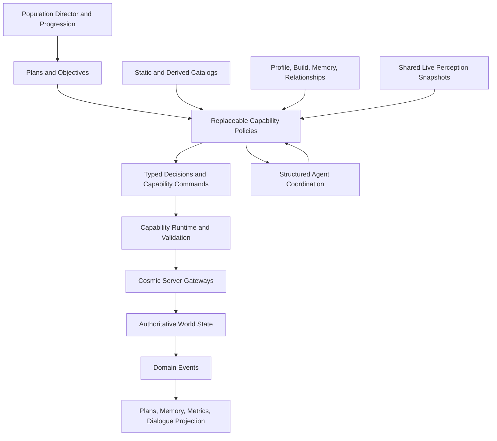
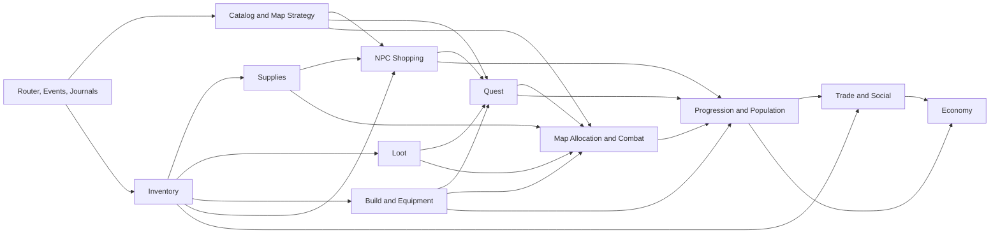

# Agent Capability Migration And Dynamic Engine Roadmap

## Status And Decision

This document is the capability-boundary and migration spine for the Agent
engine. It consolidates the intended long-term behavior, the useful systems
already present in `server.agents`, and the more specialized design documents
into one implementation order.

The central decision is:

> Preserve authoritative mechanics, replace behavior policy one capability at
> a time, and connect capabilities through typed decisions, commands, events,
> and coordination messages instead of direct calls into each other's internal
> services.

The migration is a strangler migration, not a package-renaming exercise. The
original production `server.bots` and `server.agents.legacy` packages are no
longer the main problem. Remaining NutNNut behavior is represented by policy
and orchestration semantics embedded in Agent-owned services. Moving those
classes into a folder called `legacy` would not make them detachable. A
behavior becomes replaceable only when it is selected behind a stable
capability contract and can be compared with, switched to, and removed without
changing authoritative server integration.

This roadmap deliberately puts Economy and LLM-directed Social behavior late.
The engine must first be able to progress an Agent correctly and explainably
with deterministic policies. An LLM should be able to choose among safe,
validated capabilities; it should not be required to compensate for missing
inventory, navigation, quest, combat, or transaction semantics.

The implementation-ready first autonomy milestone is defined separately in
[Tier 1 Independent Agent Progression Implementation Plan](TIER_1_INDEPENDENT_AGENT_PROGRESSION_IMPLEMENTATION_PLAN.md).
That document groups the infrastructure and capability migrations below into a
level-30 and level-70 gameplay delivery sequence. Its “Tier 1” naming is a
product milestone and is distinct from the numbered migration phases here.

## Intended Outcome

The target engine should support all of the following without creating a
monolithic Agent brain:

- an Agent can select a meaningful progression goal;
- a planner can decompose the goal into capability requests;
- each capability can make a bounded decision from portable catalog knowledge,
  live perception, profile preferences, and assigned constraints;
- all world mutations still pass through validated Cosmic server gateways;
- foreground behavior looks like a real client while background behavior can
  use safe abstract simulation;
- Agents communicate operational facts to each other through structured
  messages, while dialogue remains a human-facing presentation;
- legacy and V2 behavior can run in shadow mode and be changed per capability;
- decisions record their inputs, policy version, reason, and outcome;
- future LLM policies can replace selected decision makers without replacing
  mechanics or bypassing validation;
- population behavior can evolve through versioned policy and evaluated data,
  not live self-modifying code.

## Non-Goals

This roadmap does not:

- require all capabilities to be rewritten at once;
- put every behavior behind a remote service or an LLM;
- make the event bus the authoritative owner of state;
- let background simulation invent items, mesos, experience, or quest state;
- treat public Maple chat as Agent-to-Agent control traffic;
- make Combat choose long-term progression goals or map population placement;
- make Shopping decide item value, Supplies perform shop transactions, or
  Inventory decide where the Agent should travel;
- design the final market economy before the Economy engine is ready;
- require manually annotating every map before the first useful rollout.

## Relationship To Existing Specifications

This document defines ownership and order. It does not replace the detailed
algorithms and schemas in these documents:

- [Polished Combat Capability Implementation Plan](POLISHED_COMBAT_CAPABILITY_IMPLEMENTATION_PLAN.md)
- [Quest Focus And Combat Policy](QUEST_FOCUS_AND_COMBAT_POLICY.md)
- [Agent Engine Optimization](AGENT_ENGINE_OPTIMIZATION.md)
- [Game Knowledge Catalogs](llm-autonomy/GAME_KNOWLEDGE_CATALOGS.md)
- [NPC Quest Capability Design Specification](npc-quest-capability/NPC_QUEST_CAPABILITY_DESIGN_SPECIFICATION.md)
- [Post-Maple-Island Victoria Progression Roadmap](POST_MAPLE_ISLAND_VICTORIA_PROGRESSION_ROADMAP.md)
- [Agent Event Bus Design Specification](event-bus/AGENT_EVENT_BUS_DESIGN_SPECIFICATION.md)
- [Agent Simulation Tier Design Specification](simulation-tier-runtime/AGENT_SIMULATION_TIER_DESIGN_SPECIFICATION.md)
- [Agent Population Director Design Specification](population-director/AGENT_POPULATION_DIRECTOR_DESIGN_SPECIFICATION.md)
- [Agent Profile System Design Specification](profile-platform/AGENT_PROFILE_SYSTEM_DESIGN_SPECIFICATION.md)
- [Social Relationship Runtime Design Specification](social-relationship-runtime/SOCIAL_RELATIONSHIP_RUNTIME_DESIGN_SPECIFICATION.md)
- [Economy Design Specification](llm-autonomy/ECONOMY_DESIGN_SPECIFICATION.md)

When there is a conflict, the specialized document remains authoritative for
its algorithm, while this document is authoritative for cross-capability
ownership and migration sequencing.

## Architecture

### Layers



The layers have different replacement rates:

1. **Cosmic integration and authoritative mechanics** should be stable. They
   validate and execute attacks, pickups, NPC interactions, purchases, trades,
   equipment changes, quest mutations, and movement.
2. **Capability policies** are replaceable. They decide which valid action is
   desirable now.
3. **Plans and progression** decide why a capability should act and what
   outcome is required.
4. **Presentation** decides what a human observer sees or reads. It must not be
   needed for operational Agent-to-Agent coordination.

### Stable Mechanisms To Preserve

The current engine already has valuable foundations that should be reused:

- per-Agent serialized, bounded mailbox execution;
- capability runtime, invocation, result, and journal types;
- `AgentServerAdapter` and Cosmic integration gateways;
- shared read-only map perception snapshots;
- real-network-recipient and observing-player views;
- navigation graph, movement physics, climb, portal, and recovery mechanics;
- attack planning and packet/mechanics authorities;
- generic NPC interaction and quest start/complete validators;
- simulation-tier and background-action concepts;
- profile, plan, population, relationship, and economy specifications;
- generated game-knowledge catalogs and fast indexes.

These mechanisms may need contract cleanup, but should not be duplicated in
each behavior pack.

### Replaceable Behavior Packs

Each migrated capability should be selectable independently:

```text
LEGACY       execute current behavior
SHADOW_V2    execute legacy; calculate and journal V2 without mutation
V2_CANARY    execute V2 for a deterministic cohort; retain fast rollback
V2           execute V2 for the enabled population
```

A behavior assignment should include at least:

```text
agentId
capability
mode
policyId
policyVersion
cohortId
assignedAt
```

There must never be two mutating implementations executing the same
capability for the same Agent at the same time. Shadow decisions are data only.

Personality is not the same as implementation selection. An Agent can be
cautious, social, or loot-focused regardless of whether its Combat policy is
legacy or V2. Deployment assignment belongs to the engine; personality belongs
to the profile.

### Decision Provenance

Every important decision should be journalable as a compact record:

```text
decisionId and chainId
agentId and capability
objectiveId or planStepId
policyId and policyVersion
simulationTier
catalogBundleVersion
profileVersion
perceptionSnapshotVersion or timestamp
candidate summary
selected action
reason codes
constraints and reservations used
execution result
```

This is required for shadow comparison, live debugging, future offline model
training, and safe policy evolution. It also prevents an LLM explanation from
being mistaken for the actual reason the server executed an action.

## Capability Ownership Summary

| Capability | Owns | Does not own |
| --- | --- | --- |
| Progression | choosing the next meaningful goal and plan family | executing movement, combat, shops, or quests |
| Population/Allocation | map capacity, crowd placement, party region assignment | moment-to-moment combat |
| Navigation | finding and executing a route to a requested destination | deciding why the destination is valuable |
| Combat | encounter tactics, target and attack choice inside an assigned objective/region | choosing the long-term training map or party distribution |
| Loot | choosing and collecting eligible ground drops | deciding all long-term item value or silently bypassing authority |
| Inventory | item state, classification, reservation, capacity, and disposition proposals | traveling, shopping, trading, or combat |
| Supplies | resource needs, thresholds, reserve targets, and consumption policy | NPC transaction execution or dialogue |
| Shopping | NPC shop discovery and validated buy/sell execution | Free Market pricing, social negotiation, or ultimate item value |
| Equipment | legal gear comparison, loadout plans, equip/unequip decisions | acquiring items directly or choosing the whole career |
| Build | AP/SP/job legality and build targets | executing equipment purchases or combat |
| Quest | quest objective interpretation, state, special rules, and reward selection | low-level combat/navigation/NPC mechanics |
| Trade | validated exchange mechanics after parties agree | relationships, price beliefs, or conversational negotiation |
| Economy | price beliefs and buy/sell/hold/farm proposals | direct mutation or NPC fixed-price mechanics |
| Social | relationships, cooperation, negotiation, and human interaction goals | transferring assets or using chat as a control protocol |
| Dialogue | observer-facing language and emote projection | operational Agent-to-Agent coordination |
| Safety/Recovery | interruption, death, stuck, invalid-state, and resource emergency policy | ordinary goal selection |

## Current Implementation Assessment

The current `server.agents.capabilities` tree already contains Agent-owned
Combat, Looting, Shop, Inventory, Supplies, Equipment, Quest, NPC, Trade,
Dialogue, Navigation, Recovery, Social, and capability-runtime packages. This
is a strong reconstruction result. The migration should not discard working
mechanics merely because some behavior originated in NutNNut.

The practical keep/change assessment is:

| Area | Preserve | Change or isolate |
| --- | --- | --- |
| Combat | attack data, hitbox/range, attack-plan selection, buffs, ammo checks, target/commitment and anchored-farm experience | separate tactical policy from execution; consume map/party assignments; remove map- or quest-specific choices from generic ticks |
| Navigation | graph, foothold, climb, portal, waypoint, physics, recovery, and continuity mechanics | make route selection a replaceable policy; remove objective value decisions and behavior-specific state from mechanics |
| Loot | ownership/eligibility checks, target services, cleanup, passive/background concepts | ask Inventory for interest; make observer/background execution explicit; prevent Loot from owning long-term item disposition |
| Inventory | collection, classification, trade/equip integration, item use, drop/sell mechanics | unify snapshots and reservations; replace scattered “trash” truths and direct capability callbacks with plans/results |
| Supplies | potion/ammo counters, autopot authority, donor-plan knowledge, passive recovery, return-scroll mechanics | separate need from acquisition; replace direct Agent scans and chat; stop Supplies from implicitly owning Shopping or Trade |
| Shop | NPC approach, purchase sequencing, potion/ammo purchase knowledge, state and result handling | consume procurement/disposition plans; split `AgentFreeMarketStall*` from NPC Shopping; stop Shop from deciding protected item value |
| Equipment | optimizer, recommendation/scoring, compatibility, loadout executor, reserve concepts | formalize Build/Profile inputs; separate recommendation from execution and acquisition; journal complete score reasons |
| Quest/NPC | generic start/complete requests, validators, snapshots, NPC interaction contracts, proven Amherst/Maple Island catalogs | generalize objective composition and support status; keep narrow special handlers instead of adding more chain-specific orchestration |
| Trade | transfer validation, window/tick lifecycle, retry/cancel, item/meso placement and reconciliation experience | separate recommendation, social agreement, category announcement, and dialogue from the transaction state machine |
| Dialogue | routing, selectors, reporters, sanitization, conversation/session and LLM adapters | consume events/intents; remove direct operational dependencies; gate ambient presentation on real observers |
| Runtime | per-Agent bounded mailbox, capability frames/results/journals, Cosmic adapter, shared perception | add behavior version routing, cancellation, provenance, and capability-owned session state rather than enlarging central runtime state |

NutNNut-derived behavior is most valuable where it captures Maple mechanics,
timing, packet-safe execution, recovery experience, or a proven heuristic. It
is least suitable as the permanent architecture when policy, mutation,
presentation, and cross-Agent discovery are fused in the same tick. The goal is
therefore to preserve demonstrated behavior as fixtures and legacy policies,
not to preserve its coupling.

## Shared Contracts Between Capabilities

Avoid passing mutable service objects between capabilities. Prefer small,
immutable requests and results. The initial contract vocabulary should include:

- `ObjectiveRequest`: desired outcome, priority, deadline, cancellation rule;
- `RegionAssignment`: map, allowed region, capacity lease, party role;
- `CombatDirective`: required targets, incidental policy, stop conditions;
- `LootInterest`: item, quantity, reason, priority, reservation owner;
- `SupplyNeed`: resource category, current stock, target reserve, urgency;
- `ProcurementRequest`: acceptable items, quantities, budget, deadline;
- `DispositionPlan`: keep, reserve, equip, consume, store, sell, trade, or drop;
- `EquipmentPlan`: legal target loadout and ordered changes;
- `QuestObjective`: conditions, capability dependencies, completion evidence;
- `TradeProposal`: parties, assets, constraints, expiry, reason;
- `DialogueIntent`: event reference, audience, tone, urgency, dedupe key;
- `CapabilityCommand`: validated execution request with idempotency key;
- `CapabilityResult`: success, retry, blocked, partial, or superseded.

The concrete names can follow existing project conventions. The important part
is that ownership and direction are stable.

## Map Knowledge And Strategy

### Why Map Strategy Is Not Combat Policy

A map can have eight spawns of a desired mob and two unrelated spawns. It can
also support one Agent across the whole map, two Agents split top/bottom, or
four Agents assigned to smaller lanes. Those are facts and allocation choices
about the map and population. Combat should receive the assigned region and
objective, then decide whether an incidental mob is worth killing.

Putting all of this into Combat would cause several problems:

- every Combat tick would repeat global map and population work;
- parties and independent Agents could make conflicting split decisions;
- “best map” would become a hard-coded absolute instead of a contextual score;
- Navigation, Progression, and future LLM planning could not reuse the same
  knowledge;
- map strategy could not be curated or improved independently of combat code.

### Three Map-Knowledge Layers

#### 1. Generated facts

Generated from WZ/XML, SQL, scripts, and existing catalog exporters:

- bounds, footholds, ladders, ropes, portals, and portal destinations;
- mob spawn points, mob IDs, spawn counts, and respawn metadata;
- NPC and reactor placements;
- map flags, town/field classification, return map, and hazards;
- drop sources and quest links;
- shop and service availability.

These facts belong to the Catalog Platform and should not be manually copied
into behavior code.

#### 2. Derived spatial analysis

Produced offline or at catalog-build time:

- connected walk/climb regions;
- region bounds and foothold membership;
- travel cost between regions and portals;
- spawn density per region and mob;
- candidate farming anchors and attack coverage;
- melee/ranged/AOE suitability;
- loot access difficulty and fall/recovery risk;
- safe idle, staging, NPC-approach, and observation spots.

Derived records need a method version and confidence so they can be rebuilt and
compared when navigation or WZ interpretation changes.

#### 3. Curated strategy overlays

Human-reviewed information that generation cannot reliably infer:

- named farming anchors and preferred facing/attack pattern;
- recommended active Agent count and a hard safety maximum;
- party split templates for one, two, three, four, or more members;
- map-specific hazards, traps, awkward portals, or bad recovery points;
- primary, filler, incidental, and avoid mob roles;
- known class/build suitability exceptions;
- intentional non-optimal route variants;
- special quest, reactor, or event constraints.

An overlay must reference generated region/foothold identifiers instead of
duplicating geometry. Missing overlays are allowed; the generic derived policy
is the fallback.

### Suggested Map Strategy Record

```yaml
mapId: 1010100
schemaVersion: 1
source:
  generatedBundle: "..."
  overlayVersion: "..."
  confidence: reviewed
regions:
  - regionId: lower
    footholdIds: []
    anchorPoints: []
    accessCost: 0
    hazards: []
    spawnGroups:
      - mobId: 100100
        role: primary
        expectedShare: 0.75
    suitability:
      melee: 0.8
      ranged: 0.7
      aoe: 0.6
partyLayouts:
  "1": [{slot: whole, regions: [lower, middle, upper]}]
  "2": [{slot: lower, regions: [lower]}, {slot: upper, regions: [middle, upper]}]
recommendedActiveAgents: 2
hardMaxActiveAgents: 4
safeSpots: []
routeVariants: []
notes: []
```

The final schema should use stable IDs and validation rules from the Catalog
Platform. The example illustrates ownership; it is not a requirement to encode
map polygons by hand.

### “Best Map” Is A Query, Not A Static Label

The catalog may identify strong candidate maps for a mob or level band, but the
runtime answer depends on:

- Agent level, job, AP/SP build, skills, range, and damage;
- quest and item objectives;
- travel time and known route;
- current supplies and shop proximity;
- map crowding and current leases;
- party composition and available split layout;
- expected kills, experience, mesos, and desired drops per minute;
- death, recovery, accuracy, and potion costs;
- simulation tier and whether a real observer is present;
- profile tolerance for danger, repetition, and non-optimal travel.

Progression or a Training policy requests and scores candidate maps. The
Population Director grants a capacity/region lease. Combat consumes that lease.
An LLM may inspect a compact ranked explanation, but should not scan raw
foothold graphs during a combat tick.

### Population And Party Splits

The Population Director owns admission to a map. Party coordination may
request a layout, but the selected layout is committed as region leases so all
members agree. A lease contains:

- assigned map and region IDs;
- members and party role;
- issue/expiry time and renewal rule;
- allowed overlap and regroup conditions;
- maximum pursuit distance outside the region;
- reason for reallocation.

The recommended count is a quality target, not just server capacity. The hard
maximum is a safety limit. If a map exceeds the recommendation, the planner
should prefer another comparable map unless a quest, party, or social reason
justifies crowding.

NutNNut formation and anchored-farming behavior may be used as input evidence,
but it should be adapted behind `RegionAssignment` and map strategy rather than
becoming the permanent owner of population placement.

## Detailed Capability Design

### Progression

#### Responsibility

Progression decides **what the Agent should work toward next**. It does not
perform the work. It chooses among plan families such as:

- tutorial and Maple Island completion;
- first job and build milestones;
- quest chains;
- level/training milestones;
- supply recovery;
- equipment improvement;
- social or party objectives;
- future economic objectives.

#### Initial Population Framework

The first useful version does not need advanced autonomy. Use deterministic,
versioned plan sets with weighted alternatives:

1. apply hard safety and legality gates;
2. identify unmet milestone prerequisites;
3. generate eligible plan families;
4. score by profile preference, expected value, travel, crowding, readiness,
   novelty, and population demand;
5. select with bounded weighted randomness;
6. journal the choice and commit for a minimum useful duration;
7. replan only on completion, material world change, failure threshold, or
   higher-priority interruption.

This can run a meaningful population before LLM planning exists. Different
assigned profiles and weighted plan sets produce diversity without sacrificing
reproducibility.

#### Later Evolution

Progression may eventually combine utility planning, learned estimates, and
LLM proposals. Those systems should still output the same validated plan and
objective contracts. Live policy learning may update bounded data only after
offline evaluation and versioned promotion; it should not rewrite live code.

### Navigation

Navigation answers **how to reach a requested location**. It owns:

- inter-map portal routes;
- same-map path, region, waypoint, rope, ladder, drop, and jump execution;
- route commitment and no-progress detection;
- controlled alternate reachable routes;
- foreground physics and background ETA abstractions;
- arrival evidence.

It does not decide that a shop, mob, NPC, or player is worth visiting. The
requesting capability supplies the destination, tolerance, deadline, and
reason.

The current navigation mechanics are valuable and high risk. They should first
be wrapped as a stable executor, instrumented, and reused. Policy improvements
such as intentionally non-optimal routes belong in a route-selection policy,
not in portal or physics packet code.

### Combat

#### Responsibility

Combat is a generic tactical routine that should work on almost any supported
map when given:

- a combat objective;
- an assigned map region or party role;
- allowed/required mob classes;
- an incidental-combat policy;
- an Agent build, skills, supplies, and safety constraints;
- a perception snapshot and map strategy summary.

It owns target choice, target/route commitment, positioning, skill/attack-plan
choice, attack timing, buffs, ammo checks, encounter interruption, and tactical
stop conditions.

It does not choose the long-term training map, admit additional Agents, own
quest truth, value inventory globally, or mutate server combat state outside
the authoritative attack execution path.

#### Target Roles

Targets should be classified relative to the active objective:

- `REQUIRED`: directly advances the active quest or explicit hunt objective;
- `DROP_SOURCE`: can provide a required active item;
- `SPAWN_PRESSURE`: clearing it can restore desired target spawns;
- `USEFUL_FILLER`: useful experience/drop with acceptable detour;
- `INCIDENTAL`: safe and nearly free because it is already in attack range or
  blocks the route;
- `AVOID`: dangerous, wasteful, reserved, or outside the assignment.

An Agent may kill one of the two unrelated mobs on an eight-target map when it
is in the way, inside attack coverage, cheap, safe, and does not meaningfully
delay the primary objective. This is an explicit incidental policy, not an
accidental side effect. Candidate score should account for objective value,
coverage, route cost, expected time-to-kill, risk, loot value, spawn pressure,
and commitment state.

#### Tactical Loop

1. read one shared perception snapshot;
2. apply hard safety, region, ownership, and eligibility filters;
3. generate a bounded candidate set;
4. score candidates with reason components;
5. preserve target/route leases unless a break condition applies;
6. select a legal attack plan through existing attack authorities;
7. reposition or navigate only within the allowed diversion budget;
8. execute one validated action;
9. consume the resulting events and update tactical memory;
10. stop, wait, loot, recover, or request reallocation when conditions require.

The detailed utility, hysteresis, danger cost, follow behavior, and rollout
sequence remain defined by the Polished Combat plan. Combat hot paths must not
perform database, file, network, LLM, or whole-population scans.

#### Foreground And Background

- **Presentation mode:** real movement, attack packets, visible timing, normal
  drop and pickup behavior.
- **Background active:** cheaper perception and cadence; authoritative virtual
  actions where supported.
- **Background abstract:** aggregate bounded combat outcomes from catalog and
  profile rates, then reconcile through background-action authority.
- **Offline:** plan-level estimates only; no invented live-map effects.

Materialization must preserve health, mana, supplies, experience, loot,
position, quest counters, and cooldown invariants.

### Loot

#### Responsibility

Loot answers **which eligible ground opportunity should be collected now and
how to collect it in the current simulation tier**. It owns:

- visible drop detection and candidate selection;
- ownership, expiry, pickup, distance, and reachability eligibility;
- loot-route scheduling and combat diversion budget;
- pickup execution or approved background collection;
- completion/failure events.

Loot does not own the permanent value of every item. It asks Inventory for an
`ItemInterest` result containing reason, priority, desired quantity, and any
reservation. It also does not decide to sell or trade the item.

#### Two Modes

1. **Observer present:** the Agent must approach the drop and use normal pickup
   behavior. Timing can vary, but the presentation must remain plausible.
2. **No real observer:** an approved background action may collect an eligible
   drop without rendering the complete walk/pickup sequence. The same ownership,
   capacity, quest, item, and audit validation still applies.

Direct background collection should credit the authoritative Agent inventory
first. It should not silently send arbitrary items straight to storage in the
initial implementation. Storage has separate capacity, access, persistence,
economic, and trade semantics. A later Storage capability or deferred inventory
reconciliation policy may move explicitly eligible items after the collection
is recorded.

#### Collection Priority

Suggested initial priority:

1. active quest requirement or reserved item;
2. scarce supply or ammo below reserve;
3. legal equipment upgrade candidate;
4. high-confidence valuable or demanded item;
5. mesos and generally useful consumables;
6. low-value item when route cost is negligible and capacity is safe;
7. ignore, defer, or leave when value is unknown and capacity is constrained.

“Interest” must be quantity-aware. Once a quest reservation is satisfied, the
same item can move from required to future-demand, economic, or trash policy.

### Inventory

#### Responsibility

Inventory is the authoritative Agent-facing interpretation of inventory state.
It owns:

- consistent inventory snapshots and capacity/stack checks;
- item classification and normalized quantities;
- reservations with owner, amount, priority, expiry, and release conditions;
- protection from accidental sell/drop/trade/consume;
- disposition proposals: keep, equip, consume, store, sell, trade, or drop;
- reconciliation after authoritative transactions;
- item-interest answers for Loot and acquisition planners.

Inventory does not walk to a shop, execute a trade, choose a training map, or
perform the actual quest. It exposes facts and policy decisions to the
capability that owns the action.

#### Reservation Reasons

At minimum:

- active quest;
- near-future accepted plan;
- supply reserve;
- ammo reserve;
- equipment candidate or future job/build item;
- party/shared objective;
- promised trade;
- economic hold;
- operator/test protection.

Reservations need explicit precedence and conflict reporting. A shop sale or
trade transfer must fail closed if it would violate a higher-priority
reservation.

#### Item Disposition

Do not encode a global `isTrash(itemId)` truth. Disposition is contextual:

- a Red Potion may be inefficient for a high-HP Agent but useful for a low-level
  Agent, a quest, a friend, or a sale;
- Cursed Dolls and Jr. Necki skins may be valuable due to quest demand even when
  the current Agent does not need them;
- equipment may be poor now but reserved for a future job milestone or another
  Agent;
- an item may be valuable but still not worth a long detour.

The inventory policy should produce a reasoned classification with confidence
and source. Unknown items default to keep or bounded quarantine, not destructive
sale.

### Supplies

#### Responsibility

Supplies answers **what consumable resources the Agent needs and how urgent the
need is**. It owns:

- HP/MP potion, ammo, return scroll, and other consumable counts;
- low/critical thresholds and target reserve calculation;
- consumption and autopot selection policy;
- efficiency constraints based on max HP/MP, expected damage, skills, and
  travel horizon;
- group supply requests and donor eligibility;
- acquisition requests, not transaction execution.

A `SupplyNeed` may say:

```text
category=HP_RECOVERY
currentEffectiveRecovery=12,000
targetEffectiveRecovery=60,000
minimumPerUse=300
maximumWasteRatio=0.35
urgency=HIGH
acceptableItemIds=[...]
```

This separates “I need enough useful HP recovery” from “buy 200 Orange
Potions at this particular NPC.”

#### Relationship To Other Capabilities

- Inventory reports current quantities and protects reserves.
- Supplies calculates need and acceptable substitutions.
- Progression or an Acquisition coordinator selects shop, storage, trade, farm,
  or rest as the acquisition strategy.
- Shopping performs a fixed-price NPC purchase.
- Social/Economy may later propose obtaining supplies from another party.
- Trade performs the actual exchange.
- Dialogue may optionally present the result to a human observer.

Supply shortage must never directly require map chat. Structured
Agent-to-Agent messages carry exact category, amount, urgency, location, and
expiry.

### Shopping

#### Responsibility

Shopping in this roadmap means **NPC shops only**. It owns:

- finding candidate NPC shops from the catalog;
- comparing fixed NPC availability and prices against a procurement request;
- selecting a reachable shop under budget and time constraints;
- navigating to and approaching the NPC through other capabilities;
- opening the correct shop and executing validated buy/sell actions;
- reporting partial purchase, capacity, mesos, stock, or interaction failure.

Shopping does not own Free Market stalls, player pricing, price beliefs,
negotiation, or long-term economic value. Current `AgentFreeMarketStall*`
classes should eventually move behind a Market/Economy boundary rather than
defining the NPC Shopping package.

#### Buying

Shopping consumes a procurement request created by Supplies, Equipment,
Quest, Progression, or a future Economy policy. It may choose among acceptable
SKUs and shops, but it must not silently change the purpose, protected budget,
or required quality.

For potions, selection can optimize:

- recovery per meso;
- recovery per inventory slot;
- expected waste relative to max HP/MP and trigger threshold;
- travel cost and current urgency;
- shop availability and minimum reserve;
- profile preference within server-clamped bounds.

#### Selling

Shopping executes an Inventory-approved `DispositionPlan`. It does not decide
that an item is trash merely because it is low level. Before sale, Inventory
must account for quest reservations, future plan demand, equipment, supply,
party promises, and later economic demand.

### Equipment

#### Responsibility

Equipment owns:

- legal equip-slot and weapon/job compatibility;
- current and candidate stat snapshots;
- weighted comparison and complete loadout optimization;
- AP/level/job/fame/sex and server-rule requirement checks;
- equip, unequip, and replacement plans;
- future-build reservation recommendations;
- explanation of score and rejected constraints.

The initial generic policy should select the best legal overall loadout from
what the Agent owns. It should consider effective combat stats rather than raw
sum alone: weapon type, attack/magic attack, primary/secondary stats, accuracy,
speed, defense/survivability, HP/MP, slots/upgrades, and class-specific value.

Build/Profile supplies the scoring weights and future requirements. Inventory
supplies candidates and reservations. Equipment emits acquisition requests for
missing upgrades; it does not purchase or trade them itself.

Start deterministic and conservative. Profile-flavored preferences should not
override legality or cause obvious severe downgrades unless an explicit
presentation/cosmetic policy allows it.

### Quest

#### Responsibility

Quest owns:

- authoritative quest-state interpretation;
- eligibility and prerequisite planning;
- objective decomposition;
- start/complete readiness and evidence;
- reward choice policy;
- special-rule selection;
- quest-chain and cancellation/retry state.

It composes NPC, Navigation, Combat, Loot, Inventory, Use Item, Reactor,
Shopping, Party, and dialogue-presentation capabilities. It should not
reimplement their mechanics.

#### Generic First, Explicit Exceptions

Most quests should be described through catalog objectives and a generic
state machine:

```text
discover -> eligible -> approach/start -> active objectives -> ready to turn in
-> approach/complete -> reward/reconcile -> next link
```

Special handlers are required when behavior cannot be safely represented as
data. Examples include:

- Yoona's Shopping Guide and its simulated Cash Shop transition/grounding delay;
- selectable or class-dependent rewards;
- scripts with meaningful dialogue choices;
- timed, repeatable, daily, or hidden quests;
- party quests and shared counters;
- instance/event maps;
- use-item, reactor, escort, delivery, or scripted movement objectives;
- inventory-capacity and equipment-slot reward constraints;
- quests whose completion must wait for a visible presentation invariant.

Special handlers should implement a narrow extension contract and return to
the generic state machine. Avoid one orchestration class per quest chain when a
catalog rule suffices.

#### Scaling Worldwide

Scale by coverage and capability readiness, not by assuming all cataloged
quests are executable. Each quest should have a support status such as:

```text
CATALOGED
PLANNABLE
EXECUTABLE_GENERIC
EXECUTABLE_SPECIAL
VALIDATED
BLOCKED_WITH_REASON
```

Automated validation should check prerequisite links, NPC placements, portal
reachability, mob/drop sources, reward capacity, special handler references,
and unsupported script actions.

### Build

Build owns legal and desired AP/SP/job development. It should remain separate
from Equipment because an Agent's long-term build can make a currently wearable
item strategically wrong, while Equipment still needs a clean answer about the
best legal loadout for a specified build.

The build profile should define job path, AP targets, SP ordering, weapon
families, minimum accuracy or utility constraints, and respec policy. It feeds
Progression, Equipment, Combat, and supply estimation.

### Trade

Trade is the authoritative exchange capability. It owns invitation, window
lifecycle, item/meso placement, confirmation, cancellation, timeout, capacity,
ownership, reservation validation, and reconciliation.

It consumes an already agreed `TradeProposal`. It does not decide friendship,
fair value, or conversational wording. Existing trade services contain useful
mechanics but also policy and dialogue coupling; migrate them by first
preserving the transaction state machine, then moving recommendation and
presentation decisions out.

### Social

Social owns relationships, cooperation, party formation goals, requests,
negotiation, reciprocity, trust, promises, and human interaction intent.

An Agent needing a quest item can:

- let Progression choose a self-acquisition plan using Navigation, Combat, and
  Loot; or
- let Social/Economy negotiate a Trade proposal with another Agent/player.

Both paths ultimately use the same Inventory reservation and Trade execution
contracts. Social is another way to attain progression outcomes; it is not a
parallel mutation path.

#### Agent-To-Agent

Agents should exchange structured messages containing exact technical context:

```text
messageType=SUPPLY_REQUEST
requesterId
resourceCategory
currentQuantity
requestedQuantity
urgency
location
deliveryConstraint
expiresAt
correlationId
```

Other useful messages include region assignment, party invitation, combat
assist, item availability, trade proposal, quest sync, route warning, and plan
handoff. These messages use bounded mailboxes, TTLs, dedupe keys, authorization,
and correlation IDs.

If a real observer is present, a Dialogue policy may project a natural subset
of the cooperation into Maple chat. Chat is presentation, not the protocol.

#### Agent-To-Player

Human interaction may eventually use an LLM because the input and expected
language are open ended. The LLM receives a bounded summary and safe tools. It
may propose dialogue, social goals, or validated capability requests. It must
not receive raw mutable server objects or directly transfer items, change
quests, execute attacks, or bypass normal checks.

### Dialogue

Dialogue consumes events, social intents, profile tone, conversation state,
and audience information. It decides whether, when, where, and how to present a
message or emote.

It should normally require an eligible real-network observer for ambient event
reactions. The audience check should use the server's real-recipient/observer
view, not total map characters, so Agents do not trigger presentation for each
other.

Dialogue can suppress, combine, delay, or rephrase events. It does not consume
the event in a way that prevents plans, metrics, or memory from seeing it.

### Economy

Economy should remain specialized and late. Its initial responsibility is
observation and proposal:

- price and liquidity beliefs;
- demand and scarcity estimates;
- buy, sell, hold, farm, transfer, or ignore recommendations;
- opportunity cost and budget allocation;
- market-risk and confidence tracking.

It does not mutate inventory, mesos, shops, trades, or drops. NPC shop fixed
prices remain catalog/Shopping concerns. Free Market and player-market behavior
belongs to Economy/Market plus Social and Trade, not NPC Shopping.

An observation-only Economy engine can be introduced before autonomous market
actions. It should first explain what it would do, compare against outcomes,
and build trustworthy data.

### Safety And Recovery

Safety and Recovery are cross-cutting, high-priority capabilities. They can
interrupt ordinary policy for death, stuck navigation, invalid foothold,
critical supplies, map mismatch, transaction inconsistency, repeated failure,
or server shutdown.

They should publish explicit interruption and recovery events. They should not
silently rewrite the active objective; the planner decides whether to resume,
retry, change strategy, or abandon after recovery.

## Event, Command, And Messaging Model

### Three Different Concepts

Do not collapse these into a single “event listener” abstraction:

1. **Command:** a request to perform work, with one clear owner and a result.
2. **Domain event:** an immutable fact that already happened.
3. **Coordination message:** directed operational information or a proposal
   between Agents/capabilities.

Examples:

```text
AttackMobCommand -> Combat executor
MobKilledEvent -> Quest, Progression, metrics, memory, Dialogue projection
SupplyRequestMessage -> candidate donor Agent
DialogueIntent -> observer-facing presentation policy
```

Listeners must not compete to mutate the same authoritative state. A domain
event may cause a plan to request a new command, but that command still passes
through its capability owner and validation.

### Recommended Event Families

#### Character and progression

- level gained;
- job advanced;
- AP/SP assigned;
- skill learned or skill level changed;
- death, revive, map changed, portal used;
- plan started/completed/failed/superseded;
- objective started/completed/blocked.

#### Combat

- encounter started/ended;
- mob targeted, attacked, killed, or lost;
- damage dealt/received;
- buff applied/expired;
- ammo low/empty;
- target lease or route lease broken;
- no-progress or danger interruption.

#### Inventory, loot, and supplies

- drop observed, targeted, picked up, expired, or rejected;
- item gained/lost/quantity changed;
- inventory full or reservation conflict;
- supply low/critical/recovered;
- potion/ammo used;
- item disposition proposed/executed.

#### Quest and NPC

- quest became eligible, started, progressed, ready, completed, forfeited;
- reward selected/received;
- NPC interaction started/completed/failed;
- special quest condition reached;
- reactor or scripted field action completed.

#### Equipment and upgrading

- upgrade candidate found;
- item equipped/unequipped;
- loadout changed;
- scroll attempted/passed/failed/destroyed;
- requirement or build conflict.

#### Shopping, trade, economy, and social

- procurement need created/satisfied/blocked;
- shop visit and buy/sell result;
- trade proposed/accepted/completed/cancelled/failed;
- price observation or economy recommendation;
- party formed/left, relationship or promise changed;
- structured help request created/fulfilled/expired.

#### Operations

- capability decision and execution result;
- policy shadow disagreement;
- simulation tier changed/materialized;
- mailbox drop/backpressure;
- adapter validation failure;
- persistence/reconciliation failure.

### Payload Rules

Events must be immutable and portable. They contain IDs, value snapshots,
reason codes, versions, timestamps, and correlations—not live `MapleCharacter`,
`MapleMap`, client session, inventory, or service references.

Every causal chain should have:

- event/command/message ID;
- correlation or chain ID;
- source Agent/capability;
- policy version;
- created time and optional expiry;
- idempotency/dedupe key where repetition could mutate state;
- simulation tier and observer context when relevant.

At 2,000 Agents the bus must be bounded and priority-aware. Safety and
authoritative reconciliation cannot be dropped. Cosmetic dialogue, redundant
telemetry, and coalescible state changes may be sampled, combined, or dropped
under pressure according to the Event Bus specification.

## Legacy Detachment Strategy

### What Counts As Legacy

Legacy is behavior semantics, not necessarily a package path. A current
Agent-owned class is legacy for a capability when it:

- directly chooses policy and executes mechanics in one method;
- directly invokes dialogue as part of operational behavior;
- scans unrelated Agents or mutable server collections for a decision;
- stores behavior-specific state in a global runtime entry;
- cannot be shadowed without also mutating the world;
- encodes a one-off quest/map behavior as a universal rule;
- is called directly by many systems instead of behind one capability owner.

### How To Preserve Useful NutNNut Behavior

For each capability:

1. characterize current behavior with fixtures and live decision journals;
2. identify authoritative mechanics that must remain shared;
3. extract a `Legacy...Policy` that returns a decision without changing its
   outcome;
4. route that decision through the common capability executor;
5. implement V2 against the same request/result contract;
6. run V2 in shadow mode and compare reasoned decisions;
7. canary a deterministic cohort;
8. roll out with instant per-capability fallback;
9. delete the legacy policy only after its rollback window and references are
   gone.

Do not maintain a permanent duplicate legacy server adapter, inventory model,
navigation engine, or packet path. Only behavior policy should be duplicated
during migration.

### Behavior-Owned Session State

Do not continue expanding one giant `AgentRuntimeEntry`. Shared identity,
mailbox, lifecycle, and authoritative handles can remain central. Tactical
state such as target leases, loot routes, supply requests, quest special-state,
and dialogue cooldowns should be owned by their capability session and cleared
through explicit lifecycle hooks.

This makes a capability detachable and prevents an old tick from reviving old
behavior after a V2 switch.

## Recommended Migration Order

The phases below are ordered by dependency, mutation risk, observability, and
ability to prove the architecture on a narrow surface before touching combat or
population-wide planning.

### Phase 0: Baseline, Inventory, And Contract Freeze

#### Work

- inventory current packages, callers, tick owners, mutable state, and direct
  cross-capability calls;
- classify each current service as mechanics, policy, orchestration,
  presentation, adapter, or compatibility behavior;
- record baseline decisions and outcomes for Maple Island and representative
  Victoria scenarios;
- define the shared request/result vocabulary and capability ownership table;
- identify authoritative mutation entry points and forbid alternatives;
- establish scale, persistence, and rollback acceptance metrics.

#### Reason

Without a baseline, “V2 is better” cannot be measured and regressions will be
attributed to the wrong layer. Freezing contracts before extraction prevents
each capability from inventing incompatible messages.

#### Exit Gate

- current behavior can be replayed or characterized for critical flows;
- every mutation has a known authoritative owner;
- all capability overlaps have an explicit temporary owner;
- no behavior has been changed yet.

### Phase 1: Behavior Router, Decision Journal, And Event Foundation

#### Work

- implement per-capability behavior assignment (`LEGACY`, `SHADOW_V2`,
  `V2_CANARY`, `V2`);
- make existing policy interfaces real seams or replace them with small
  capability-specific contracts where the empty generic interface is
  insufficient;
- implement the bounded event runtime defined by the Event Bus specifications;
- add decision provenance and correlation IDs;
- route commands through the existing capability runtime/server adapter;
- add lifecycle cancellation so old behavior sessions cannot continue after a
  switch, map change, logout, or simulation-tier change.

#### Reason

This is the enabling layer for every later migration. Building a new Combat or
Inventory policy first would create another hard-wired implementation with no
safe comparison or rollback.

#### Exit Gate

- one harmless sample capability can run legacy plus non-mutating shadow;
- event pressure is bounded and observable;
- mutating commands are single-owner and idempotent where required;
- policy assignment can be changed for a deterministic cohort and rolled back.

### Phase 2: Audience-Aware Dialogue Projection And Structured Coordination

#### Work

- replace direct operational `sayMapNow`-style calls with domain events or
  directed messages;
- introduce `DialogueIntent` and audience eligibility based on real network
  observers;
- route Agent-to-Agent supply/help examples through structured messages;
- add dedupe, cooldown, TTL, chain-depth, and anti-conversation-loop guards;
- retain existing text selectors/reporters as presentation adapters initially.

#### Reason

This is a low-authority vertical slice: it proves that event consumers can
react without owning the mutation. It also immediately removes one of the
largest modularity problems—operational logic depending on public chat—before
Supply, Trade, Social, or LLM expansion.

#### Exit Gate

- no critical supply or scroll flow depends on map chat;
- no ambient event chat is emitted when only Agents are present;
- observing players still receive bounded, natural presentation;
- disabling Dialogue does not disable operational cooperation.

### Phase 3: Catalog Platform Completion And Map Strategy Foundation

#### Work

- normalize current generated map, portal, mob spawn, item source, shop,
  resupply, NPC, and action-affordance outputs into the Catalog Platform;
- add derived region/spawn/access analysis with versions and confidence;
- define and validate the curated map-strategy overlay schema;
- provide compact APIs for mob source, quest source, shop, region, training
  candidate, capacity, and party-layout queries;
- seed reviewed overlays for Maple Island and a few Victoria training maps;
- expose bounded summaries suitable for planners and future LLMs.

#### Reason

Combat, Loot, Shopping, Quest, Population, and Progression all need consistent
knowledge. Creating the schema early avoids embedding another round of map IDs,
NPC IDs, and spatial exceptions in capability code. Full worldwide curation is
not a blocker because derived generic fallback remains available.

#### Exit Gate

- catalog build is versioned, validated, and read-only at runtime;
- no hot path needs to scan raw catalog files;
- Maple Island strategy overlays resolve to valid generated regions/footholds;
- missing or stale overlays fail to a safe generic policy with diagnostics.

### Phase 4: Inventory V2

#### Work

- create one inventory snapshot/query surface;
- implement item classification, quantity-aware interest, reservations,
  capacity, and disposition plans;
- migrate direct sell/drop/trade/equip protection checks to reservations;
- add conservative unknown-item behavior and reasoned classifications;
- emit inventory events only after authoritative changes;
- shadow current trash, collection, and trade classifications.

#### Reason

Inventory is a dependency for Loot, Supplies, Shopping, Equipment, Quest,
Trade, and Economy. Migrating those first would duplicate item-interest and
protection rules or risk destructive item loss.

#### Exit Gate

- active quest/supply/equipment/trade reservations cannot be accidentally sold,
  dropped, consumed, or transferred;
- snapshots and events reconcile with authoritative inventory;
- classification is explainable and quantity-aware;
- legacy and V2 disposition differences are reportable before execution.

### Phase 5: Supplies V2

#### Work

- separate counts, need calculation, consumption, donor selection, acquisition
  request, and dialogue presentation;
- calculate HP/MP reserve using max stats, trigger threshold, expected combat,
  travel horizon, waste ratio, and profile clamps;
- express ammo, potion, and return-scroll needs through `SupplyNeed`;
- replace direct Agent scans/chat with indexed structured requests;
- preserve authoritative autopot and item consumption mechanics.

#### Reason

Supplies is bounded, frequent, and depends mainly on Inventory. It is a good
first consequential behavior migration and prepares clean requests for NPC
Shopping and Social/Trade without requiring either.

#### Exit Gate

- supply need and consumption decisions are independently testable;
- no consumable is used below reservation rules or without authority;
- group requests expire and cannot loop;
- shortage handling works with Dialogue entirely disabled.

### Phase 6: NPC Shopping V2

#### Work

- limit Shopping ownership to NPC fixed-price shops;
- consume procurement and disposition plans;
- use catalog shop/resupply indexes and Navigation/NPC capability contracts;
- implement potion SKU selection, budget, capacity, partial purchase, and
  failure results;
- separate Free Market stall behavior behind a future Market boundary;
- shadow current shop selection and quantities before canary execution.

#### Reason

Shopping becomes simple and reliable once Supplies says what is needed and
Inventory says what is protected/disposable. Migrating it earlier would force
Shopping to own both policies and preserve the current overlap.

#### Exit Gate

- Shopping cannot sell an unapproved/reserved item;
- purchases satisfy a traceable request and budget;
- failed or partial transactions reconcile correctly;
- Free Market behavior is not treated as an NPC shop concern.

### Phase 7: Loot V2 And Background Collection

#### Work

- use Inventory item-interest and reservation answers;
- separate target selection, route/presentation, pickup authority, and
  background action;
- preserve drop ownership, expiry, capacity, and pickup validation;
- observer mode walks to drops; no-observer mode may use audited direct
  collection;
- add loot diversion budgets and post-combat collection windows;
- defer direct-to-storage until a separate storage/reconciliation contract is
  designed and validated.

#### Reason

Loot must understand item interest before deciding what to chase and requires
simulation-tier/audience rules for invisible collection. With Inventory and
event infrastructure stable, it can be changed without corrupting items or
making presentation inconsistent.

#### Exit Gate

- foreground pickups remain visually plausible;
- background collection produces the same authoritative inventory/quest
  outcomes and complete audit events;
- duplicate or expired pickup commands are harmless;
- combat cannot be trapped in unbounded loot diversion.

### Phase 8: Build And Equipment V2

#### Work

- formalize job/AP/SP/build profiles and legal requirement queries;
- separate equipment scoring from equip execution;
- optimize complete legal loadouts with explainable score components;
- reserve future-build candidates through Inventory;
- emit procurement requests for desired missing gear;
- shadow current auto-equip recommendations and severe downgrade cases.

#### Reason

Equipment depends on clean Inventory ownership and stable Build inputs. It
should precede broad Progression so progression plans can reason about actual
readiness rather than treating level as the only milestone.

#### Exit Gate

- all equipped loadouts are legal and transactionally reconciled;
- obvious downgrades and requirement conflicts are blocked;
- scoring and profile influence are explainable;
- future build reservations do not permanently leak or starve inventory.

### Phase 9: Quest Generalization

#### Work

- keep the proven Maple Island plan and NPC/quest validators as baseline;
- express quest objectives as capability requests and completion evidence;
- add support-status coverage, special-handler registry, and reward-choice
  policy;
- migrate chain-specific orchestration to generic state machines where safe;
- validate catalog links and capability support worldwide;
- keep explicit special behavior for Yoona and other presentation/script
  invariants.

#### Reason

Quest is already one of the more Agent-owned areas, so rewriting it early has
lower value than stabilizing its dependencies. Once Inventory, Supplies,
Shopping, Loot, Build, and Equipment have clean contracts, Quest can compose
them rather than growing more one-off functions.

#### Exit Gate

- every enabled quest has a declared support level;
- generic and special quests produce the same objective/result contracts;
- reward choice and capacity are handled before completion;
- unsupported script behavior blocks with a reason instead of guessing.

### Phase 10: Map Allocation And Combat V2

#### Work

- add map admission, capacity lease, region assignment, and party split policy;
- feed Combat a `RegionAssignment` and `CombatDirective`;
- follow the detailed Combat plan: legacy policy extraction, profiles,
  decision state, utility shadow, hysteresis canary, danger cost, follow
  diversion, incidental presets, and spawn-pressure rollout;
- preserve attack planning/execution and server mechanics authorities;
- validate presentation/background equivalence and scale budgets;
- add reallocation when a region is empty, inaccessible, overcrowded, or
  unsuitable for the Agent build.

#### Reason

Combat is high-frequency, high-risk, and depends on maps, build, supplies,
Inventory, Loot, Quest, and population decisions. Migrating it after those
contracts makes it genuinely generic instead of encoding more Maple Island or
quest-specific exceptions.

#### Exit Gate

- target decisions are bounded, explainable, and stable under hysteresis;
- incidental kills follow explicit policy;
- Agents respect capacity/region leases and party splits;
- no whole-population/catalog/LLM/database work occurs in the combat hot path;
- scale and materialization tests pass with per-capability rollback available.

### Phase 11: Progression V1 And Population Orchestration

#### Work

- generalize proven plan runtime into plan families and weighted alternatives;
- implement milestone/prerequisite planning for Maple Island, Victoria arrival,
  first jobs, level bands, build, supplies, gear, and supported quests;
- let Population Director balance cohorts, maps, roles, and capacity;
- add commitment, novelty, failure, and replanning rules;
- provide compact planner/LLM summaries and decision journals;
- run long-duration population simulations before enabling broader autonomy.

#### Reason

Progression only becomes useful when its selected capabilities can reliably
execute and report blockers. Introducing it sooner would create a planner that
mostly learns workarounds for incomplete primitives.

#### Exit Gate

- a population can progress from Maple Island into supported Victoria paths
  without operator micro-management;
- plans stop/retry/replan for explicit reasons;
- profiles produce bounded diversity without invalid builds;
- map capacity and resource demand remain stable under cohort load.

### Phase 12: Trade Cleanup, Social V1, And LLM Dialogue

#### Work

- isolate Trade transaction mechanics from recommendation/dialogue;
- implement proposal, promise, expiry, reservation, and reconciliation
  contracts;
- enable structured Agent-to-Agent requests and negotiations;
- connect relationship memory and party/cooperation goals;
- add observer-gated presentation of relevant social events;
- expose a bounded, tool-based LLM interface for Agent-to-player conversation
  and optional social proposals.

#### Reason

Social behavior is meaningful only when Agents have real goals, inventory,
supplies, equipment, quests, and progression. Otherwise it is cosmetic chat or
an unsafe parallel way to mutate state. Trade mechanics must be clean before a
negotiator can safely propose exchanges.

#### Exit Gate

- Agent-to-Agent coordination works without chat or an LLM;
- no proposal can transfer assets without Trade validation;
- LLM output is bounded, cancellable, observable, and non-authoritative;
- dialogue suppression cannot break operational plans.

### Phase 13: Economy Observation, Then Market Actions

#### Work

- collect price, volume, demand, farming-cost, and transaction observations;
- build versioned price/utility beliefs with confidence;
- generate non-mutating buy/sell/hold/farm recommendations;
- compare recommendations to later outcomes;
- only after validation, allow Economy/Social to create proposals consumed by
  Shopping, Trade, or Progression under budgets and risk limits;
- keep NPC fixed-price Shopping distinct from Free Market/market actions.

#### Reason

Economy is specialized and can amplify mistakes across the population. It
needs trustworthy inventory, progression, transaction, and observation data.
An observation-first period creates evidence without risking inflation,
resource concentration, or destructive sales.

#### Exit Gate

- beliefs have provenance, confidence, and stale-data rules;
- recommendations are explainable and budget constrained;
- market actions use normal Trade/Inventory authority;
- kill switches and population exposure caps are tested.

### Phase 14: Capability-By-Capability Legacy Retirement

#### Work

- verify no Agent/cohort uses the legacy policy;
- retain rollback for an agreed soak window;
- remove legacy-only state, ticks, config, event adapters, and direct callers;
- remove compatibility classes after reference and replay checks;
- update package registry and operational runbooks;
- repeat independently for each capability.

#### Reason

A single “delete legacy” event is unnecessarily risky. Combat can remain on a
legacy policy while Supplies or Shopping is already V2. Deleting only after a
capability is proven keeps rollback small and ownership obvious.

#### Exit Gate

- no runtime assignment, config, test, or production caller references the
  retired policy;
- equivalent or intentionally changed behavior is documented;
- long-soak metrics meet the capability acceptance criteria;
- shared mechanics remain used by the V2 implementation.

## Dependency Summary



The arrows represent strong semantic dependencies, not necessarily Java
imports. Some implementation work can overlap, but activation should respect
the gates.

## Testing And Rollout Rules

### Test Levels

Each capability migration needs:

- pure policy unit tests with immutable inputs;
- contract tests for request/result and reason codes;
- golden tests preserving intentional legacy behavior;
- differential shadow tests comparing legacy and V2;
- server integration tests for authoritative mutation and reconciliation;
- materialization tests across simulation tiers;
- deterministic cohort/canary tests;
- load tests with bounded candidates, queues, snapshots, and tick budgets;
- long-soak tests for state leaks, repeated ticks, retries, and persistence;
- failure injection for map change, logout, death, full inventory, insufficient
  mesos, stale catalog, expired message, and server shutdown.

### Comparison Categories

Not every legacy/V2 disagreement is a defect. Classify differences as:

```text
EQUIVALENT
INTENDED_IMPROVEMENT
LEGACY_BUG_AVOIDED
V2_REGRESSION
INSUFFICIENT_CONTEXT
NONDETERMINISTIC_BUT_VALID
```

The classification and evidence should be recorded so shadow disagreement
rates remain meaningful.

### Rollback

Rollback must be per capability and cohort. It should:

- cancel V2 sessions and pending commands;
- preserve authoritative inventory/quest/transaction state;
- clear or translate behavior-owned tactical state;
- prevent delayed V2 messages/ticks from executing after reassignment;
- resume the legacy policy from a valid shared snapshot, not serialized V2
  internals.

## Performance And Uptime Constraints

For the intended 500 players and 2,000 Agents:

- use one shared immutable perception snapshot per map/version, not repeated
  mutable map scans per Agent;
- maintain real-network-recipient and observer indexes;
- use bounded candidate sets and decision cadence by simulation tier;
- use indexed Agent lookup and directed mailboxes, never scan all Agents for a
  supply or social request;
- keep catalog access read-only and indexed;
- coalesce non-critical events and cosmetic presentation under pressure;
- exclude Agents from session-only real-player periodic work;
- cache inventory/player-storage snapshots where authority permits;
- batch persistence and telemetry with bounded queues and disk retention;
- keep database, file, network, and LLM calls out of movement/combat ticks;
- expose queue depth, dropped/coalesced event counts, decision time, snapshot
  age, mailbox age, and reconciliation failures;
- retain JVM crash, GC, heap, and disk guardrails from the production profile.

Correctness work should be validated at presentation scale first, then
background scale. Abstract simulation is not permission to skip authoritative
accounting.

## LLM Integration Boundary

An LLM is best used for tasks with ambiguity, language, or broad planning:

- player conversation and intent interpretation;
- choosing among already valid high-level plans;
- explaining a recommendation from compact evidence;
- proposing social negotiation text or goals;
- suggesting catalog/strategy annotations for human review.

It should not be placed in:

- attack timing or packet construction;
- foothold physics or portal execution;
- inventory/meso mutation;
- quest validation;
- trade confirmation mechanics;
- high-frequency target scoring;
- event delivery or recovery safety.

The LLM receives a bounded summary of profile, plan, relationships, relevant
catalog results, live situation, and safe actions. It returns a proposal with
confidence and reason. Deterministic policy validates and either accepts,
adjusts, or rejects it. The actual command goes through the normal capability
runtime.

## Controlled Evolution

“Evolving itself” should initially mean improving versioned data and policies
through an evaluated promotion pipeline:

1. collect decision/outcome records;
2. derive candidate parameter, route, map strategy, or policy updates offline;
3. validate against replay, invariants, and abuse cases;
4. review generated catalog/strategy changes where confidence is low;
5. shadow the candidate version;
6. canary a bounded cohort;
7. promote or roll back;
8. retain provenance and the previous version.

Safe adaptive examples include learned travel-time estimates, spawn yield,
item demand, shop-trip sizing, map suitability, and policy weights within
server bounds. Unsafe initial examples include live code generation, changing
mutation authority, weakening inventory/trade validation, or unbounded
population-wide experimentation.

## First Concrete Deliverables

The most valuable next deliverables are:

1. a current behavior/caller inventory organized by the ownership table;
2. capability mode assignment and decision-journal contracts;
3. the bounded event runtime plus Dialogue projection vertical slice;
4. the map strategy overlay schema and reviewed Maple Island seed;
5. Inventory reservation and item-interest V2;
6. Supplies V2 using structured requests;
7. NPC Shopping V2 consuming procurement/disposition plans;
8. Loot V2 with foreground/background execution parity;
9. Build/Equipment V2;
10. Quest generalization;
11. map allocation and Combat V2 following the existing detailed plan;
12. deterministic Progression V1 and population orchestration.

This order builds the dynamic engine from stable facts and safe primitives
upward. It preserves the useful mechanics already developed, creates clean
places for profile and LLM influence, and makes each remaining NutNNut behavior
independently observable, replaceable, and removable.
