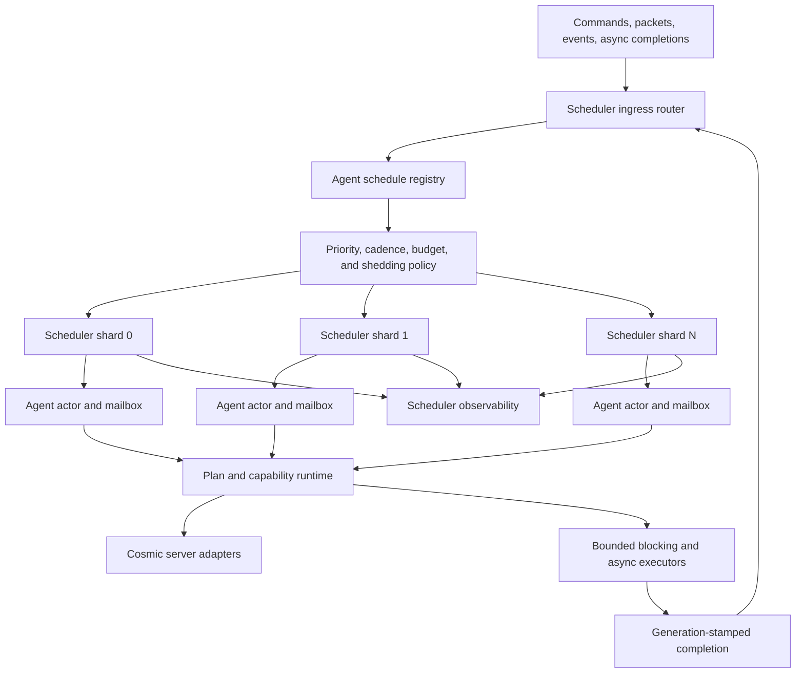

# Full Centralized Agent Scheduler Implementation Plan

## Purpose

This document defines the production migration from the current optional
sequential Agent dispatcher to a fully centralized, asynchronous, bounded, and
observable Agent scheduling runtime.

The target is not one thread per Agent and it is not one future per Agent. The
target is a small fixed set of scheduler workers that own all Agent execution,
accept external work through bounded mailboxes, and allocate work according to
visibility, simulation mode, priority, due time, and measured cost.

Primary scale target:

```text
500 concurrent real players
2000 concurrent Agents
30-day server uptime target
```

The scheduler must preserve the server as the authority for every state
mutation and must never allow Agent work to delay player-critical server work.

## Scope

The scheduler owns:

- Agent registration, cancellation, pause, resume, and quiescence.
- due-time calculation and cadence selection.
- shard ownership and single-writer Agent execution.
- bounded command and completion ingress.
- priority, fairness, cost, and time budgets.
- simulation-mode-aware tick frequency.
- overload handling and load shedding.
- scheduler lifecycle and shutdown draining.
- scheduler metrics, snapshots, and diagnostics.

The scheduler does not own:

- gameplay decisions.
- capability validation or execution semantics.
- plan selection.
- map, inventory, quest, trade, or combat authority.
- database persistence logic.
- navigation graph construction.
- LLM inference.
- economy decisions.

Those systems submit immutable work or wake-up signals and receive results;
they do not bypass Agent runtime ownership.

## Current Implementation Baseline

Implementation progress on `feature/agent-central-scheduler-runtime`:

- Phase 0 baseline evidence is committed under
  `docs/agents/evidence/central-scheduler/phase-0`.
- Phase 1 moves scheduler types under `server.agents.runtime.scheduler`, adds
  the stable `AgentScheduler` facade, immutable validated mode configuration,
  typed generation-bound handles, and an O(1) active-session index.
- `LEGACY_PER_AGENT` remains the default. `CENTRAL_SHARDED` is implemented as
  an explicit opt-in and remains blocked from production default rollout.
- Phase 2 makes mailbox ownership mandatory whenever either central mode is
  selected. Chat, whisper, equip, potion, follow, formation, pending-offer,
  Amherst mutation, airshow, and entry-scoped delayed callbacks now enter the
  owning session asynchronously through bounded mailboxes. Legacy mode retains
  its inline compatibility path unless mailboxes are explicitly enabled.
- Phase 3 replaces the central-sequential registration scan and per-cycle sort
  with one bounded-ingress shard and an indexed due-time heap. Producers submit
  one coalesced synchronization marker per admitted live/closing registration;
  only the scheduler cycle mutates due time and heap ownership. The 4096-record
  default admission bound reserves cleanup capacity for the 2000-Agent target.
- Phase 4 adds explicit work and priority classes, a 10 ms cycle deadline, a
  256-item hard guard, critical/visible reserved passes, per-registration cost
  EWMA, repeated starvation promotion up to interactive priority, immediate
  bounded continuations, and 2048-sample rolling delay/cost windows.
- Phase 5 isolates scheduler-reachable navigation, persistence, LLM/network,
  catalog, and economy work on bounded workload lanes with stamped mailbox
  completion.
- Phase 6 classifies the closed gateway inventory, routes known sibling writes
  through destination mailboxes, and implements fixed stable-hash shards with
  local and aggregate metrics.
- Phase 7 adds disabled-by-default simulation-aware cadence, O(1) map presence
  wake-ups, per-map background budgets, and materialization boundaries while
  preserving the authoritative guarded tick.
- Phase 8 adds disabled-by-default bounded guarded-tick frames, ordered slices,
  continuation limits, lifecycle cleanup, and per-slice metrics.

The repository already contains a safe foundation:

- `AgentTickSchedulingService` selects legacy or central scheduling.
- `AgentTickScheduler` is a lazy central dispatcher.
- `AgentRuntimeEntry` owns one bounded `AgentActionMailbox`.
- `AgentTickOrchestrator` drains the mailbox before gameplay work.
- `AgentTickRuntime` and the guarded tick path are shared by both scheduler
  modes.
- stale sessions are rejected by session generation.
- lifecycle cancellation removes scheduler registration.
- missed fixed-rate periods are skipped instead of replayed.
- one Agent failure does not terminate the central loop.
- scheduler cycle, lag, skip, slow, and failure counters exist.
- deterministic cadence parity and 500-session dispatcher tests exist.

Current mode selection:

```text
agents.scheduler.central.enabled=false
```

When enabled, the current dispatcher drains bounded registration ingress into
an indexed due-time heap, applies priority and cycle budgets, and runs selected
work through the same guarded tick. Stable-hash sharding, simulation cadence,
and tick slicing are implemented as separate explicit opt-ins. This is useful
for parity and scaling validation, but it is not yet the production-approved
2000-Agent scheduler.

## Current Gaps

The production target must address these gaps:

1. Tick slicing is implemented but disabled by default and lacks live-client
   parity plus measured p99 evidence.
2. Multi-shard ownership is explicit opt-in and has not completed live/soak
   production validation.
3. Background-active cadence exists, but abstract gameplay execution remains
   intentionally denied pending capability-specific reconciliation designs.
4. Mailbox and central scheduler compatibility flags are disabled by default.
5. Catalog rebuilds are not yet routed through the Phase 5 executor lane;
   current catalog loads are startup or explicit command work, not scheduler
   callbacks.
6. There is no formal overload or load-shedding state machine.
7. Pause/resume does not yet expose a wait-for-quiescence contract required by
    profile exchange and Double Agent operations.

## Implementation Readiness Audit

Original design audit baseline: `master` at `28555684e8` on 2026-07-12.
Current implementation baseline: `feature/agent-central-scheduler-runtime`
from `26264f4cc2` plus the committed phase checkpoints.

It is not safe to jump directly to `CENTRAL_SHARDED`, make central scheduling
the default, or change gameplay cadence. The following source facts are the
current mandatory migration inputs:

- `AgentSchedulerMode` exposes all three rollout modes. Legacy,
  central-sequential, and central-sharded have implementations; sharded mode is
  explicit opt-in and remains non-default.
- `AgentTickScheduler` now uses bounded coalesced ingress and an indexed
  one-shard due-time heap without a global registration scan or due-list sort.
- `AgentRuntimeRegistry.isActiveSession` now uses the generation-stamped O(1)
  Agent character index maintained at lifecycle registration and removal.
- `AgentActionMailbox` is bounded and generation-stamped. Central modes require
  mailbox ownership; legacy mode remains inline unless explicitly configured.
- chat command delivery is asynchronous and packet/event-loop paths do not
  wait for Agent mailbox results.
- delayed callbacks are classified; generation-scoped session mutations
  validate and enter through the owning mailbox.
- scheduler-reachable navigation graph construction, Amherst progress
  persistence, LLM/network work, and trade/item analysis use separate bounded
  workload executors and generation/request-stamped mailbox completions.
- direct future waits are absent under `server.agents`; synchronous navigation
  graph access is restricted by test to explicit debug/probe tools.
- scheduler metrics now include bounded rolling global and work-class delay/
  cost percentiles. Per-shard, priority, map, and simulation-mode breakdowns
  remain for the phases that introduce those dimensions.
- the existing 500-session soak proves 10,000 dispatcher callback invocations;
  it is not a 500-Agent gameplay, packet, database, or long-duration soak.
- capability/gameplay MVP proof is not complete. Scheduler foundations may be
  built behind disabled modes, but production default changes and behavioral
  cadence changes remain gated by capability parity evidence.

Readiness decision:

```text
Phase 0-1: ready to implement now
Phase 2: complete; evidence is recorded under phase-2
Phase 3: complete; evidence is recorded under phase-3
Phase 4: complete; evidence is recorded under phase-4
Phase 5: complete; evidence is recorded under phase-5
Phase 6 implementation: locally complete; live thread-affinity/parity gates remain
Phase 7+: ready only behind unchanged PRESENTATION behavior and disabled abstraction
Default CENTRAL_SHARDED: blocked on staged live and soak acceptance
```

No phase may reinterpret the existing 500-session unit soak as production
scale evidence.

## Required Invariants

The final design must preserve these invariants.

### One Agent, One Writer

At most one scheduler worker may execute mutable runtime work for a given
Agent session at a time.

```text
same Agent + same session generation -> one owning shard -> one active work item
```

External packet, command, async completion, LLM, database, console, and GM
threads must enqueue immutable messages. They must not mutate an active Agent
runtime directly.

### No Stale Session Work

Every registration, mailbox action, delayed wake-up, and async completion must
carry the Agent session generation. A generation mismatch is rejected without
mutation.

### Bounded Work

Every queue, mailbox, event buffer, completion queue, retry queue, and retained
history must have a capacity and an explicit saturation policy.

### No Blocking On Scheduler Workers

Scheduler workers must never wait for:

- SQL or character persistence.
- navigation graph construction or disk cache reads.
- LLM responses.
- HTTP calls.
- catalog rebuilds.
- slow file access.
- another Agent future.

Blocking work runs on a dedicated bounded executor. Its completion returns to
the owning Agent mailbox with the original session generation.

### Server Authority

The scheduler decides when Agent work may run. It never grants permission to
mutate game state. Capabilities and Cosmic integration adapters still validate
live map, character, inventory, quest, trade, and combat state.

### Player Work Wins

Agent workers and queues must be separate from player packet handling, core
server timers, save safety, and shutdown-critical work. Overload degrades Agent
fidelity before affecting player responsiveness.

### Cosmic Thread Affinity

Single-writer Agent ownership does not imply exclusive ownership of Cosmic
objects. Character, map, monster, drop, trade, inventory, packet, and event
instance APIs may have channel, map, timer, or lock-order assumptions.

Before multi-shard execution, every mutating integration gateway must be
classified as one of:

```text
SHARD_SAFE_DIRECT
SERVER_EXECUTOR_REQUIRED
READ_ONLY_SNAPSHOT
ASYNC_EXTERNAL
UNSAFE_PENDING_REFACTOR
```

`SERVER_EXECUTOR_REQUIRED` work must be submitted to the authoritative Cosmic
executor and return a generation-stamped completion; a shard must not wait for
it. `UNSAFE_PENDING_REFACTOR` blocks multi-shard rollout. The audit must cover
movement, map transfer, combat, mob control, loot, inventory, equipment, trade,
shop, NPC, quest, party, packet broadcast, death, and despawn.

### No Catch-Up Storm

Periodic work that misses several periods runs once using current state. It
does not replay every missed tick.

### Constant-Time Session Identity

Scheduler hot paths must not scan leader-owned collections to validate a live
session. Before the heap scheduler is accepted, the runtime registry must
provide an O(1) index keyed by stable Agent identity and session generation.
Register, replace, relogin, and remove must update the leader view and session
index atomically from the lifecycle boundary. Tests must prove stale
generations cannot become active again.

### Deterministic Cleanup

Despawn, logout, replacement, death cleanup, transfer, shutdown, and failed
spawn must cancel registration, invalidate queued work, fail pending results,
and release retained scheduler state.

## Target Architecture



## Recommended Package Layout

```text
server.agents.runtime.scheduler
  AgentScheduler
  AgentSchedulerMode
  AgentSchedulerConfig
  AgentSchedulerLifecycle
  AgentSchedulerIngress
  AgentSchedulerRouter
  AgentSchedulerShard
  AgentScheduleRegistry
  AgentScheduleState
  AgentScheduleHandle
  AgentScheduleCommand
  AgentWakeReason
  AgentWorkClass
  AgentPriorityClass
  AgentCadencePolicy
  AgentBudgetPolicy
  AgentFairnessPolicy
  AgentLoadSheddingPolicy
  AgentSchedulerClock
  AgentSchedulerSnapshot

server.agents.runtime.mailbox
  AgentMailbox
  AgentMailboxEnvelope
  AgentMailboxAction
  AgentMailboxResult
  AgentMailboxOverflowPolicy

server.agents.runtime.async
  AgentAsyncTaskGateway
  AgentAsyncCompletion
  AgentAsyncWorkKind
  AgentAsyncExecutorRegistry

server.agents.monitoring
  AgentSchedulerMetrics
  AgentSchedulerRollingWindow
  AgentSchedulerIncidentReporter

server.agents.integration.cosmic
  CosmicAgentSchedulerThreadFactory
  CosmicAgentServerHealthReader
```

The existing public registration path should remain a facade so spawn,
relogin, and lifecycle callers do not depend on scheduler internals.

## Scheduler Modes And Rollout Compatibility

Replace the final boolean-only choice with an explicit mode:

```text
LEGACY_PER_AGENT
CENTRAL_SEQUENTIAL
CENTRAL_SHARDED
```

Compatibility mapping:

```text
agents.scheduler.central.enabled=false -> LEGACY_PER_AGENT
agents.scheduler.central.enabled=true  -> CENTRAL_SEQUENTIAL
```

New configuration:

```text
agents.scheduler.mode=legacy|central-sequential|central-sharded
```

The old property remains supported during migration. The explicit mode wins
when both are present. Remove the old property only after at least one stable
release and documented migration warning.

## Agent Schedule State

Each live session owns a compact scheduler record. Suggested model:

```java
record AgentScheduleState(
    int agentCharacterId,
    long sessionGeneration,
    int shardId,
    AgentPriorityClass priority,
    AgentSimulationMode simulationMode,
    long nextRunAtNanos,
    long lastRunAtNanos,
    long lastEnqueuedAtNanos,
    long estimatedCostMicros,
    int consecutiveDeferrals,
    int consecutiveFailures,
    boolean queued,
    boolean running,
    boolean paused,
    boolean closing
) {}
```

The concrete implementation may use mutable shard-owned fields to avoid record
allocation. No field may be mutated concurrently outside its owning shard.

The state should also retain bit flags for coalescible wake reasons:

```text
PERIODIC_TICK
EXTERNAL_COMMAND
ASYNC_COMPLETION
MAP_EVENT
PLAN_EVENT
CAPABILITY_TIMER
LIFECYCLE
MATERIALIZATION
```

Multiple identical wake-ups coalesce into one pending bit. FIFO payloads remain
in the bounded per-Agent mailbox.

## Shard Ownership

Use a fixed number of long-lived scheduler shards. Default sizing should be
conservative:

```text
workers = clamp(1, availableProcessors / 2, 4)
```

Make the worker count configurable and require restart to change it.

Assign initial ownership using a stable hash of Agent character ID and session
generation. Stable ownership provides:

- single-writer Agent runtime mutation.
- no lock around ordinary Agent state.
- predictable cache locality.
- balanced ownership independent of map population.

Do not migrate ownership on every map change. Map-aware priority and budgets
should use map metadata without making map ID the ownership key. Dynamic shard
rebalancing is deferred until metrics prove static hashing is insufficient.

Shared map mutations must continue through existing server-authoritative APIs.
Before enabling more than one shard, audit the movement, combat, loot, trade,
NPC, and map-object adapters for assumptions introduced by the currently
sequential central dispatcher. Multi-shard rollout is blocked until this audit
and focused concurrency tests pass.

## Queue Design

Each shard owns:

1. A bounded multi-producer ingress queue.
2. A shard-local due-time heap or timing wheel.
3. A shard-local ready queue separated by priority.
4. Agent schedule state for its registrations.

For the first production implementation, use an indexed minimum heap ordered
by `nextRunAtNanos`, then registration sequence. At 2000 Agents this is simple,
bounded, and avoids the current full scan and per-cycle sort.

Only the shard worker mutates its heap. Other threads submit commands:

```text
REGISTER
CANCEL
WAKE
PAUSE
RESUME
QUIESCE
UPDATE_MODE
UPDATE_PRIORITY
ASYNC_COMPLETE
SHUTDOWN
```

Ingress saturation behavior:

- lifecycle cancel and shutdown: reserve capacity or use a dedicated critical
  lane; never drop.
- duplicate wake: coalesce by Agent and wake-reason bit.
- cosmetic/social wake: reject or coalesce first.
- background planning wake: defer with metric.
- player-directed command: reject with a structured busy result if bounded
  capacity is exhausted.

Do not use an unbounded executor queue as the scheduler.

## Execution Model

The scheduler is asynchronous across Agents but serial within one Agent.

```text
external event
  -> immutable mailbox envelope
  -> owning shard receives wake signal
  -> shard selects Agent under budget
  -> drain bounded mailbox actions
  -> run one bounded Agent work slice
  -> calculate next due time
  -> reinsert schedule state
```

An Agent callback may request async work:

```text
Agent work slice
  -> submit immutable async request to bounded executor
  -> mark capability WAITING_EXTERNAL
  -> finish scheduler slice immediately
  -> completion stamped with Agent ID + generation + request ID
  -> completion enters Agent mailbox
  -> scheduler wakes owning shard
  -> capability validates completion and resumes
```

No scheduler worker calls `Future.get`, joins a `CompletableFuture`, sleeps, or
polls for external completion.

## Work Classes

Use explicit work classes so diagnostics and shedding are understandable:

```text
LIFECYCLE_CRITICAL
PLAYER_DIRECTED
PRESENTATION_MOVEMENT
PRESENTATION_GAMEPLAY
BACKGROUND_GAMEPLAY
PLAN_ADVANCE
ASYNC_COMPLETION
SOCIAL
COSMETIC
MAINTENANCE
```

Lifecycle cleanup and async completion delivery are work classes, not special
threads mutating Agent state.

## Priority Classes

Recommended priority order:

1. `CRITICAL`: despawn, release, death cleanup, session replacement, shutdown.
2. `INTERACTIVE`: direct player command, trade response, visible NPC response.
3. `VISIBLE`: movement, combat, loot, and presentation in a real-player map.
4. `BACKGROUND_ACTIVE`: stateful work in an unobserved sensitive map.
5. `BACKGROUND_ABSTRACT`: ETA/event-driven invisible progress.
6. `DEFERRED`: planning, profile adaptation, social, cosmetic, LLM follow-up.

Priority affects admission and latency target, but it must not permit permanent
starvation. Every deferred item accumulates age credit. Once its wait exceeds a
configured threshold, the effective priority rises by one level, excluding
work intentionally paused by load shedding.

## Budget Model

Every shard cycle has both a time budget and a work-count guard:

```text
cycleDeadline = cycleStart + shardBudgetNanos
maxWorkItemsPerCycle = configured hard guard
```

Stop selecting ordinary work when either limit is reached. Critical cleanup may
use a small reserved budget.

Track an exponentially weighted moving average of each Agent/work-kind cost:

```text
estimatedCost = alpha * lastCost + (1 - alpha) * previousEstimate
```

Use the estimate for admission. Do not start a known expensive background item
when it would consume the remaining visible-work reserve.

Initial budget configuration should be measured, not guessed. Suggested knobs:

```text
agents.scheduler.shards=auto
agents.scheduler.cycleBudgetMs=10
agents.scheduler.maxWorkItemsPerCycle=256
agents.scheduler.visibleReservePercent=40
agents.scheduler.criticalReservePercent=10
agents.scheduler.maxAgentSliceMs=25
agents.scheduler.starvationPromotionMs=2000
```

`maxAgentSliceMs` initially detects and reports monolithic slow ticks; it cannot
safely interrupt Java code. Persistent offenders must be decomposed into
resumable capability slices.

## Cadence Policy

Cadence belongs to policy, not individual ad hoc scheduled futures.

Initial policy bands:

```text
PRESENTATION:
  movement/presentation  50 ms
  ordinary AI           250-500 ms

BACKGROUND_ACTIVE:
  state update          250-1000 ms
  perception refresh    shared and reduced

BACKGROUND_ABSTRACT:
  no continuous movement tick
  wake on ETA, event, command, or coarse heartbeat
  heartbeat             5-30 seconds

PAUSED/OFFLINE:
  no periodic gameplay work
  lifecycle and explicit wake only
```

The policy returns the next due time based on:

- simulation mode.
- current capability status.
- visible player presence.
- pending mailbox work.
- route or action ETA.
- recovery deadline.
- map sensitivity.
- failure backoff.
- load-shedding level.

Cadence changes must preserve existing visible behavior before invisible modes
are optimized.

## Tick Decomposition

The existing guarded tick remains the parity unit for the first migration.
After central-sharded parity, split the monolithic callback into bounded work
slices:

1. mailbox and lifecycle preflight.
2. simulation-mode transition.
3. perception refresh or shared snapshot acquisition.
4. plan/objective update when due.
5. one active capability frame step.
6. movement/presentation step when due.
7. outcome/event publication.
8. next-run hint calculation.

Each slice returns a result such as:

```java
record AgentWorkResult(
    AgentWorkStatus status,
    long nextRunAtNanos,
    AgentWakeReason waitReason,
    int estimatedFutureCost,
    boolean immediateContinuation
) {}
```

Immediate continuation is bounded. A capability may not loop indefinitely in
one scheduler turn.

## Mailbox Migration

The current mailbox foundation becomes mandatory in stages.

Move these external mutations behind immutable actions:

1. player chat and direct commands.
2. follow, stop, grind, and navigation commands.
3. trade and shop responses.
4. party and social events.
5. Agent Console commands.
6. async navigation completion.
7. persistence completion.
8. LLM and planner completion.
9. map presence and simulation-mode events.
10. Double Agent profile transition requests.

Each action must define:

- session generation.
- work class.
- deduplication/coalescing key if applicable.
- expiry deadline if stale commands should be discarded.
- completion future only when the caller truly requires a response.
- overload result.

Do not block network event-loop threads waiting for a scheduler result. Existing
synchronous command behavior must either use a short bounded handoff with no
server locks held or be converted to an asynchronous reply.

For this repository, packet/event-loop callers use asynchronous replies. The
target command contract is:

```text
caller validates syntax and authorization
  -> submit bounded Agent command envelope
  -> return from packet/event-loop handler without waiting
  -> owning shard applies or rejects command
  -> result is emitted through Agent reply/command-result delivery
```

Result futures are optional observability handles, not permission to block a
network, scheduler, map, or core timer thread. Every result has a deadline;
session close, replacement, overflow, or expiry completes it exceptionally and
removes retained state. Tests must fail if production packet handlers call
`get`, `join`, or unbounded waits on Agent results.

Mailbox enqueue must also signal the owning scheduler shard. An action must not
wait for the next periodic gameplay cadence merely because the Agent was idle
or scheduled far in the future. Wake signals are generation-stamped,
coalescible, and bounded; payload ordering remains in the per-Agent mailbox.

## Delayed Callback Migration

Every Agent-related delayed callback must receive one final classification:

```text
SESSION_SCOPED_ACTION
GLOBAL_AGENT_MAINTENANCE
PRESENTATION_CLEANUP
ASYNC_EXTERNAL_COMPLETION
DELETE_AS_REDUNDANT
```

`SESSION_SCOPED_ACTION` carries Agent ID, generation, work class, expiry, and a
wake reason. It returns through scheduler ingress rather than mutating runtime
from `TimerManager`. Global maintenance and presentation cleanup may retain a
server timer only when they do not mutate Agent session state; that exception
must be documented at the call site. Lifecycle removal cancels or invalidates
all session-scoped delayed work.

## Async Work Isolation

Use separate bounded executors by workload characteristic:

```text
navigation graph build/load
database and persistence
LLM/network
catalog rebuild
economy batch analysis
```

Do not put unrelated slow work into one global queue. Each executor exposes:

- active count.
- queue depth and capacity.
- submitted, completed, rejected, failed, and timed-out counts.
- p50/p95/p99 duration.

The scheduler receives only immutable completion summaries. Large graph,
inventory, or prompt objects should remain in their owning cache/service and be
referenced by bounded IDs or compact immutable views where practical.

## Lifecycle State Machine

Suggested scheduler lifecycle:

```text
NEW
  -> REGISTERED
  -> RUNNABLE
  -> RUNNING
  -> WAITING
  -> PAUSED
  -> QUIESCING
  -> QUIESCENT
  -> CLOSING
  -> CLOSED
```

Valid behavior:

- registration is idempotent for the same session generation.
- replacement invalidates the old generation before the new session runs.
- cancel is safe before, during, or after a tick.
- a running tick observes closing at its next bounded checkpoint.
- closed sessions cannot be resumed.
- all pending mailbox results fail with a structured session-closed reason.

## Pause And Quiescence Contract

Ordinary pause means no gameplay work is selected, but critical lifecycle and
completion cleanup may still run.

Profile switching, Double Agent, ownership transfer, and safe snapshots need a
stronger contract:

```java
CompletionStage<AgentQuiescenceToken> quiesce(
    AgentSessionId session,
    AgentQuiescenceReason reason,
    Duration timeout);
```

Quiescence completes only when:

- no Agent work item is running.
- no mutable capability commit is in progress.
- queued ordinary actions are either drained or frozen by policy.
- the returned token identifies the same session generation.

Resume requires the valid token or an explicit lifecycle recovery path. A
timed-out quiescence request must fail without pretending the Agent is safe to
switch.

## Failure Policy

Failure handling remains per Agent.

Recommended policy:

1. Record failure with Agent, map, work class, capability, and duration.
2. Complete the current action with a structured failure.
3. Apply bounded exponential backoff for repeated non-critical failures.
4. Reset the streak after a successful guarded work slice.
5. Quarantine an Agent after the configured threshold.
6. Keep lifecycle cleanup schedulable while quarantined.
7. Never stop a shard because one Agent throws.

Fatal JVM errors should not be swallowed as ordinary Agent failures. Preserve
the repository's established fatal-error policy.

## Load Shedding

Define explicit levels driven by scheduler delay, queue pressure, CPU, heap,
GC, and server health:

```text
LEVEL_0 NORMAL
LEVEL_1 SUPPRESS_COSMETIC
LEVEL_2 REDUCE_BACKGROUND_CADENCE
LEVEL_3 PAUSE_DEFERRED_AND_LLM
LEVEL_4 PAUSE_LOW_PRIORITY_BACKGROUND
LEVEL_5 ADMISSION_CONTROL
```

Shedding order:

1. cosmetic dialogue, emotes, fidgets, and social chatter.
2. background perception refresh frequency.
3. profile adaptation, economy analysis, and LLM work.
4. low-priority background Agent progress.
5. new Agent admission or materialization.

Never shed:

- despawn and stale-session cleanup.
- shutdown safety.
- canonical profile restoration.
- visible safety-critical movement/combat cleanup.
- completion handling needed to release resources.

All shedding decisions require reason-coded metrics.

## Map Awareness

Maintain a compact map scheduling summary outside individual Agent scans:

```text
map ID
real player count
Agent count by simulation mode
map sensitivity
visible work demand
background work demand
recent map cost
```

Map presence changes should publish one event that wakes affected Agents or
updates a shared mode epoch. Do not have every Agent scan the channel/map on
every tick to discover player presence.

Per-map budget caps prevent one crowded map from consuming all Agent capacity.
Visible Agents remain prioritized, but a crowded visible map may share a map
budget fairly across its Agents.

## Fairness

Fairness applies at three levels:

1. priority-class fairness using reserved budgets.
2. map fairness using per-map deficit or weighted round robin.
3. Agent fairness using wait age and consecutive deferrals.

Recommended selection key:

```text
effective priority
then due time
then map deficit
then Agent wait age
then stable registration sequence
```

Exact ordering may be optimized, but tests must prove that a continuously busy
visible population cannot starve cleanup and that background Agents still make
bounded progress under normal load.

## Configuration

All scheduler configuration should be immutable after startup unless a field is
explicitly documented as safe for live tuning.

Proposed settings:

```text
agents.scheduler.mode=legacy
agents.scheduler.shards=auto
agents.scheduler.baseWakeMs=10
agents.scheduler.cycleBudgetMs=10
agents.scheduler.maxWorkItemsPerCycle=256
agents.scheduler.ingressCapacityPerShard=4096
agents.scheduler.maxAgentSliceMs=25
agents.scheduler.visibleReservePercent=40
agents.scheduler.criticalReservePercent=10
agents.scheduler.starvationPromotionMs=2000
agents.scheduler.quiescenceTimeoutMs=5000
agents.scheduler.failureBackoffBaseMs=250
agents.scheduler.failureBackoffMaxMs=30000
agents.scheduler.failureQuarantineThreshold=3
agents.scheduler.logSlowWork=true
agents.scheduler.slowWorkMs=25
```

Validate at startup:

- capacities and budgets are positive.
- reserve percentages do not exceed 100.
- worker count is within a safe bound.
- timeout and backoff ranges are coherent.
- unknown mode fails startup with a clear message.

Do not silently convert an invalid production configuration into an unbounded
mode.

Configuration is resolved once at startup into an immutable
`AgentSchedulerConfig` value. Resolution precedence is:

```text
explicit JVM property
  -> config.yaml Agent scheduler setting
  -> documented default
```

The legacy `agents.scheduler.central.enabled` property is consulted only when
`agents.scheduler.mode` is absent. The resolved configuration and source of
each non-default override are logged once without secrets. Tests cover invalid
mode, invalid percentages, zero/negative capacities, legacy compatibility, and
explicit-mode precedence.

## Observability

Required global metrics:

- registered, runnable, waiting, paused, quiescent, and quarantined Agents.
- queue depth and high-water mark by shard and priority.
- due and overdue work.
- scheduler delay p50/p95/p99.
- work duration p50/p95/p99 by work class and simulation mode.
- cycle duration and budget utilization.
- budget overruns and Agent slice overruns.
- fairness deferrals and starvation promotions.
- load-shedding level and shed counts by reason.
- stale generation rejection count.
- mailbox submitted, coalesced, rejected, expired, and drained counts.
- async request and completion counts by executor.
- shard ownership counts and imbalance.
- lifecycle registration, replacement, cancel, and cleanup counts.

Required top-N views:

- slowest Agents.
- most overdue Agents.
- busiest maps.
- highest-cost capabilities.
- largest mailboxes.
- most frequently failing Agents.

Required correlation:

- player count.
- player packet latency where available.
- heap and GC pauses.
- DB pool active/waiting.
- save queue pressure.
- map count and broadcast pressure.

Metrics must use bounded rolling windows. Do not retain one event per tick for
30 days.

## Administrative Diagnostics

Provide read-only diagnostics first:

```text
!agentscheduler status
!agentscheduler shards
!agentscheduler top slow
!agentscheduler top overdue
!agentscheduler agent <name|id>
!agentscheduler map <mapId>
```

Later guarded operations may include:

```text
!agentscheduler pause <agent>
!agentscheduler resume <agent>
!agentscheduler quarantine <agent>
!agentscheduler unquarantine <agent>
```

Do not provide a live command that changes shard count. Mode changes and worker
count changes require restart until a proven safe migration mechanism exists.

## Shutdown

Shutdown sequence:

1. stop new Agent admissions and external ordinary commands.
2. enqueue critical close for all sessions.
3. stop selecting new gameplay work.
4. drain lifecycle and resource-release completions within a deadline.
5. quiesce profile/persistence boundaries.
6. cancel remaining async requests where supported.
7. fail unresolved mailbox futures.
8. close shard ingress.
9. join scheduler workers.
10. publish final scheduler snapshot.

Shutdown must have a hard deadline and report sessions that failed to close.
It must not wait forever for an LLM, graph load, or database request.

## Implementation Phases

### Required Evidence Layout

Implementation evidence is stored under:

```text
docs/agents/evidence/central-scheduler/<phase>/
  SUMMARY.md
  COMMANDS.md
  METRICS.md
  PARITY.md
  REMAINING_RISKS.md
```

Generated logs, heap dumps, recordings, and large profiler captures stay out
of Git; `SUMMARY.md` records their local path, timestamp, build commit, test
population, duration, configuration, and checksum when retained.

Every phase records:

- commit and scheduler mode.
- exact compile/test/soak commands.
- Agent and real-player population.
- duration and workload mix.
- scheduler delay, work cost, queue depth, rejection, failure, heap, GC, DB,
  packet-latency, and shutdown observations available for that phase.
- behavior parity result and any required live-client validation.
- rollback procedure tested for that phase.

Phase 0 must add a repeatable synthetic harness for 50/100/250/500 sessions and
must explicitly label dispatcher-only measurements. Live gameplay evidence is
recorded separately and cannot be inferred from synthetic callback counts.

### Phase 0: Freeze And Measure Baseline

Work:

- keep legacy and current central-sequential behavior unchanged.
- capture 50, 100, 250, and 500 Agent baseline metrics.
- record visible movement/combat/dialogue parity.
- identify current slow tick components.
- create the evidence directory and population harness.
- record legacy and central-sequential results separately.

Exit:

- repeatable baseline evidence exists.
- no unexplained failures in current scheduler parity tests.
- the harness reports workload type and does not claim live gameplay coverage.

### Phase 1: Extract Stable Scheduler API

Work:

- move scheduler classes under a scheduler package behind `AgentScheduler`.
- preserve `AgentTickSchedulingService` as the lifecycle facade.
- add explicit scheduler mode configuration.
- add typed registration/session identifiers.
- add the O(1) active-session generation index.
- keep central-sequential behavior identical.

Exit:

- legacy and central-sequential parity tests pass unchanged.
- spawn, relogin, replacement, and despawn use only the facade.
- scheduler hot-path session validation performs no leader-list scan.

### Phase 2: Mandatory Mailbox Ownership

Work:

- inventory all external Agent mutations.
- inventory and classify all delayed callbacks.
- migrate them one family at a time to immutable mailbox actions.
- add coalescing, expiry, and overload result contracts.
- replace packet/event-loop waits with asynchronous result delivery.
- make mailbox enqueue wake the owning scheduler.
- remove direct external mutable runtime access after each family moves.

Exit:

- static scan and focused tests show external entry points use mailbox/facade.
- no network, scheduler, map, or core timer thread waits on Agent results.
- every delayed callback has a documented final classification.

### Phase 3: Single-Shard Heap Scheduler

Status: complete on `feature/agent-central-scheduler-runtime`. Evidence is
recorded under `docs/agents/evidence/central-scheduler/phase-3`. This is
dispatcher-only proof; live-client and long-duration scale evidence remain
required before a default change.

Work:

- implement shard-local ingress and indexed due-time heap.
- run with exactly one shard.
- remove global per-cycle registration scan and sort.
- preserve current full guarded tick as the work item.

Exit:

- cadence and behavior parity pass.
- scheduler registration/removal remains leak-free.
- 500-Agent deterministic soak has bounded queue and delay.

### Phase 4: Time And Cost Budgets

Status: complete on `feature/agent-central-scheduler-runtime`. Evidence is
recorded under `docs/agents/evidence/central-scheduler/phase-4`. All current
production full ticks enter as visible gameplay; later capability slicing and
simulation policy will assign narrower work classes without changing this
phase's scheduling contract.

Work:

- add cycle deadline, work-count guard, cost EWMA, and reserved budgets.
- add priority queues and starvation aging.
- add rolling latency/cost metrics.
- detect slow monolithic callbacks.

Exit:

- overload tests prove bounded cycle duration.
- critical and visible work meet latency targets under synthetic background load.
- background work makes progress under normal load.

### Phase 5: Async Completion Contract

Work:

- define `AgentAsyncTaskGateway` and generation-stamped completions.
- route navigation, DB, LLM, and other blocking completions through mailboxes.
- prohibit waits on scheduler threads with tests and code scans.

Exit:

- stale completions are rejected.
- executor saturation releases permits and pending state.
- scheduler workers remain responsive during slow external operations.

### Phase 6: Multi-Shard Execution

Local implementation status: complete behind explicit opt-in. Gateway affinity,
stable ownership, same/different-map deterministic execution, failure isolation,
and concurrent cancellation evidence are recorded under
`docs/agents/evidence/central-scheduler/phase-6`. Live packet-visible capability
stress and staged population soak remain rollout gates.

Work:

- audit shared-map integration adapters.
- record the thread-affinity classification for every mutating gateway.
- enable stable-hash shard ownership.
- add shard-local state and imbalance metrics.
- test simultaneous Agents in the same and different maps.

Exit:

- no duplicate execution for one Agent.
- no lost registration during concurrent lifecycle events.
- map/combat/loot/trade tests pass under concurrency.
- no `UNSAFE_PENDING_REFACTOR` gateway is reachable in multi-shard mode.
- ThreadSanitizer-equivalent stress assertions or deterministic race harnesses
  find no known ownership violations.

### Phase 7: Simulation-Aware Cadence

Status: locally complete on `feature/agent-central-scheduler-runtime`, disabled
by default. Evidence is recorded under
`docs/agents/evidence/central-scheduler/phase-7`. Map observation transitions,
mode-owned cadence and priority, and materialization/reconciliation extension
points are implemented. Every mode still executes the normal guarded tick;
abstract gameplay, ETA travel, packet suppression, and other compressed
outcomes remain disabled and out of this phase.

Work:

- consume real-player map-presence events.
- integrate presentation, background-active, and background-abstract modes.
- replace invisible movement ticks with ETA/event wake-ups where implemented.
- add map budgets.

Exit:

- visible behavior remains unchanged.
- invisible Agent work drops measurably.
- materialization produces valid state.

### Phase 8: Tick Slicing

Status: locally complete on `feature/agent-central-scheduler-runtime`, disabled
by default. Evidence is recorded under
`docs/agents/evidence/central-scheduler/phase-8`. The guarded tick retains its
existing call order and early-return behavior while central modes may execute
the frame in bounded turns. Live-client parity and measured p99 targets remain
rollout gates.

Work:

- split guarded full tick into bounded lifecycle, plan, capability, movement,
  and outcome slices.
- add continuation limits and next-run hints.
- remove known long loops from scheduler turns.

Exit:

- p99 Agent slice duration stays within the measured target.
- objective/capability behavior remains equivalent.

### Phase 9: Load Shedding And Admission Control

Work:

- implement explicit shedding levels.
- correlate with server health.
- add reason-coded suppression and recovery hysteresis.
- add Agent population admission limits.

Exit:

- synthetic overload preserves real-player responsiveness.
- scheduler recovers without a thundering herd.
- critical cleanup is never shed.

### Phase 10: Quiescence And Profile Operations

Work:

- implement strong quiescence tokens.
- integrate Double Agent/profile exchange, transfer, snapshots, and release.
- test timeout, rollback, disconnect, and shutdown behavior.

Exit:

- profile operations cannot overlap mutable Agent work.
- canonical profile restoration is guaranteed before save/release.

### Phase 11: Scale Soak And Default Change

Run:

```text
250 Agents  -> functional baseline
500 Agents  -> scheduler parity and player responsiveness
1000 Agents -> mixed visible/background modes
1500 Agents -> load shedding and recovery
2000 Agents -> 8-hour, 24-hour, then multi-day soak
```

Only change the production default after:

- no unbounded scheduler or mailbox growth.
- no post-warmup heap growth trend attributable to scheduler state.
- no duplicate or stale Agent execution.
- clean spawn, death, relogin, transfer, despawn, and shutdown.
- acceptable player login, map change, combat, NPC, trade, and shop latency.
- visible Agent movement/combat/dialogue parity passes.
- rollback mode remains tested.

## Automated Test Matrix

### Unit Tests

- registration is idempotent by session generation.
- replacement invalidates old registration and queued work.
- heap returns due work without global scan.
- missed cadence coalesces to one execution.
- priority order respects reserved budgets.
- aging prevents ordinary starvation.
- mailbox capacity, coalescing, expiry, and close behave correctly.
- stale async completion is rejected.
- pause prevents ordinary work.
- quiescence waits for active work and returns a generation-bound token.
- cancel during running work closes after the bounded checkpoint.
- failure backoff and quarantine are bounded.
- load shedding never rejects critical cleanup.
- configuration rejects unsafe values.

### Deterministic Scheduler Tests

Use a fake monotonic clock and manually driven shards:

- exact cadence over many periods.
- stable ordering for equal due times.
- cost budget admission.
- round-robin/map fairness.
- burst wake coalescing.
- clock jump resilience.
- no replay storm after a long pause.
- shard assignment stability.
- shutdown drain ordering.

### Integration Tests

- spawn -> register -> follow -> despawn.
- relogin and session replacement.
- death and recovery.
- movement, navigation, combat, loot, NPC, quest, trade, and shop flows.
- async navigation success, failure, timeout, and stale completion.
- map change while work is queued.
- player enters an Agent-only map and triggers materialization priority.
- Double Agent quiescence and profile exchange.
- server shutdown with active and waiting Agents.

### Concurrency Stress Tests

- repeated register/cancel/wake for the same Agent.
- 2000 sessions across all shards.
- many Agents in one map.
- all Agents due simultaneously.
- executor saturation while scheduler remains responsive.
- mailbox saturation during session replacement.
- slow Agent callback while other shards continue.
- forced failures do not terminate a shard.

### Live Gameplay Tests

With one observing client:

- visible Agent follows, navigates, climbs, attacks, loots, talks, trades, dies,
  and recovers normally.
- direct commands respond within the expected latency.
- Agent effects and mob reactions remain visible.
- leaving and re-entering a map preserves valid Agent state.

With two observing clients:

- both clients see consistent movement, combat, death, and map transitions.
- no duplicate packets or double Agent actions occur.

## Soak Pass Criteria

Initial targets should be recorded as measured service-level objectives after
baseline collection. At minimum, a 2000-Agent soak passes only when:

- scheduler ingress and mailbox depths remain bounded.
- p95 and p99 scheduler delay stabilize rather than grow continuously.
- no shard remains permanently saturated.
- no Agent executes concurrently with itself.
- no stale generation mutation occurs.
- heap, mailbox, registration, and completion object counts return after Agent
  removal.
- heap usage plateaus after warmup.
- GC pause trend remains acceptable.
- DB pool waiting does not grow because of scheduler workers.
- real-player actions remain responsive.
- shutdown completes within its configured deadline.

## Rollback Plan

Until central-sharded scheduling has completed production soak:

- retain `LEGACY_PER_AGENT`.
- retain `CENTRAL_SEQUENTIAL`.
- keep the guarded tick callback shared.
- avoid schema changes that prevent old-mode startup.
- make migration state reconstructible from `AgentRuntimeRegistry`.

Rollback requires restart. On startup, scheduler registrations are rebuilt from
live Agent lifecycle registration; no in-memory heap or shard state is treated
as persistent truth.

## Documentation Updates During Implementation

Every phase must update:

- this implementation plan with completion evidence.
- `AGENT_CENTRAL_SCHEDULER.md` for current operating instructions.
- `AGENT_ENGINE_SCALING_TRACK.md` for scaling status.
- `RECONSTRUCTION_RULES.md` when an ownership boundary changes.
- Agent soak test documentation with commands and observed metrics.

Do not mark a phase complete from code presence alone. Record tests, live
behavior evidence, and remaining rollback conditions.

## Mandatory Source Scans

Run and record these scans during Phase 0, after each ownership migration, and
before changing the default mode:

```powershell
rg -n "AgentSchedulerRuntime\.(schedule|register)\(" src/main/java/server/agents
rg -n "TimerManager" src/main/java/server/agents
rg -n "\.get\([^)]*TimeUnit|\.join\(\)|Thread\.sleep" src/main/java/server/agents
rg -n "agents\.mailbox\.enabled|agents\.scheduler\.central\.enabled" src/main/java src/test/java
rg -n "ScheduledFuture" src/main/java/server/agents
```

Each match is classified in phase evidence; scans are not expected to be empty
until the phase that owns the match is complete. The final scan may retain
server-timer usage only for documented global maintenance or presentation
cleanup that cannot mutate a live Agent session.

## Definition Of Done

The full centralized scheduler is complete when:

1. All live Agents register through one scheduler facade.
2. No Agent owns a repeating scheduled future.
3. A fixed bounded set of shards owns all Agent runtime execution.
4. One Agent is never mutated by two scheduler workers concurrently.
5. External mutations and async completions enter through bounded mailboxes.
6. Scheduler workers never block on I/O or external futures.
7. Scheduling is due-time, priority, fairness, map, simulation-mode, and cost
   aware.
8. Overdue periodic work coalesces instead of replaying.
9. Load shedding protects real-player responsiveness.
10. Lifecycle cleanup and shutdown are deterministic.
11. Rolling metrics expose delay, cost, pressure, fairness, and failures.
12. Visible Agent behavior passes parity tests.
13. 2000 mixed-mode Agents pass the staged soak criteria.
14. Legacy rollback remains available for at least one proven release.

The intended result is a centralized Agent actor runtime, not merely a shared
timer: thousands of Agents make asynchronous progress through bounded work,
while each individual Agent remains deterministic, single-writer, observable,
and subordinate to the authoritative Cosmic server.
