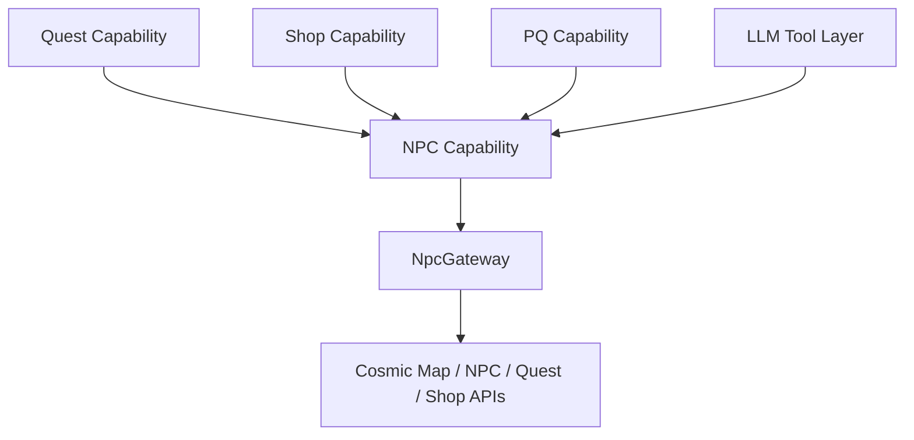

# NPC Capability Plan

This plan is intentionally separate from the active Agent reconstruction. The
goal is to prepare data and boundaries now, then plug them into
`server.agents.capabilities.npc` later.

## Target Shape



## First Plug-In Boundary

Start with read-only lookup and planning:

- `AgentNpcCatalog`
- `AgentNpcPlacement`
- `AgentNpcApproachPoint`
- `AgentNpcInteractionBox`
- `AgentNpcDialogueTiming`
- `AgentNpcCatalogRepository`
- `AgentNpcRuntimeValidator`
- `AgentNpcApproachPointChooser`
- `AgentNpcInteractionCommand`
- `AgentNpcInteractionResult`
- `AgentNpcInteractionAudit`

Do not start by executing quest/shop actions.

The runtime-facing lookup contract is documented in
`docs/agents/NPC_CATALOG_INTEGRATION_CONTRACT.md`.

## Validation Boundary

Before an Agent direct-calls quest or shop behavior, validate:

- same map
- NPC exists
- NPC placement matches catalog row when possible
- chosen point is inside interaction box
- agent is close enough
- chosen point is reachable by navigation
- agent is not in a blocking state
- quest start/complete requirements are satisfied
- reward choice policy is available when a choice is required
- action is not marked script-sensitive/manual-review
- live server still agrees with catalog action type

Blocking states include:

- dead
- changing map
- in trade / hired merchant / miniroom
- in cash shop or MTS
- already in NPC/script conversation
- stunned or otherwise unable to move/interact
- inventory full when the interaction may grant items
- plan objective cancelled or timed out

## Variation Rules

To avoid identical-looking agents:

- choose an approach point with stable seeded randomness
- reserve approach points temporarily
- prefer same foothold but allow lower/nearby platforms where the box permits
- use dialogue timing estimates for pre-action delay
- reduce delay for repeated dialogue
- use profile-specific reading speeds and jitter
- choose from multiple valid NPC placements when the same NPC exists in several
  maps and the plan does not require a specific one
- avoid recently failed approach points
- avoid clustering with other agents by using short-lived point reservations

## Manual Override Strategy

Keep generated data and manual tuning separate:

```text
generated data: tmp/npc-catalog/*.json
manual overrides: docs/agents/npc_overrides.example.yaml as template
```

Later, move real overrides to config or database if runtime needs them.

## Safe Implementation Order

1. Generate catalog, map summaries, and validation reports.
2. Add read-only Agent NPC model classes.
3. Load catalog behind a repository interface.
4. Add approach-point chooser with stable randomness.
5. Add live range/reachability validators.
6. Add structured command/result/audit models.
7. Add validation-only dry-run command.
8. Integrate shop approach only.
9. Integrate shop buy/sell through protected item and budget policies.
10. Integrate quest start/complete direct calls.
11. Add reward choice policy.
12. Add script-sensitive/manual-review gates.
13. Add failure memory for unreachable points and blocked NPC rows.
14. Expose limited LLM tools.
15. Add integration tests for Maple Island quest start/complete and shop usage.

Do not let an LLM call raw quest/shop functions. It should call controlled
Agent tools that use the validators above.

## Required Runtime Models

`AgentNpcInteractionCommand` should include:

- agent id.
- objective id.
- requested action type: quest start, quest complete, shop buy, shop sell,
  dialogue option, travel service, storage, job advance.
- npc id.
- map id.
- optional placement key.
- optional quest id.
- optional shop id.
- optional item id/quantity.
- attempt number.
- presentation mode flag for simulated delay.

`AgentNpcInteractionResult` should include:

- status.
- reason code.
- selected placement key.
- selected approach point.
- movement result when movement was needed.
- delay applied.
- live validation snapshot.
- changed quest/item/meso state.
- retry recommendation.

Recommended status values:

- `SUCCESS`
- `VALIDATION_ONLY_SUCCESS`
- `BLOCKED_REQUIREMENT`
- `BLOCKED_MANUAL_REVIEW`
- `BLOCKED_AGENT_STATE`
- `NPC_MISSING`
- `PLACEMENT_MISMATCH`
- `OUT_OF_RANGE`
- `UNREACHABLE`
- `INVENTORY_FULL`
- `REWARD_CHOICE_UNRESOLVED`
- `SHOP_ITEM_UNAVAILABLE`
- `SCRIPT_FAILED`
- `TIMEOUT`
- `CANCELLED`

## Implementation Acceptance

The NPC capability is ready for Maple Island MVP when:

- an agent can find a quest NPC from catalog data.
- an agent can select a non-identical valid approach point.
- runtime validates live NPC presence and range.
- runtime explains unmet quest requirements.
- runtime starts and completes a quest without dialogue replay.
- runtime applies dialogue-length delay when enabled.
- runtime blocks script-sensitive/manual-review NPCs.
- runtime can resume after relog without repeating completed quest actions.
- runtime logs every NPC interaction result with reason codes.

It is ready for full-game expansion when:

- shop buy/sell uses budget and protected-item policies.
- reward choices use profile/economy/catalog scoring.
- travel-service NPCs are represented as controlled actions.
- job-advance NPCs are gated by class/stat/level requirements.
- storage/MTS/cash-shop-like interactions are either supported or explicitly
  blocked.
- all inferred interaction labels have manual-review or validation coverage.
