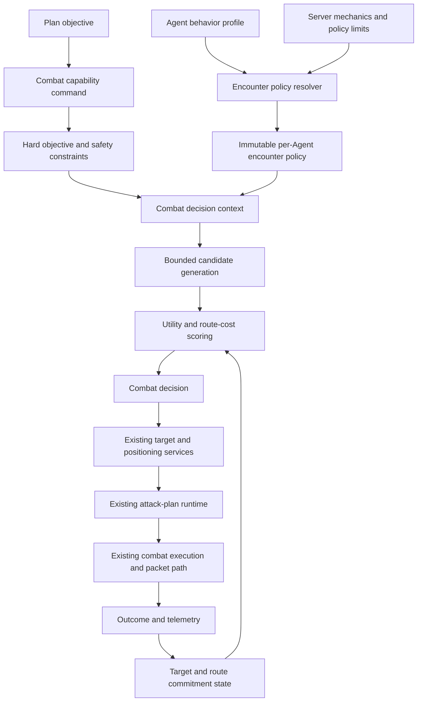

# Polished Combat Capability Implementation Plan

Status: proposed, compatibility-first

Baseline reviewed: `master` at `78b2d2cfbc`

Last reviewed: 2026-07-15

## Decision

Polished combat should extend the reconstructed combat services. It should not
replace them with a second combat engine.

The recommended model is a hybrid:

```text
Plan Card and capability objective
  -> hard objective constraints
  -> per-Agent encounter policy
  -> bounded tactical decision state
  -> utility target selection and route cost
  -> existing attack planner and positioning services
  -> existing movement, combat execution, and packet paths
```

This gives Agents different combat styles without moving tactical details into
Plan Cards, duplicating player mechanics, or destabilizing the completed
Amherst, Southperry, and full Maple Island runs.

The initial production default must remain behaviorally equivalent to current
combat. New scoring acts in shadow mode before any Agent is allowed to follow
its decisions.

## Goals

- Make grind, quest combat, travel encounters, and follow opportunities feel
  deliberate instead of reactive or indecisive.
- Let profiles describe combat preferences through a small, bounded policy.
- Keep quest targets and capability completion criteria authoritative.
- Allow an Agent to prefer a longer safer route when the expected cost is lower.
- Prevent target, platform, rope, and route flip-flopping through commitment and
  hysteresis.
- Give follow mode a tunable diversion budget instead of a binary attack gate.
- Preserve normal attack range, cooldown, damage, skill, ammo, collision,
  physics, loot, and packet behavior.
- Remain affordable under the centralized scheduler at 100 and eventually 2000
  Agents.
- Make every tactical decision explainable and reproducible enough to test.

## Non-Goals

- Do not rewrite `client.Character` or player combat.
- Do not add a parallel physics engine or direct position mutation.
- Do not move packet construction or skill legality into a personality profile.
- Do not make Plan Cards specify target scoring, exact routes, or per-tick moves.
- Do not permit a profile to expand hitboxes, ignore cooldowns, bypass ammo, or
  override capability scope.
- Do not add an LLM call to the live combat loop.
- Do not implement long-term learning or adaptive balancing in the first rollout.

## Current-State Assessment

### Current Combat Flow

The current grind loop is already decomposed into useful services:

```text
AgentTickCoreService
  -> Agent live mode dispatch
  -> AgentGrindModeDispatchService
  -> AgentGrindModeCoordinator
  -> AgentGrindModeTickService
       1. recover the cached target inside seek range
       2. build an attack plan for that target
       3. validate the cached loot target
       4. search for and conditionally adopt a target
       5. refresh nearby grind loot
       6. run no-target movement fallback when needed
       7. commit to the selected target
       8. handle ranged retreat, AoE reposition, jump, or attack
       9. choose the navigation or convenient-loot target
  -> existing movement tick and physics
```

Quest combat is already layered correctly:

```text
CombatQuestObjectiveCapability
  -> verify active quest
  -> travel through a child capability
  -> AgentCombatCapability
       -> restrict allowed mob ids
       -> delegate to reconstructed grind combat
       -> verify kills and required loot from live state
  -> verify quest state and loot
```

This objective/capability split should remain unchanged.

### Existing Strengths To Preserve

| Concern | Current implementation | Decision |
| --- | --- | --- |
| Objective targeting | `AgentCombatObjectiveTargetStateRuntime` filters candidates and closer threats | Keep as a hard filter that no profile can override |
| Reachability | `AgentCombatTargetRuntime` consults the navigation graph and path cost | Extend the cost model; keep graph reachability authoritative |
| Target commitment | `AgentGrindTargetCommitmentService` gives a new target a 12-second lease | Extract to policy with the current value as the compatibility default |
| Retarget cadence | `AgentGrindTargetSearchService` uses a configured 400 ms search interval | Keep bounded and scheduler-aware; avoid scoring on every physics tick |
| Anti-flip-flop | `AgentGrindTargetSearchPolicy` suppresses switching and requires a strictly larger AoE cluster in range | Generalize into score-improvement hysteresis without losing this rule |
| Attack planning | `AgentCombatPlanRuntime` and attack-plan scoring compare useful and raw DPS | Keep mechanical and deterministic |
| Ranged positioning | retreat, degenerate range handling, cross-region retreat, and AoE reposition are separate services | Keep these services and let policy adjust only bounded preferences |
| Follow opportunity attacks | `AgentFollowOpportunityTickService` and `AgentLocalOpportunityAttackService` already support local attacks | Add diversion and leash policy around this seam |
| Loot interaction | convenient loot may influence the combat navigation tail | Add a bounded detour budget; do not let loot silently replace the objective |
| Runtime state | target, search, retreat, breakout, AoE, cooldown, and movement state are Agent-owned | Add one small decision-state object instead of another runtime hierarchy |
| Scheduler | Agent ticks are sliced and centrally budgeted by work class | Bound candidate work and never block or rebuild graphs in combat |
| Test coverage | combat, grind, navigation, follow, range, skill, and scheduler seams have focused tests | Add parity and decision tests beside the existing suites |

### Gaps In The Current System

1. `AgentBehaviorProfile.Encounter` currently contains only `style` and
   `maxEstimatedHits`, and the encounter data is not wired to combat.
2. `AgentCombatPolicy` is an empty marker and does not yet define an executable
   policy contract.
3. Target scoring is mostly travel and platform cost plus AoE and sibling-region
   occupancy. It does not express danger, expected time to kill, resource cost,
   objective value, or switching cost in one decision.
4. The navigation graph represents physical routes, but normal target search
   does not yet use a generalized danger-aware route cost.
5. Follow opportunity combat uses fixed gates. It has no explicit soft leash,
   hard leash, time budget, or return-cost estimate.
6. Commitment exists for targets, retreat, breakout, and AoE reposition, but
   there is no single tactical snapshot explaining why a target and route are
   still being held.
7. Randomness and profile variation could cause churn if sampled every tick.
   Combat needs stable decisions with deterministic tie-breaking.
8. Live combat tuning currently uses global mutable `AgentCombatConfig` fields.
   Global mechanics and per-Agent preferences need separate ownership.

## Updates To The Earlier Combat Proposal

The earlier direction remains valid, with these corrections from the current
code review:

- Combat mode should select a baseline policy preset. It should not become a
  large enum containing every possible tuning combination.
- Individual adjustments should be flat policy values within a preset. Avoid
  nested levels such as mode, subtype, difficulty, and variation.
- The current combat loop already has commitment and several tactical states.
  Add policy resolution and a decision snapshot; do not introduce a second
  behavior tree beside it.
- The current navigation graph already contributes reachability and path cost.
  Add an optional dynamic risk cost to the existing search, not a separate path
  finder owned by combat.
- Attack-plan selection is already a strong mechanical seam. Personality should
  primarily affect whether to engage, whom to target, how much to reposition,
  and how much resource to spend. It should not alter damage execution.
- The centralized scheduler makes unbounded candidate scoring unsafe. Generate
  a bounded candidate set, rank regions first, and fully score only the best few.
- Current MVP Plan Cards should not change. Their objective target filters and
  completion checks remain the regression oracle.

## Recommended AI Pattern

For this engine, a practical high-fidelity 2D platform combat model is:

```text
Hierarchical objective/capability state
  + utility scoring for target and route choices
  + explicit tactical state machine for execution
  + A* graph navigation with injectable bounded costs
  + commitment, hysteresis, and no-progress recovery
```

This uses the useful parts of common game-AI patterns without importing their
full complexity:

- Plan Cards and capability frames serve the hierarchical task role.
- Utility scoring compares valid tactical choices.
- Existing combat and movement services serve the execution state machine.
- The navigation graph performs route search.
- Agent runtime state acts as a small blackboard.

A large behavior tree would duplicate the existing service pipeline. Full GOAP
inside every combat tick would be too expensive and would blur objective and
tactical ownership. GOAP or an LLM may later choose plans; neither should pick
individual mobs or movement edges in the hot loop.

## Architecture



### Ownership Boundaries

```text
Plan Card owns:
  required quest, map, mob ids, kill counts, loot counts, and exit criteria

Capability owns:
  validation, child handoff, timeout, retry, cancellation, and completion

Encounter policy owns:
  preferences and bounded tradeoffs among valid choices

Combat decision state owns:
  current intent, leases, score history, and progress timestamps

Navigation owns:
  reachability, edge execution, physical route search, and route cost

Attack planner owns:
  legal usable attacks, hitboxes, targets, expected damage, and cooldown value

Execution owns:
  damage application, skill effects, ammo, cooldown, animation, and packets
```

## Policy Model

### Presets And Parameters

Use a small set of named presets that resolve to one flat immutable policy:

```text
legacy-objective
  Exact current behavior. Required default during rollout.

objective-only
  Pursue allowed objective targets and required loot with minimal diversion.

evasive
  Prefer safer routes and avoid incidental combat when a bounded detour exists.

opportunistic
  Take cheap nearby fights and loot when the return cost stays within budget.

aggressive
  Accept more risk, wider diversion, and higher resource use while obeying scope.
```

The preset is a readable baseline, not a branch in every combat service. The
resolver overlays explicitly provided values, clamps them to server limits, and
produces one `AgentEncounterPolicy` snapshot.

Do not create separate modes for every lock duration, leash distance, or danger
weight. That would make combinations hard to reason about and test.

### Proposed Immutable Policy

The exact Java shape should stay small. A proposed record is:

```java
public record AgentEncounterPolicy(
        String preset,
        IncidentalCombatStyle incidentalStyle,
        int seekRangePx,
        long decisionIntervalMs,
        long targetCommitmentMs,
        int targetSwitchMinimumImprovement,
        long routeCommitmentMs,
        int routeSwitchMinimumImprovement,
        int maxEstimatedHits,
        long maxCombatDiversionMs,
        int maxCombatDiversionPx,
        long maxLootDiversionMs,
        int followSoftLeashPx,
        int followHardLeashPx,
        int objectiveTargetWeight,
        int threatWeight,
        int travelTimeWeight,
        int expectedDamageWeight,
        int resourceCostWeight,
        int aoeValueWeight,
        int occupancyWeight,
        int recentFailureWeight,
        boolean dangerAwareRouting,
        boolean shadowOnly) {
}
```

Names and units must be explicit. Avoid generic values such as `aggression=7`
inside the combat runtime. Traits may influence policy resolution, but combat
services should consume concrete bounded values.

### Global Mechanics Versus Profile Preferences

Keep these global and authoritative:

- hitboxes and fallback attack ranges.
- knockback constants.
- skill and weapon legality.
- cooldown and animation timing.
- ammo and item consumption.
- movement physics and collision.
- maximum graph-search work.
- absolute seek, leash, diversion, and route-risk caps.
- capability deadlines and objective scope.

Allow profiles to influence only bounded preferences:

- engagement style.
- target and route commitment duration within server limits.
- minimum improvement required before switching.
- incidental fight hit/time limit.
- follow diversion and loot budget.
- safe-route preference.
- objective, threat, AoE, resource, and danger weights.
- optional deterministic tie-break variation.

## Decision Context And Result

The policy layer should be pure and testable. It receives a compact snapshot,
not `Client`, packet writers, or mutable server services.

Suggested context:

```text
agent id and stable decision seed
map id and current position/region
active mode: quest combat, grind, follow, or scripted movement
hard allowed mob ids
current target and target lease
current route and route lease
HP/MP ratios and supply state
weapon/attack-plan summaries
owner/follow-anchor position and motion
candidate mob summaries
coarse route-risk snapshot
recent target/route failure summaries
current time and decision sequence
```

Suggested candidate:

```text
mob object id and mob id
position and navigation region
objective relevance
reachable flag and route summary
estimated travel time
estimated hits and time to kill
expected incoming damage exposure
attack-plan useful DPS and resource cost
AoE cluster value
loot/EXP value when allowed
sibling occupancy
recent failure penalty
```

Suggested result:

```text
intent: attack, approach, retreat, reposition, loot, wait, or return-to-owner
selected target object id
selected route/region when applicable
score and runner-up score
commit-until timestamp
reason codes
shadow/active marker
```

The result describes intent. Existing services still perform the action and
live validation can reject it.

## Target Utility

### Hard Filters First

Utility scoring must never rescue an invalid candidate. Filter first:

1. target is alive and present on the same map.
2. target is inside the absolute seek limit.
3. target mob id is allowed by the active objective, when one exists.
4. a legal attack plan or a legal approach route exists.
5. required ammo, MP, and safety conditions are satisfied.
6. capability scope and map restrictions permit combat.

### Candidate Generation

Avoid fully pathfinding to every monster.

```text
1. collect live allowed monsters inside seek range
2. group candidates by navigation region
3. compute cheap local and objective scores
4. keep the best candidate per region
5. keep the best N regions by cheap score
6. run detailed path/risk scoring only for those regions
7. keep a small final candidate set for utility comparison
```

`N` must be a server-capped constant and measured under population load.

### Utility Formula

The implementation should use integer or fixed-scale scores so tests are stable.
A conceptual formula is:

```text
utility =
    objective value
  + immediate threat value
  + AoE/cluster value
  + allowed loot/EXP value
  - travel time cost
  - expected incoming damage cost
  - attack resource cost
  - sibling occupancy cost
  - recent failure cost
  - target switching cost
  - route switching cost
```

Important rules:

- Current quest targets receive an overwhelming objective weight, not an
  absolute teleport or reachability exception.
- Estimated hits and time to kill should come from current attack planning and
  formula providers where practical.
- Expected damage is a coarse risk estimate, not frame-perfect simulation.
- A current target keeps a switching bonus until its lease expires or it becomes
  invalid, unreachable, unsafe beyond the hard limit, or stops making progress.
- Deterministic tie-breaking uses objective priority, lower travel cost, lower
  mob object id, then a stable per-Agent seed only when variation is enabled.
- Never sample fresh random noise on each retarget check.

## Commitment And Hysteresis

The current 12-second target commitment solved part of the rope/platform churn.
Polish it without weakening the existing behavior.

### Target Lease

Keep the target until one of these events occurs:

- target dies, despawns, leaves the map, or becomes disallowed.
- route becomes unreachable.
- hard safety policy requires retreat or recovery.
- no progress is observed for a bounded interval.
- lease expires and another target exceeds the switch threshold.
- an explicit ranged threat or objective override passes its own threshold.

The current `12_000 ms` becomes the `legacy-objective` default. Phase 1 must
prove that extracting the value does not change behavior.

### Route Lease

Target commitment alone is not enough. The Agent can keep one mob while
oscillating between ways to reach it. Add a short route lease:

```text
current target region
selected first edge or route signature
committed-until
last progress position/time
last route cost
failure count
```

Keep the route while it remains valid and progress is being made. Switch only
when the new route improves cost by the configured threshold, the current edge
fails, or recovery takes ownership.

### No-Progress Detection

Use physical progress rather than repeated decision count:

```text
progress = meaningful reduction in route distance
        or target entered attack range
        or attack/kill/loot progress occurred
```

Do not refresh commitment merely because the same decision function ran again.
Escalate through the existing movement recovery path before abandoning the
objective.

## Danger-Aware Route Cost

### Current State

The navigation graph already gives physical reachability and edge costs. Combat
target scoring adds local travel, vertical/platform penalties, and sibling
occupancy. Cross-region retreat also probes graph routes.

What is missing is a generalized dynamic risk cost for normal approach routes.

### Proposed Cost

```text
route cost =
    graph travel time
  + expected touch-damage exposure
  + hostile density exposure
  + vertical transition cost
  + fall/stuck risk from recent history
  + portal restriction cost
  + congestion cost
  + route switching cost
```

This allows a cautious Agent to choose a longer route around orange mushrooms
when its total expected cost is lower. An aggressive Agent may still choose the
short path if its risk weight is low.

### Navigation Ownership

Add an optional cost provider or search-policy argument to
`AgentNavigationPathService`. Do not copy A* into combat.

The navigation graph remains static and cacheable. Dynamic risk should be a
separate coarse `AgentRouteRiskSnapshot`, keyed by map and region and refreshed
on a staggered cadence. It must not mutate cached graph edges.

The first implementation should score region exposure, not simulate every mob
collision along every pixel. More precision can follow only if metrics show it
is needed.

### Performance Rules

- Never build or warm a graph from a combat decision.
- Use `peekGraph` behavior and a fallback legacy score when a graph is absent.
- Reuse one route-risk snapshot across multiple Agents where safe.
- Cap detailed route probes per decision.
- Cache path summaries only for short leases and invalidate on map, target,
  movement-profile, or graph-version change.
- Record path search caps and fallback decisions.

## Follow Tightness And Diversion

Follow mode should remain owner-centered. A profile controls how much freedom
the Agent has, not whether the owner can be abandoned.

Use four gates:

```text
soft leash
  Inside this distance, incidental action may be considered.

hard leash
  Outside this distance, return to the follow anchor immediately.

diversion time budget
  Predicted engage, kill/loot, and return time must fit.

anchor urgency
  Suppress diversion when the owner is moving away, changing vertical region,
  approaching a portal, or otherwise making the return estimate unreliable.
```

Suggested policy sequence:

```text
if outside hard leash:
  return to owner
else if owner movement is urgent:
  continue following
else if local target is valid and predicted round trip fits budget:
  take opportunity attack
else:
  continue following
```

`AgentFollowOpportunityTickService` remains the admission seam.
`AgentLocalOpportunityAttackService` remains the execution seam. The new policy
must not bypass their movement, range, attack-plan, or cooldown checks.

## Quest Combat And Incidental Combat

Quest-required combat and incidental travel combat are different contexts.

### Quest Combat

- Allowed mob ids from the capability are hard constraints.
- Required loot remains a hard completion condition.
- Objective progress outranks profile preferences.
- The profile may choose among valid objective targets and safe routes.
- An `evasive` profile cannot refuse an objective forever. It may block only on
  a hard safety condition that the capability can report and recover from.

### Incidental Combat

The encounter style may choose:

- `objective-only`: ignore unrelated mobs.
- `evasive`: choose a safe bounded detour when available.
- `attack-if-cheap`: engage only below hit/time/resource thresholds.
- `direct-walker`: continue through if hard safety permits.
- `attack-everything`: engage valid nearby mobs within diversion limits.

This policy belongs around navigation and local opportunity combat. It must not
be embedded as tactical steps in Maple Island Plan Cards.

### Spawn-Pressure Clearing

`QUEST_FOCUS_AND_COMBAT_POLICY.md` describes optional filler clearing when quest
targets are scarce and a map is spawn-clogged. Keep this deferred until the
base utility and objective filters are proven.

When implemented, filler clearing must be an explicit bounded tactical subtask
with a burst limit. It must not widen the objective allowed-mob set silently.

## Attack-Plan Selection

Keep attack-plan scoring mechanical. It currently compares useful damage, raw
damage, useful DPS, raw DPS, guaranteed full-HP kills, cooldown, and skill id.

Permitted future additions:

- overkill penalty.
- MP/ammo/potion reserve cost.
- AoE opportunity value.
- target-specific immunity or resistance confidence.
- a bounded preference for one-hit completion.

Do not put personality checks into `AgentAttackExecutionProvider` or packet
creation. The policy can tell the planner how much resource cost matters; the
planner still returns only legal attacks.

## Scheduler And Scaling Constraints

The centralized scheduler divides a frame into:

```text
PREFLIGHT
LIFECYCLE
PLAN_AND_GATES
CAPABILITY_AND_MOVEMENT
```

Combat runs inside the final gameplay/movement portion and shares the scheduler
with navigation, capability progress, and presentation work.

Required constraints:

- Tactical decisions run at their own bounded cadence, not every physics step.
- A decision may inspect only a capped candidate set.
- No database, file, network, or LLM work occurs in combat decision code.
- No graph construction occurs in the combat hot path.
- Expensive shared map snapshots are staggered and reusable.
- Continuing an existing commitment is cheaper than making a new decision.
- Shadow evaluation has a population cap and sampling rate.
- New telemetry is aggregated; do not log every Agent decision at INFO.
- Scheduler continuation and cycle-budget metrics are rollout gates.

Combat does not need a new scheduler thread. It should execute as bounded work
within the existing Agent tick and use existing asynchronous graph warmup where
needed.

## Profile Integration

### Backward-Compatible Schema

Current executable profiles contain:

```json
{
  "encounter": {
    "style": "objective-only",
    "maxEstimatedHits": 0
  }
}
```

Preserve this shape. Add an optional `combatPolicy` block or optional encounter
fields in a new profile schema version. Missing fields resolve to the
`legacy-objective` policy.

Recommended shape:

```json
{
  "encounter": {
    "style": "objective-only",
    "maxEstimatedHits": 0,
    "combatPolicy": {
      "preset": "legacy-objective",
      "targetCommitmentMs": 12000,
      "targetSwitchMinimumImprovement": 0,
      "routeCommitmentMs": 0,
      "routeSwitchMinimumImprovement": 0,
      "dangerAwareRouting": false,
      "maxCombatDiversionMs": 0,
      "maxCombatDiversionPx": 0,
      "maxLootDiversionMs": 0
    }
  }
}
```

The compatibility profile intentionally leaves new behavior off. Later named
profiles can override a small subset.

### Resolution

Resolve once when the Agent profile is assigned or its version changes:

```text
server defaults
  -> preset defaults
  -> profile overrides
  -> trait-derived bounded adjustments, later
  -> hard server clamps
  -> immutable AgentEncounterPolicy
```

Do not repeatedly parse JSON or sample profile randomness during combat.

## Feature Gates

Use one rollout mode, not many unrelated booleans:

```text
OFF
  Current code path only.

LEGACY
  New policy record supplies current constants; decisions remain current.

SHADOW
  New scorer runs for sampled decisions but current target/route is executed.

CANARY
  Only explicitly assigned Agents act on the new scorer.

ACTIVE
  Eligible profiles act on the new scorer.
```

Global mode wins over profile requests. Maple Island validation Agents can be
pinned to `LEGACY` throughout rollout.

## Proposed Classes And Changes

### New Small Types

| Proposed type | Responsibility |
| --- | --- |
| `AgentEncounterPolicy` | Immutable resolved preference values |
| `AgentEncounterPolicyResolver` | Merge preset, profile, and server clamps |
| `AgentCombatDecisionContext` | Pure snapshot for one tactical decision |
| `AgentCombatCandidate` | Precomputed target/route/attack summary |
| `AgentCombatUtilityScorer` | Pure deterministic candidate scoring |
| `AgentCombatDecision` | Selected intent, score, runner-up, and reasons |
| `AgentCombatDecisionState` | Target/route lease, progress, and last reasons |
| `AgentRouteCostPolicy` | Optional additive navigation edge/region cost |
| `AgentRouteRiskSnapshot` | Coarse reusable map/region danger data |
| `AgentCombatDecisionTelemetry` | Aggregated counters and sampled diagnostics |

Avoid creating one class for each weight. Keep calculation helpers pure and
package-local unless another package has a real consumer.

### Existing Classes To Extend

| Existing type | Intended change |
| --- | --- |
| `AgentBehaviorProfile` | Parse optional backward-compatible combat policy fields |
| `AgentBehaviorProfileRuntime` | Expose resolved encounter policy, not gameplay actions |
| `AgentRuntimeEntry` | Own one compact combat decision-state object |
| `AgentGrindModeCoordinator` | Resolve policy and pass it through hooks/context |
| `AgentGrindTargetSearchService` | Use policy cadence and decision result |
| `AgentGrindTargetSearchPolicy` | Apply score-improvement hysteresis |
| `AgentGrindTargetCommitmentService` | Use resolved target lease with legacy default |
| `AgentCombatTargetRuntime` | Generate bounded candidates and route summaries |
| `AgentGrindNavigationTargetSelector` | Respect route lease and risk-aware route result |
| `AgentFollowOpportunityTickService` | Admit actions using leash/diversion policy |
| `AgentNavigationPathService` | Accept an optional bounded cost policy |
| scheduler metrics/diagnostics | Add aggregated decision cost and churn counters |

### Classes That Should Remain Mechanically Authoritative

- `AgentCombatCapability` and `CombatQuestObjectiveCapability`.
- `AgentCombatObjectiveTargetStateRuntime`.
- `AgentCombatPlanRuntime` and legal attack planners.
- `AgentCombatRangePolicy` and hitbox services.
- `AgentCombatAttackRuntime` and `AgentAttackExecutionProvider`.
- cooldown, ammo, buff, damage, movement, and packet gateways.
- normal player combat handlers.

No `Character.java` change is expected for this work.

## Implementation Phases

Each phase is independently mergeable and defaults to current behavior.

### Phase 0: Baseline And Replay Fixtures

Work:

- Record current default combat config and target/route decisions for focused
  synthetic maps.
- Add deterministic scenario fixtures for same-platform targets, rope-separated
  platforms, ranged retreat, AoE clusters, follow opportunities, and objective
  filtering.
- Capture one-Agent Amherst, Southperry, and full Maple Island smoke results.
- Capture scheduler and pathfinding cost under a staged Agent cohort.

Exit gate:

- Existing tests pass.
- Fixtures reproduce the current decisions.
- Baseline target switches, no-progress recoveries, path searches, objective
  duration, and scheduler cost are recorded.

### Phase 1: Extract A Legacy Encounter Policy

Work:

- Add `AgentEncounterPolicy` with only values already used by current combat.
- Add a resolver that always returns `legacy-objective`.
- Move `TARGET_COMMITMENT_MS`, retarget cadence, and other decision-owned
  constants behind the policy without changing their values.
- Keep physics, hitbox, damage, support, and execution constants in
  `AgentCombatConfig`.

Exit gate:

- Golden decision fixtures are identical.
- Maple Island Plan Cards and capability commands are unchanged.
- No new profile field can alter behavior yet.

Rollback:

- Switch rollout mode to `OFF` and use current constants directly.

### Phase 2: Profile Schema And Server Clamps

Work:

- Extend the behavior-profile schema with optional combat policy fields.
- Resolve missing fields to the legacy preset.
- Validate enums, units, ordering, and server hard caps at load time.
- Cache the immutable resolved policy on the Agent runtime/profile state.
- Add admin diagnostics that show source, resolved values, and clamp reasons.

Exit gate:

- Existing profile JSON loads unchanged.
- Invalid profiles fail closed to legacy behavior with a clear diagnostic.
- Runtime combat performs no JSON parsing.

### Phase 3: Decision State And Telemetry

Work:

- Add compact target/route commitment and progress state.
- Mirror the existing target commitment into the new state.
- Add reason codes and aggregated telemetry.
- Record target switches, route switches, commitment expiry, no-progress,
  search cost, candidate counts, and fallback causes.

Exit gate:

- Behavior remains legacy-equivalent.
- INFO logs remain quiet at cohort scale.
- Diagnostic commands can explain the current target and route lease.

### Phase 4: Utility Scoring In Shadow Mode

Work:

- Add bounded candidate generation.
- Add pure utility scoring using current route, attack-plan, objective, AoE, and
  occupancy data.
- Run only for sampled Agents/decisions.
- Compare shadow choice with executed legacy choice.
- Do not act on the shadow result.

Exit gate:

- Decision cost stays inside the scheduler budget.
- Shadow output never widens objective target scope.
- Disagreement cases are inspectable by reason and score.
- No graph warmup/build occurs from shadow evaluation.

### Phase 5: Target Hysteresis Canary

Work:

- Allow explicit canary profiles to act on utility target choices.
- Add minimum score improvement and no-progress release rules.
- Preserve the current strict larger-cluster AoE behavior as a baseline rule.
- Keep route selection legacy during this phase.

Exit gate:

- Rope/platform target churn is lower than baseline.
- Kill and quest progress do not regress beyond the agreed tolerance.
- Completed Maple Island runs remain successful when pinned to legacy.
- Canary rollback requires only a rollout-mode change.

### Phase 6: Route Commitment And Danger Cost

Work:

- Add route leases and progress tracking.
- Add optional route cost policy support to navigation search.
- Build staggered coarse region risk snapshots.
- Enable danger-aware route cost for canary profiles.
- Keep the physical graph and edge executor unchanged.

Exit gate:

- Agents stop alternating between rope/platform approaches without progress.
- Cautious profiles can choose a demonstrably safer longer route.
- Aggressive profiles can retain the faster route.
- Pathfinding p95/p99 and scheduler cycle utilization remain acceptable.

### Phase 7: Follow Diversion Policy

Work:

- Add soft/hard leash, diversion time/distance, and anchor urgency.
- Estimate engage plus return cost before admitting an opportunity attack.
- Add bounded loot detours.
- Preserve immediate owner return outside the hard leash.

Exit gate:

- Tight profiles stay close to the owner.
- Loose profiles take nearby opportunities but return within budget.
- Portal and map-change behavior remains authoritative.

### Phase 8: Incidental Encounter Presets

Work:

- Activate `objective-only`, `evasive`, `attack-if-cheap`, `direct-walker`, and
  `attack-everything` through the same policy record.
- Keep fidgets separately gated and disabled during combat commitments.
- Add stable seeded tie-break variation only where equal choices are valid.

Exit gate:

- Different profiles show recognizable behavior without invalid mechanics.
- Same seed and state replay to the same tactical decisions.
- Different seeds vary only allowed tie-breaks and presentation choices.

### Phase 9: Objective-Aware Filler Clearing And Rollout

Work:

- Implement spawn-pressure clearing as an explicit bounded tactical subtask.
- Stage 5, 10, 25, 50, and 100-Agent cohorts.
- Move from `CANARY` to `ACTIVE` only after combat, plan, and scheduler gates pass.

Exit gate:

- Amherst, Southperry, and full Maple Island complete without plan-card changes.
- Objective mobs and loot are never bypassed.
- Cohort target/route churn, stuck recovery, and scheduler cost improve or remain
  within accepted bounds.
- Rollback to `LEGACY` is configuration-only.

## Test Strategy

### Unit Tests

Add focused tests for:

- profile resolution and hard clamps.
- legacy preset exact values.
- utility monotonicity for objective value, travel time, risk, and resource cost.
- deterministic tie-breaking.
- target switching only above the improvement threshold.
- target invalidation and no-progress release.
- route switching only above the threshold or on failure.
- safe-route versus short-route policy choices.
- follow soft/hard leash and round-trip diversion budget.
- objective filters overriding profile preference.
- missing graph and missing attack-plan fallbacks.
- scheduler work caps and candidate limits.

Extend existing suites rather than creating a parallel test tree:

- `AgentGrindTargetSearchPolicyTest`.
- `AgentGrindTargetCommitmentServiceTest`.
- `AgentCombatScoringPolicyTest`.
- `AgentCombatGrindTargetPolicyTest`.
- `AgentGrindNavigationTailServiceTest`.
- `AgentNavigationPathServiceTest`.
- `AgentFollowOpportunityTickServiceTest`.
- `AgentBehaviorProfileRuntimeTest`.

### Golden Compatibility Tests

For `OFF` and `LEGACY`, assert the same target, attack plan, positioning intent,
and capability outcome as the baseline for:

- melee same-platform combat.
- ranged degenerate range and retreat.
- magic/ranged legal attack selection.
- AoE cluster selection and reposition.
- rope and multi-platform pursuit.
- required quest target filtering.
- required loot completion.
- follow opportunity attack admission.
- no-target wander/recovery.

### Integration And Live Smoke

- Run the full Amherst objective sequence.
- Run the Amherst-to-Southperry segment.
- Run clean level-1 full Maple Island to Southperry.
- Confirm quest EXP, loot, chair, and terminal state are unchanged.
- Confirm no Agent teleports, flies, widens range, or attacks disallowed mobs.
- Observe cautious and aggressive canaries on a map with a short dangerous route
  and a longer safe route.
- Observe follow profiles while the owner walks, climbs, and uses a portal.

### Scale Tests

Stage cohorts at `5`, `10`, `25`, `50`, and `100` Agents. Measure:

- scheduler cycle p50/p95/p99 and budget exhaustion.
- combat decision p50/p95/p99.
- path search p50/p95/p99 and cap/fallback count.
- candidates generated and fully scored.
- target and route switches per minute.
- no-progress and recovery count.
- time to first attack and objective completion.
- damage taken, deaths, and supply consumption.
- follow-anchor separation and return time.
- plan timeouts and manual interventions.

Use relative regression gates from Phase 0 rather than inventing permanent
thresholds before measurements exist.

## Observability

Expose a sampled diagnostic view:

```text
agent/profile/policy version
mode and objective id
selected target and reason codes
current and runner-up scores
target and route lease remaining
estimated travel/time-to-kill/risk/resource cost
candidate count and path probes
last progress time
last recovery/fallback reason
shadow choice versus executed choice
```

Aggregate counters should include:

```text
decision count and duration
candidate cap reached
shadow disagreement
target switch and suppressed switch
route switch and suppressed switch
commitment expiry
target invalidated
route unreachable
no progress
legacy fallback
profile clamp/fallback
```

Verbose per-decision logs should be debug-only and rate-limited.

## Failure And Recovery Rules

Fallback order:

```text
invalid profile
  -> legacy-objective policy

missing risk snapshot
  -> normal graph cost

missing graph
  -> current local scoring and movement behavior

target invalid/dead
  -> clear commitment and search at next allowed cadence

route fails but target remains valid
  -> movement recovery, then one bounded re-route

repeated no progress
  -> release route, then target, then capability recovery/block policy

scheduler budget pressure
  -> retain current commitment and defer new scoring
```

Failing to make a fresh tactical decision should never stop an already valid
attack or route commitment.

## Compatibility And Rollback Guarantees

- Default rollout mode is `OFF` or `LEGACY` until explicitly advanced.
- Missing profile fields resolve to current constants.
- Current Plan Cards, capability commands, and objective exit criteria do not
  change.
- Existing attack execution and player mechanics remain authoritative.
- Current navigation graph and edge execution remain authoritative.
- New state is runtime-only until a persistence requirement is proven.
- Every active phase has a configuration-only rollback to legacy decisions.
- Maple Island showcase/testing Agents can remain permanently pinned to legacy
  while other canaries are evaluated.

## Acceptance Criteria

The polished combat capability is ready for general use when:

- `OFF` and `LEGACY` reproduce current combat and completed MVP plans.
- Profile policy cannot widen quest target scope or bypass mechanics.
- Target and route commitments visibly reduce platform/rope indecision.
- Cautious and aggressive profiles choose different valid routes where risk
  tradeoffs exist.
- Follow tightness produces bounded, explainable diversions.
- Same state and seed produce the same decision.
- No combat decision performs blocking work or graph construction.
- 100-Agent tests remain within agreed scheduler and pathfinding regressions.
- Rollback to legacy requires no code or data migration.
- Diagnostics explain the selected target, route, and suppressed alternatives.

## Deferred Work

Defer until the compatibility and scale gates pass:

- adaptation of weights from deaths, failures, and success history.
- long-term map danger memory.
- party role coordination and shared target assignment.
- economy-aware farming value.
- equipment/build-driven tactical specialization beyond legal attacks.
- PvP behavior.
- LLM-authored policy changes.
- full spawn-pressure clearing and future-quest loot optimization.

## Relationship To Existing Documentation

- `QUEST_FOCUS_AND_COMBAT_POLICY.md` remains authoritative for objective focus,
  tactical subtask boundaries, and future spawn-pressure clearing.
- `INTERACTION_REALISM_POLICY.md` remains authoritative for incidental encounter
  presentation and the rule that realism cannot bypass mechanics.
- `profile-platform/PROFILE_RUNTIME_ARCHITECTURE.md` remains authoritative for
  profile portability and decision-only profile APIs.
- `AGENT_CENTRAL_SCHEDULER.md` and
  `AGENT_FULL_CENTRALIZED_SCHEDULER_IMPLEMENTATION_PLAN.md` remain authoritative
  for scheduler budgets and rollout evidence.
- This document is authoritative for the compatibility-first implementation
  order of polished tactical combat.

## Final Recommendation

Start with extraction, not new behavior. Resolve the current 12-second target
lease, retarget cadence, seek range, and existing scoring inputs through a
legacy policy and prove exact parity. Then add decision state and shadow utility
scoring. Only after measured shadow results should target utility, route risk,
follow diversion, and encounter presets be activated for canary Agents.

This sequence improves combat without asking completed Agent plans to absorb a
combat rewrite, and it leaves a clean extension point for future class builds,
personality profiles, and autonomous Victoria Island progression.
