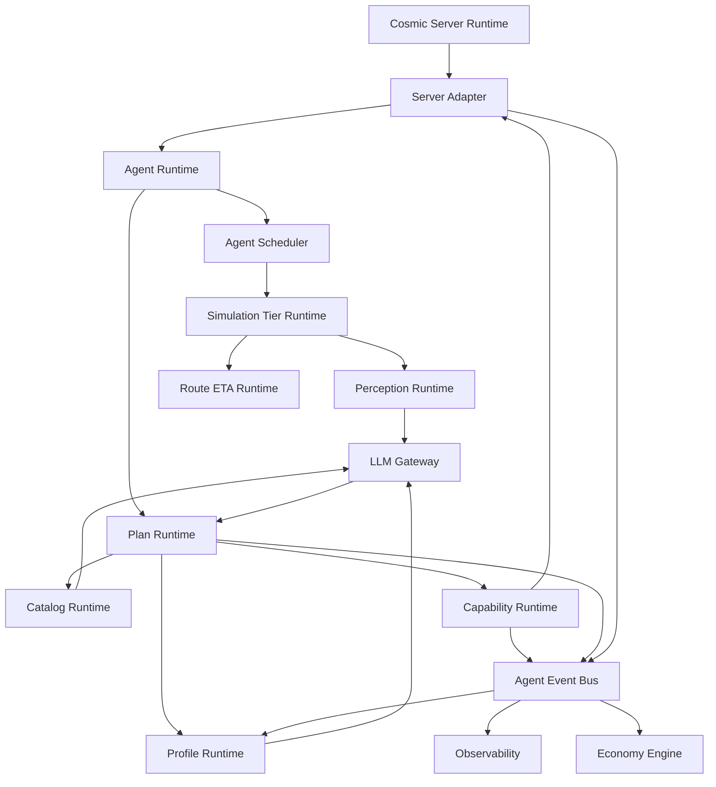

# Post-Reconstruction Agent Platform Specification

This document describes the intended system after the nutnnut bot
reconstruction is complete. It now separates the immediate post-reconstruction
gameplay proof from the later optimization/scaling track.

Short description:

```text
The project reconstructs nutnnut's AI companion/bot implementation into a
modular, scalable, server-validated Agent platform for Cosmic v83.
```

The final platform should preserve useful legacy behavior, but it should no
longer be shaped like a monolithic companion bot. It should become a set of
modular packages that can run thousands of autonomous Agents, support future
quest/economy/profile/LLM systems, and remain safe for real players on the same
server.

## Recommended Delivery

The best delivery should be three layers:

1. Product/architecture specification.
   - This document.
   - Explains what the system is, why it exists, and how the pieces fit.

2. Package specifications.
   - One design specification and one technical specification per package.
   - Examples: profile platform, economy engine, scaling runtime, plan runtime.

3. Implementation epics.
   - Concrete checklists and tests.
   - Examples: 2k Agent scaling track, Maple Island MVP, NPC quest capability.

This avoids one giant document becoming stale. The top-level spec stays stable;
package specs evolve independently.

## Source And Transformation

Source system:

```text
nutnnut's Cosmic AI companion / bot implementation
```

Baseline behavior:

- The reconstruction branch treats nutnnut's merged `source/master` behavior as
  the legacy behavior baseline.
- Existing bot behavior should be preserved during reconstruction unless a
  later cleanup phase explicitly changes it.

Transformation target:

```text
Legacy companion bot
  -> reconstructed Agent runtime
  -> optimized multi-Agent simulation platform
  -> modular gameplay/autonomy platform
```

The reconstruction should not simply rename bot classes. It should extract
stable responsibilities into packages with clear boundaries.

## Vision

The Agent platform should let a Cosmic-like server host a living population of
Agents that can:

- move through the world.
- fight monsters.
- loot items.
- interact with NPCs.
- complete quests.
- use profiles and memories to behave differently.
- participate in economy systems later.
- accept LLM-directed high-level commands later.
- run at lower fidelity when invisible to players.
- remain observable, bounded, and safe for real players.

The first scale goal is:

```text
2000 concurrent Agents with stable server responsiveness.
```

The first gameplay proof goal is:

```text
one Agent completes Amherst, then the Maple Island questline MVP, and stops at
Southperry.
```

Current priority order after reconstruction:

1. Prove the capability runtime and objective-capability wrapper model.
2. Complete and test Amherst MVP.
3. Complete and test Maple Island MVP.
4. Decide which nutnnut legacy behaviors remain enabled, gated, or disabled as
   legacy.
5. Then start the Agent optimization/scaling track toward 2000 concurrent
   Agents.

## Design Principles

### Server Remains Authoritative

Agents do not become a second server.

They request validated actions through capabilities and server adapters. The
live server decides whether an action can be committed.

### Visible Fidelity, Invisible Efficiency

Agents visible to real players should behave with presentation fidelity.

Agents not visible to real players should preserve world-state fidelity without
paying full movement, broadcast, cosmetic, and physics cost.

### Modular Packages

Each major responsibility should be implemented as a package:

- scheduler.
- simulation tier.
- perception.
- route ETA.
- profile.
- plan runtime.
- capability runtime.
- catalog runtime.
- economy.
- LLM gateway.

Packages communicate through stable DTOs, events, commands, and adapters.

### Gameplay Proved Before Scaling

Optimization/scaling work and gameplay capability work should remain separate
tracks. The gameplay capability boundary should be proven first so optimization
does not hard-code unfinished legacy behavior.

Scaling track:

- scheduler.
- budgets.
- modes.
- background simulation.
- observability.
- memory lifecycle.

Gameplay track:

- quests.
- NPCs.
- combat correctness.
- looting.
- inventory.
- skills.
- economy.
- LLM.

### Catalogs Are Advisory

Static catalog data is used for planning and fast lookup.

Live server state remains authoritative before every mutating action.

### Profiles Decide Preferences

The profile platform does not execute gameplay.

It supplies preferences, policy, memories, plan weights, adaptation, and
explanations to the plan and capability layers.

### Events Decouple Systems

Capabilities, plan runtime, profile adaptation, economy, observability, and
server adapters should communicate through events where possible.

This keeps packages portable and replayable.

## Final Architecture



## Core Runtime Flow

```text
Agent is scheduled
  -> scheduler assigns budget and mode
  -> simulation tier decides fidelity
  -> plan runtime chooses active objective
  -> profile runtime supplies preferences
  -> catalog/runtime snapshots supply facts
  -> capability runtime ticks one active frame
  -> objective capability may request explicit primitive handoff
  -> primitive capability wraps existing movement/combat/server behavior
  -> server adapter commits action if live state allows
  -> event bus records outcome
  -> observability/profile/economy consume outcome
```

The capability runtime owns one active capability frame per Agent and a bounded
paused-frame stack. Objective capabilities do not directly call child
capabilities. They return handoff requests, the runtime pauses/resumes frames,
and the plan advances only after the objective capability verifies its own end
state.

## Simulation Modes

### Presentation Mode

Condition:

```text
real player is in the same map as the Agent
```

Behavior:

- full movement and physics fidelity.
- normal broadcasts.
- normal visible attacks, effects, chat, and emotes.
- normal NPC timing and stop points.

Purpose:

```text
Anything a player can observe should look real.
```

### Background Active Mode

Condition:

```text
no real player in map, but the map is sensitive or pinned
```

Examples:

- boss maps.
- party quest maps.
- event maps.
- Free Market.
- merchant/shop maps.

Behavior:

- no unnecessary visual broadcasts.
- reduced movement/perception cadence.
- coarse foothold-valid state.
- preserve stronger shared-world consistency.

### Background Abstract Mode

Condition:

```text
no real player in map and map is safe to abstract
```

Behavior:

- no movement packet generation.
- no continuous physics.
- route ETA for travel.
- same-map ETA heuristics.
- abstract combat rounds where safe.
- direct validated NPC/quest/shop actions.
- materialize to valid visible state when a real player enters.

## Scaling Target

The first optimization target is:

```text
2000 concurrent Agents
```

Required scaling properties:

- bounded scheduler work.
- bounded queues.
- bounded memory.
- no full map scan per Agent tick.
- no invisible broadcast spam.
- no cosmetic work when nobody can see it.
- no unbounded journal/event growth.
- clear load-shedding behavior.
- real player packet handling stays higher priority than Agent work.

## Scaling Packages

### Agent Observability

Purpose:

- expose Agent costs, failures, modes, queues, memory, and hot maps.

Required metrics:

- Agent count by simulation mode.
- Agent count by map.
- scheduler queue depth.
- scheduler delay p50/p95/p99.
- Agent work time p50/p95/p99.
- broadcasts suppressed.
- movement ticks skipped.
- perception cache hits.
- route ETA usage.
- event backlog.
- journal backlog.
- stale state count.

### Agent Event Bus

Purpose:

- decouple runtime packages and allow bounded async processing.

Required behavior:

- topic queues.
- priority classes.
- event compaction.
- backpressure.
- selected replay/audit mode.

### Agent Scheduler Runtime

Purpose:

- prevent 2000 Agents from doing full work every server tick.

Required behavior:

- per-Agent `nextRunAt`.
- priority classes.
- per-tick work budget.
- fairness.
- map-aware scheduling.
- overload behavior.

### Simulation Tier Runtime

Purpose:

- decide presentation/background fidelity based on real-player map presence and
  map sensitivity.

Required behavior:

- mode classification.
- mode transition events.
- materialization.
- mode-specific capability behavior.

### Perception Runtime

Purpose:

- replace per-Agent live scans with shared snapshots and bounded views.

Required behavior:

- map-level shared perception snapshots.
- Agent-local filtered perception.
- cadence by mode.
- event-driven invalidation.

### Route ETA Runtime

Purpose:

- allow invisible travel without full physics.

Required behavior:

- route ETA state.
- portal-to-portal catalog support.
- same-map ETA heuristic.
- materialization point selection.

### Background Action Runtime

Purpose:

- execute invisible Agent work cheaply while preserving live validation.

Required behavior:

- background navigation arrival.
- background combat rounds.
- background NPC/quest action.
- background loot/recovery.
- final state commit with validation.

### Load Shedding Policy

Purpose:

- keep the server responsive during overload.

Required behavior:

- suppress cosmetic/social work first.
- reduce background perception cadence.
- delay low-priority Agents.
- delay LLM/economy/profile adaptation.
- preserve visible/safety-critical Agents.

### Memory Lifecycle Runtime

Purpose:

- prevent leaks and stale Agent state.

Required behavior:

- cleanup on logout/death/cancel/map change/shutdown.
- cache bounds.
- event/journal compaction.
- stale Agent detection.

## Gameplay Packages

Gameplay packages are still part of the platform, but should follow the scaling
foundation.

### Plan Runtime

Owns:

- plan card loading.
- objective graph.
- plan progress.
- sidetrack stack.
- objective runner.
- plan resume.

### Capability Runtime

Owns:

- command/result contracts.
- validators.
- active capability frame.
- paused parent-frame handoff stack.
- child-result resume.
- timeout/stuck handling.
- capability audit events.
- action routing.

Required first migration:

- primitive NavigationCapability wrapper over existing reconstructed
  movement/navigation behavior.
- primitive CombatCapability wrapper over existing reconstructed grind/combat
  behavior.
- parity tests proving wrappers preserve legacy behavior before objective
  constraints are added.
- feature-flagged tick routing: active capability frame first, legacy fallback
  when no frame is active.

### NPC Quest Capability

Owns:

- NPC range/placement validation.
- quest start/complete validation.
- direct validated quest action.
- reward choice handling.
- script-sensitive blockers.

### Recovery Policy

Owns:

- low HP/MP handling.
- death recovery.
- stuck recovery.
- no-progress policy.
- block/postpone reasons.

### Maple Island MVP

Owns:

- first gameplay vertical slice.
- questline route.
- objective sequence.
- Shanks/off-island guard.
- one-Agent integration test.

The first gameplay smoke after primitive wrapper parity is the Amherst
sub-phase:

```text
start: 10000 Mushroom Town
stop: 1000000 Amherst
plan: docs/agents/plans/maple-island-amherst-subphase.plan.json
```

This smoke must use the full capability runtime path:

```text
Plan objective -> objective capability -> primitive handoff -> live validation
```

Direct scripted calls around the capability runtime do not satisfy the
post-reconstruction gameplay acceptance criteria.

## Profile And Autonomy Layer

The profile platform should provide:

- identity.
- archetype.
- traits.
- mood.
- build intent.
- plan weights.
- relationship memory.
- world memory.
- economy preferences.
- adaptation from outcomes.
- decision journal.
- LLM-safe summaries.

Profiles do not execute actions. They influence plan and capability decisions.

## Catalog And Knowledge Layer

The catalog platform should provide:

- maps.
- portals.
- NPCs.
- NPC actions.
- quests.
- mobs.
- drops.
- items.
- reactors.
- shops.
- reward choices.
- travel services.
- route ETA data.
- fast indexes.
- LLM summaries.

Catalog runtime must use prebuilt indexes for hot paths.

## LLM Readiness

LLM control should be added only after:

- scaling foundations exist.
- profile summaries exist.
- plan runtime exists.
- capability validators exist.
- observability exists.

The LLM should:

- assign goals.
- inspect profiles.
- inspect catalog summaries.
- propose plans.
- request profile patches.
- command Agents through typed tools.

The LLM should not:

- spoof packets.
- mutate server state directly.
- force-complete quests.
- bypass validators.

## Technical Package Layout

Recommended package groups:

```text
server.agents.api
server.agents.runtime
server.agents.runtime.scheduler
server.agents.runtime.simulation
server.agents.runtime.perception
server.agents.runtime.lifecycle
server.agents.events
server.agents.observability
server.agents.model
server.agents.commands
server.agents.plans
server.agents.capabilities
server.agents.capabilities.navigation
server.agents.capabilities.combat
server.agents.capabilities.looting
server.agents.capabilities.inventory
server.agents.capabilities.npc
server.agents.capabilities.quest
server.agents.capabilities.recovery
server.agents.policy
server.agents.profiles
server.agents.legacy
server.agents.integration
server.agents.integration.cosmic
```

Portable platform packages may later move outside `server.agents`, but Cosmic
integration should stay behind `integration.cosmic` adapters.

## Data And State

Agent runtime state:

- identity.
- current mode.
- current plan/objective.
- scheduler state.
- simulation mode.
- route ETA state.
- perception snapshot reference.
- capability active state.
- paused capability frames.
- last child capability result.
- lifecycle cleanup handles.

Profile state:

- profile snapshot.
- dynamic mood.
- memories.
- relationships.
- decision journal.
- adaptation events/patches.

Plan state:

- assigned plan.
- objective statuses.
- retry counters.
- blocker.
- last live reconciliation.

Observation state:

- counters.
- histograms.
- queue depths.
- top slow agents/maps.
- event backlog.

## Validation Rules

Every mutating action must pass:

```text
catalog/planning check
profile/policy check
live server validation
capability-specific validation
```

Examples:

- NPC exists in live map before quest action.
- Agent is in interaction range before NPC action.
- Quest requirements are met before complete.
- Inventory has required item before use.
- Portal destination is allowed before travel.
- Background action revalidates before final commit.

## 2k Agent Acceptance Criteria

Minimum:

- 1000 Agents run with most maps unobserved by real players.
- real player can login, move, change maps, and interact normally.
- visible Agents present correctly.
- invisible Agents do not generate unnecessary broadcasts.
- scheduler and event queues remain bounded.
- diagnostics show top cost centers.

Target:

- 2000 Agents run in mixed modes.
- at least 24-hour soak without memory growth trend.
- no runaway Agent loops.
- no unbounded event/journal queue.
- materialization from background mode is safe.
- clean shutdown and restart.
- real player responsiveness remains acceptable.

## Gameplay Acceptance After Scaling

First gameplay acceptance:

- one Agent completes Maple Island MVP.
- every objective is journaled.
- blockers are structured.
- Shanks travel is blocked.
- no force-complete in normal mode.
- relog/restart resumes safely.

Later gameplay acceptance:

- Victoria Island quest packages.
- job-path progression.
- economy participation.
- profile-driven variation.
- LLM-directed multi-Agent plans.

## Implementation Roadmap

### Phase 0 - Reconstruction Complete

Exit criteria:

- legacy bot behavior routes through Agent-owned modules.
- old bot managers are compatibility shells or removed.
- runtime state has explicit ownership.
- behavior parity tests pass.

### Phase 1 - Scaling Foundation

Implement:

1. observability counters.
2. event bus with bounded queues.
3. scheduler budget and priority model.
4. real-player map presence detection.
5. simulation mode classifier.
6. invisible broadcast/cosmetic suppression.
7. reduced background perception cadence.
8. route ETA state.
9. materialization validation.
10. memory lifecycle cleanup.

### Phase 2 - Scale Soak

Run:

- 250 Agents.
- 500 Agents.
- 1000 Agents.
- 1500 Agents.
- 2000 Agents.

Measure:

- CPU.
- heap.
- GC pauses.
- scheduler queue depth.
- Agent work p95/p99.
- real player action latency.
- event backlog.
- memory growth.

### Phase 3 - Minimal Gameplay Package

Implement:

- plan runtime.
- capability command/result model.
- active-frame and handoff/resume capability runtime.
- primitive NavigationCapability and CombatCapability wrappers with parity
  tests.
- NPC/quest capability.
- recovery policy.
- Amherst sub-phase MVP.
- full Maple Island MVP.

### Phase 4 - Profile/Economy/LLM Expansion

Implement:

- profile adaptation.
- economy runtime.
- interaction realism.
- perception summaries.
- LLM gateway.
- population director.

## Documentation Map

Top-level:

- `docs/agents/AGENT_ENGINE_VISION_AND_RECONSTRUCTION_OVERVIEW.md`
- `docs/agents/POST_RECONSTRUCTION_AGENT_PLATFORM_SPECIFICATION.md`
- `docs/agents/PACKAGE_REGISTRY.md`
- `docs/agents/AGENT_ENGINE_SCALING_TRACK.md`
- `docs/agents/AGENT_GAMEPLAY_TRACK.md`

Reconstruction:

- `docs/agents/RECONSTRUCTION_BASELINE.md`
- `docs/agents/RECONSTRUCTION_RULES.md`
- `docs/agents/BOT_TO_AGENT_RECONSTRUCTION_MAP.md`

Profile:

- `docs/agents/profile-platform/AGENT_PROFILE_SYSTEM_DESIGN_SPECIFICATION.md`
- `docs/agents/profile-platform/AGENT_PROFILE_SYSTEM_TECHNICAL_SPECIFICATION.md`

Catalog:

- `docs/agents/catalog-platform/CATALOG_PLATFORM_ARCHITECTURE.md`
- `docs/agents/catalog-platform/CATALOG_BUNDLE_SPEC.md`
- `docs/agents/catalog-platform/CATALOG_QUERY_API.md`

Maple Island:

- `docs/agents/MAPLE_ISLAND_MVP_DESIGN_SPECIFICATION.md`
- `docs/agents/MAPLE_ISLAND_MVP_TECHNICAL_SPECIFICATION.md`
- `docs/agents/MAPLE_ISLAND_MVP_AGENT_TODO_ALIGNMENT.md`

Economy:

- `docs/agents/llm-autonomy/ECONOMY_DESIGN_SPECIFICATION.md`
- `docs/agents/llm-autonomy/ECONOMY_TECHNICAL_IMPLEMENTATION_SPECIFICATION.md`

Server adapter:

- `docs/agents/server-adapter/SERVER_ADAPTER_CONTRACT.md`
- `docs/agents/server-adapter/MINIMAL_COSMIC_EDIT_INSTALL_TARGET.md`

## Final Definition

The post-reconstruction Agent platform is:

```text
A modular, server-validated, profile-aware, catalog-informed, scalable
multi-Agent runtime reconstructed from nutnnut's AI companion/bot system,
optimized to support thousands of concurrent Agents while preserving believable
player-visible behavior and preparing for future autonomous questing, economy,
and LLM-directed control.
```
