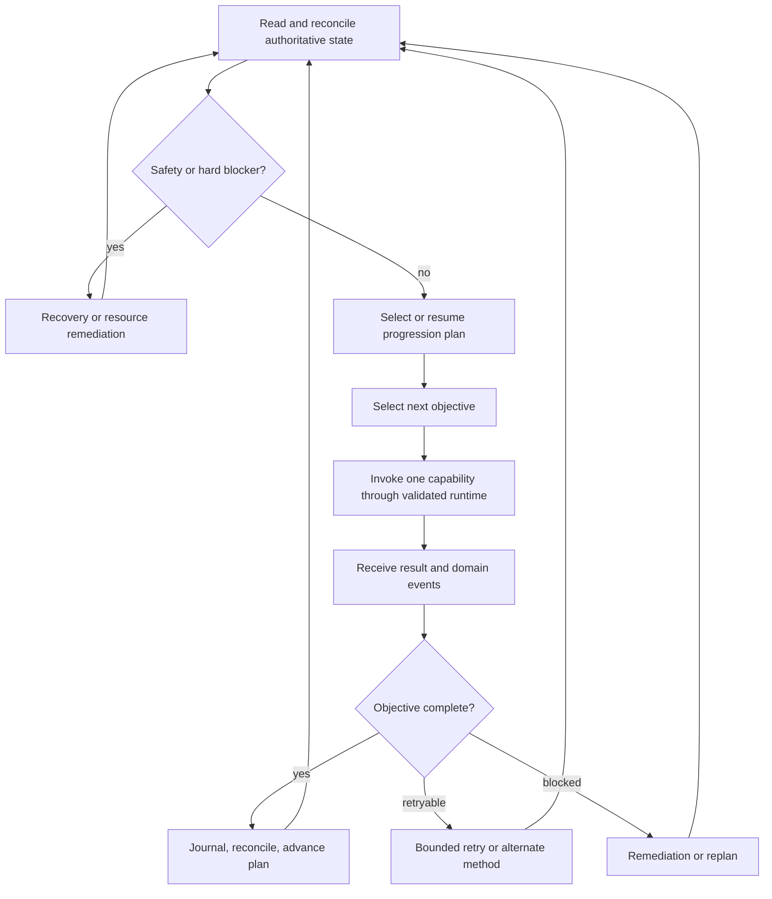

# Tier 1 Independent Agent Progression Implementation Plan

## Status And Planning Authority

This is the next-step implementation plan for the first independently
progressing Agent milestone. It consolidates the relevant gameplay, capability,
catalog, build, quest, combat, inventory, shop, recovery, profile, population,
and migration work already documented across the repository.

This document is authoritative for:

- the capabilities required for basic independent progression;
- what is required for level 30 and level 70;
- the boundary of the new Upgrade capability;
- the recommended implementation sequence;
- the first reference character path and cohort rollout;
- acceptance gates before Social, Economy, Trade, or LLM autonomy.

The broader architecture and legacy migration remain defined by
[Agent Capability Migration And Dynamic Engine Roadmap](AGENT_CAPABILITY_MIGRATION_AND_DYNAMIC_ENGINE_ROADMAP.md).
Detailed algorithms remain in their specialized specifications.

## Naming Clarification

“Tier 1” in this document means the first **gameplay autonomy milestone**. It
does not mean simulation Tier 1, event priority 1, or migration Phase 1.

To keep the acceptance gates clear, the milestone is divided into:

```text
M1-A: fresh character -> normal first job -> independent progression -> level 30
M1-B: normal second job -> independent progression -> level 70 and third-job readiness
```

M1-A proves that the complete autonomy loop exists. M1-B extends the same loop
over a much larger content, class, equipment, and resource range. Completing a
third-job advancement at level 70 can be added as the first objective of the
next milestone; M1-B must at least reach level 70 with a valid build and all
third-job prerequisites clearly reconciled.

## Product Goal

An M1 Agent must be able to start from a clean supported character and progress
without a player issuing movement, quest, combat, shop, build, or recovery
commands.

The Agent should be able to:

- finish the supported Maple Island route;
- select and persist a supported Explorer career/build;
- travel through normal portals and reach required NPCs/maps;
- perform normal first- and second-job advancement flows;
- allocate AP and SP legally according to its assigned build;
- select supported quests and training plans;
- fight suitable mobs using its job skills and resources;
- collect required and useful drops;
- protect, consume, equip, sell, and otherwise manage inventory safely;
- restock potions, ammo, return scrolls, and basic NPC-sold equipment;
- obtain equipment from inventory, quests, drops, or NPC shops;
- recover from death, stuck movement, resource shortage, full inventory,
  disconnect, restart, and temporarily impossible objectives;
- resume from persisted state without repeating rewards or losing progress;
- reach level 30 in M1-A and level 70 in M1-B;
- explain what it is doing, what blocked it, and why it changed plans.

It should do this without an LLM, Social system, player trade, Free Market, or
Economy engine. Those systems may later add more choices, but the Agent must
already possess a reliable self-progression path.

## Definition Of Independent

For this milestone, “independent” means:

- no owner/player command is required after starting autonomy;
- no GM job change, quest force-complete, arbitrary item grant, or routine warp
  is used in the production path;
- recovery warps are allowed only through an explicit, audited Recovery policy
  after normal alternatives fail;
- all attacks, pickups, item use, NPC transactions, quest changes, equipment
  changes, and job changes use validated server authority;
- every active objective has completion evidence, timeout, cancellation,
  retry, and blocker behavior;
- the Agent can replan instead of retrying one impossible action forever;
- state survives relog and server restart at documented checkpoints;
- disabling presentation dialogue does not disable gameplay;
- an operator can stop the Agent and identify its plan, objective, capability,
  and last blocker.

Independence does not mean the Agent must use every MapleStory system. It needs
at least one safe, legitimate solution for each progression need. For example,
it can buy ordinary potions from an NPC without yet negotiating with another
player or optimizing Free Market prices.

## Scope Decisions

### Required In M1

- autonomous progression/plan selection;
- catalog and map-strategy queries;
- career, AP, SP, and job advancement;
- navigation and portal travel;
- NPC, quest, reactor, and item-use objectives;
- generic combat and class skill execution;
- loot;
- inventory policy and reservations;
- supplies and consumption;
- NPC Shopping;
- equipment selection and equip execution;
- acquisition planning using self-service sources;
- safety, death, stuck, and blocker recovery;
- persistence, reconciliation, decision journals, and operator controls;
- training-map selection and population/map capacity awareness;
- conservative Upgrade support for M1-B, with the exact gate described below.

### Secondary After M1

- Social relationships and conversational goals;
- ambient Dialogue beyond minimal diagnostics/presentation;
- Agent-to-Agent or Agent-to-player Trade;
- Economy, Free Market, price speculation, and market-making;
- LLM planning or open-ended player conversation;
- parties, party quests, bosses, and coordinated group combat;
- Maker/crafting as a general acquisition source;
- account quest inheritance and Double Agent switching;
- advanced scrolling, speculative perfect-item projects, and market-funded
  upgrading;
- cosmetic collection, fame strategy, guilds, events, and minigames.

Social is intentionally secondary. A self-sufficient Agent first proves that
its goals, resources, movement, combat, build, and persistence are correct.
Social, Trade, and Economy can later offer alternate ways to satisfy the same
typed acquisition and progression needs.

## The Autonomous Progression Loop



The planner should not call low-level services directly. It selects a goal and
objective. The Capability Runtime owns execution, validation, timeout,
cancellation, and result mapping. Authoritative world state remains in Cosmic.

### Priority Ladder

When more than one need exists, use this initial deterministic priority:

1. lifecycle shutdown, invalid session, or authoritative reconciliation;
2. death, critical danger, stuck, or invalid map/position recovery;
3. critical HP/MP/ammo supply remediation;
4. required job advancement or unresolved AP/SP build state;
5. active quest objective that is still feasible;
6. inventory capacity or protected-item conflict;
7. minimum viable equipment or weapon requirement;
8. planned quest chain;
9. suitable grind/training plan;
10. planned item/equipment/scroll acquisition;
11. opportunistic loot or conservative upgrade;
12. bounded rest or idle fallback.

This ladder determines urgency, not permanent plan preference. A target or plan
lease prevents oscillation. Replanning should occur only on completion,
material state change, explicit failure threshold, capacity loss, or a higher
priority interruption.

## Tier 1 Capability Inventory

### Priority Definitions

```text
P0: required for a correct single-Agent M1-A run
P1: required for reliable all-job M1-A or M1-B progression
P2: useful later; deliberately outside the first independent loop
```

### Capability Matrix

| Capability/system | Priority | M1-A to 30 | M1-B to 70 | Current foundation | Main gap |
| --- | --- | --- | --- | --- | --- |
| Capability runtime and behavior routing | P0 | required | required | typed frames/results/journals and mailbox foundations exist | complete policy selection, cancellation, provenance, and blocker routing |
| Progression planner and plan runtime | P0 | required | required | Maple Island/Amherst plans and generic plan interfaces exist | generalized plan library, autonomous selection, commitment, remediation, resume |
| Catalog and map strategy | P0 | required | required | maps, mobs, items, drops, quests, shops, skills, NPCs, portals and MVP indexes load | worldwide validation, training queries, regions/capacity overlays, upgrade catalog runtime |
| Profile/career/build binding | P0 | required | required | behavior profiles and runtime AP/SP behavior exist | durable composable career/AP/SP/gear/plan assignment and version reconciliation |
| Perception/live-state snapshots | P0 | required | required | shared map perception and server gateways exist | one capability-safe state view and freshness/invalid-state rules |
| Navigation and portal travel | P0 | required | required | extensive graph, foothold, climb, portal, route, and recovery mechanics exist | broader route coverage, stable objective contract, alternate-route and no-progress policy |
| Recovery and safety | P0 | required | required | respawn, teleport, airborne/bounds and stuck recovery foundations exist | unified interruption policy, escalation ladder, plan resume and recovery budgets |
| NPC interaction | P0 | required | required | catalog-aware validator/request/result and gateway boundaries exist | production-wide action support, script classification, reliable approach/arrival evidence |
| Quest | P0 | required | required | generic start/complete validation and proven Maple Island catalogs/plans exist | reusable objective model, worldwide support statuses, reward choices and special handlers |
| Reactor/item-use/object interactions | P0 | required for supported quests | required for supported quests | primitive capabilities exist | catalog coverage and explicit unsupported-action routing |
| Combat | P0 | required | required | substantial target, attack, skill, buff, ammo, grind, anchored-farm and recovery code exists | generic policy boundary, map region assignment, class parity, stable quest/grind integration |
| Loot | P0 | required | required | eligibility, target, grind, cleanup and passive/background services exist | Inventory item-interest contract, diversion budgets, foreground/background authority |
| Inventory | P0 | required | required | collection, drop, sell, use, ammo, trade/equip helpers exist | unified snapshot, reservations, contextual disposition, capacity remediation |
| Supplies | P0 | required | required | potion/ammo counts, autopot, sharing and return-scroll behavior exist | separate need/consumption/acquisition, remove chat and population scans |
| NPC Shopping | P0 | required | required | approach, potion/ammo policy, sequencing, state and gateways exist | consume procurement/disposition plans; separate Free Market; robust sell/restock loop |
| Equipment | P0 | required | required | optimizer, compatibility, scoring, recommendation and executor exist | durable build inputs, complete loadout plan, acquisition request and reconciliation |
| AP/SP allocation | P0 | required | required | `AgentBuildService` and static build tables exist | data-driven profiles, prerequisites, missing branches, durability, no owner prompt dependency |
| Job advancement | P0 | first job | second job | direct chat/starter-kit job changes exist | normal NPC/test plan and dedicated validated transition capability |
| Acquisition planner | P0 | required | required | item source, shop, drop and quest catalogs exist separately | one planner that chooses inventory/quest/drop/NPC-shop sources without owning execution |
| Training-map planner | P0 | required | required | combat/grind behavior and catalog concepts exist | contextual ranking by job/build/yield/travel/supplies/risk/crowding |
| Persistence and reconciliation | P0 | required | required | plan progress and server persistence gateways exist in parts | durable capability sessions, build/plan bindings, restart resume and idempotency |
| Observability/operator controls | P0 | required | required | diagnostics, journals, production logging and soak work exist | one autonomy status surface, reason codes, kill switches and milestone dashboards |
| Population/map allocation | P1 | cohort proof | required at scale | cohort runner and Population Director designs exist | map admission, capacity/region leases, channel distribution and fairness |
| Upgrade/scrolling | P1 | optional/off by default | conservative V1 recommended | catalog specification and core server scroll mechanics exist | no Agent Upgrade capability, gateway, plan, policy, runtime catalog, or tests |
| Storage | P1 | optional | recommended if inventory pressure demands it | deferred inventory/storage snapshot work exists | explicit access, transfer, reservation and reconciliation capability |
| Simulation-tier/background actions | P1 | not needed for one Agent | required for large populations | design/runtime and background-action concepts exist | capability parity and materialization validation for the full loop |
| Social/Dialogue/Trade/Economy/LLM | P2 | not required | not required | substantial partial systems/specifications exist | intentionally deferred until self-progression is reliable |

“Current foundation” is a static code/document assessment, not a claim that the
level-30 or level-70 end-to-end run already passes. Many packages contain
strong mechanics but still combine policy, execution, presentation, or
runtime-entry state.

## Core System Boundaries

### Progression And Plan Runtime

Progression owns **what to do next**. It should select among a bounded library
of plans:

- finish current quest;
- start a supported quest chain;
- advance job;
- spend AP/SP;
- train to a level milestone;
- acquire minimum equipment;
- remediate supplies;
- clear inventory capacity;
- obtain an objective item;
- return to town;
- recover and resume;
- postpone an unsupported or inefficient objective.

Every plan declares:

```text
planId and version
entry conditions
desired outcome
ordered or conditional objectives
required capabilities
supported jobs/levels/regions
hard constraints
commitment and replan rules
failure/remediation routes
completion evidence
```

The first planner should be deterministic with bounded weighted alternatives.
Do not start with general-purpose search or an LLM. Plan selection needs a
clear reason and a progress guarantee.

### Catalog And Map Strategy

M1 depends on fast read-only knowledge for:

- maps, portals, footholds, ropes/ladders, regions and hazards;
- mobs, spawn regions, level, accuracy/risk and expected objective value;
- items, equipment requirements, consumable effect and disposition tags;
- drop sources and quest reward sources;
- quests, prerequisites, objectives, NPC actions and reward choices;
- shops, fixed prices, available items and resupply suitability;
- skills, prerequisites, target counts, attack/support classification;
- job advancement NPCs, tests and route requirements;
- training candidates by job/build/level;
- scroll target types, success/destruction rules and stat changes;
- map capacity, party split and farming-region overlays.

The current runtime catalog does not yet load the specified scroll/upgrade
catalog. M1-B Upgrade work should add it to the versioned bundle and fast query
indexes rather than reading WZ or config during a decision tick.

“Best map” must remain a contextual query. Score candidates using level/job,
accuracy, damage, skill range, quest/drop objectives, travel, supplies,
equipment, risk, crowding, map capacity and observed yield.

### Profile, Career, Build, And Plan Binding

An Agent needs a durable composition:

```text
career profile
AP build profile
SP build profile
gear policy
combat/supply behavior profile
plan set
autonomy policy version
```

The composition must survive relog/restart and reconcile with an existing
character. Runtime prompts are not acceptable as the source of truth for an
independent Agent.

The M1 build library should include all five Explorer first jobs and their
second-job branches intended for testing. Start with a smaller validated set,
then expand. An unsupported build must hold points and report a blocker rather
than guess.

### Navigation

Navigation owns how to reach a requested point, NPC, portal, region, map, or
drop. It does not decide why the destination matters.

M1 requirements:

- inter-map portal routing with expected destination validation;
- same-map walk, jump, fall, rope, ladder and platform routing;
- alternative reachable route selection;
- route commitment and no-progress detection;
- portal/map-arrival evidence;
- bounded recovery without repeated falling/rope oscillation;
- map-strategy region/anchor support;
- foreground physics and later background ETA parity;
- cancellation on objective, map, session or simulation-tier change.

World-scale navigation should be expanded by route coverage reports. Do not
declare all Victoria maps supported merely because they appear in the portal
graph.

### Recovery And Safety

Recovery is a P0 capability, not a final fallback hidden inside movement.

It owns intervention for:

- death and respawn;
- out-of-bounds/invalid foothold/airborne timeout;
- repeated rope, ladder, portal or route oscillation;
- repeated target changes with no objective progress;
- critical HP/MP/ammo shortage;
- inventory deadlock;
- map/objective mismatch;
- stale capability/session generation;
- disconnect/relogin/restart reconciliation;
- repeated server rejection.

Escalation should be:

```text
retry current action
-> small local reset or alternate edge
-> reselect route/target
-> return to safe region/town normally
-> audited recovery teleport where allowed
-> block objective and replan
-> stop Agent when invariants cannot be restored
```

Recovery reports what it changed. It does not silently mark a quest or plan
complete.

### Quest, NPC, Item Use, And Reactor Objectives

Quest owns quest truth and decomposition. Generic quest flow:

```text
eligible
-> navigate and start normally
-> execute typed objectives
-> verify requirements
-> select reward
-> navigate and complete normally
-> reconcile rewards and next quest
```

Typed objectives should cover:

- talk/start/complete;
- kill mob/count;
- collect item/count;
- deliver item;
- use item;
- interact with reactor/field object;
- visit map/region;
- reach level;
- spend AP/SP or advance job when the quest truly requires it;
- choose reward;
- wait for a script/presentation invariant;
- party/shared/timed objectives later.

Every quest has an execution support status. Unsupported scripts, events,
party requirements, or uncertain sources are postponed with a reason. The
planner must never infer that catalog presence means safe execution.

M1-A should use a curated set of validated level-30 quests. M1-B expands by
region/job and can grind through content gaps. Full worldwide quest coverage is
not required to prove independent progression.

### Combat

Combat owns the tactical encounter within an assigned objective and map
region. It must support:

- quest-required targets and drop sources;
- suitable grind targets;
- explicit incidental/filler target policy;
- target and route commitment;
- class/job weapon and skill legality;
- melee, projectile, and magic range/position behavior;
- ammo, MP, buff, cooldown and attack timing;
- no-target, unreachable-target and dangerous-target fallbacks;
- death and supply interruptions;
- stop conditions for level, kill count, item count, time, risk or resource
  budget;
- observer and background simulation rules.

The initial target priority remains:

```text
required quest mob
active quest drop source
spawn-pressure target
useful safe filler
cheap incidental mob already in the way/attack coverage
wait, reposition, change region, or replan
```

The existing attack mechanics should remain authoritative. V2 work should
replace policy around them rather than reimplement packet or damage behavior.

### Loot

Loot detects eligible drops, asks Inventory whether they are interesting, and
collects them under route/time budgets.

For M1:

- active quest items and critical supplies have highest priority;
- useful equipment and mesos follow;
- low-value items are taken only when capacity and route cost permit;
- protected ownership/expiry rules always apply;
- foreground Agents physically approach/pick up;
- no-observer background collection may be enabled only through audited
  authoritative background actions;
- direct-to-storage is deferred until Storage has an explicit contract.

Loot does not decide to sell, equip, scroll, or trade an item.

### Inventory

Inventory owns the Agent-facing truth about held items:

- consistent snapshot and free-slot/stack capacity;
- item classification and quantity-aware interest;
- reservations and protected amounts;
- keep/equip/consume/store/sell/drop/trade/upgrade-candidate disposition;
- reconciliation after authoritative changes;
- remediation proposal when capacity is low/full.

Required reservation reasons:

- active quest;
- accepted near-future plan;
- HP/MP/ammo/return-scroll reserve;
- current equipment candidate;
- upgrade base item or scroll plan;
- promised transaction later;
- operator/test protection.

Items such as quest materials must be contextual. Completion of the current
quest may release an active reservation, but a known near-future quest can keep
a smaller future-demand reservation. Unknown items fail conservatively to keep,
not automatic destructive sale.

M1 inventory-capacity remediation order:

1. stack/consume where naturally needed;
2. equip an approved upgrade;
3. sell Inventory-approved NPC trash/obsolete consumables;
4. use Storage if M1-B Storage is enabled and reachable;
5. drop only explicitly disposable items;
6. postpone loot/objective or return a blocker.

### Supplies

Supplies owns resource requirements and consumption policy:

- effective HP/MP recovery on hand;
- potion trigger thresholds and waste limits;
- ammo/star/bullet reserve;
- return scroll and class-specific consumables;
- expected consumption for the next plan/travel horizon;
- critical/low/healthy state;
- acceptable substitute items and target quantity.

It emits a `SupplyNeed`. It does not choose a particular NPC, run a trade, or
send required operational chat.

The planner resolves a shortage through existing inventory, an NPC shop, a
drop/quest acquisition plan, safe rest/passive recovery, or later Storage/
Trade. If the Agent has no mesos, it must select a feasible earning plan rather
than loop at the shop.

### NPC Shopping

M1 Shopping is NPC-only. It owns:

- selecting a reachable NPC shop from catalog results;
- comparing fixed stock and prices against a procurement request;
- navigating/approaching/opening the shop;
- validated purchase and Inventory-approved sale execution;
- handling partial purchase, no mesos, no slots, unavailable stock and shop
  interaction failure;
- reconciling inventory/mesos after the transaction.

It does not decide what is valuable, set a build, negotiate, or use the Free
Market. Current Free Market stall classes should move behind a later Market/
Economy boundary.

For potions, the request and selection should consider recovery per meso,
recovery per slot, expected waste, travel cost, plan horizon and urgency.

### Equipment

Equipment owns legal loadout selection and execution:

- job/level/stat/sex/fame and weapon compatibility;
- comparison of current and candidate loadouts;
- job/build-specific stat value;
- full-slot optimization rather than isolated item score only;
- safe equip/unequip/replacement ordering;
- future-build reservation recommendations;
- an acquisition request when an important slot cannot be satisfied.

Equipment does not decide where to farm or buy. It describes acceptable
candidates and minimum improvement. Acquisition chooses a source.

M1-A can progress with ordinary quest/drop/NPC gear and should not require
scrolling. M1-B can introduce conservative Upgrade where it materially improves
a retained item, but base equipment progression remains the fallback.

### AP And SP Build

Build owns legal allocation according to a durable profile.

M1-A requirements:

- five Explorer first-job career profiles;
- validated AP rules including fixed cap and regular requirement-aware variants;
- data-driven first-job SP targets with prerequisites;
- reconciliation with existing points/skills;
- hold-and-block behavior for unsupported or inconsistent builds;
- automatic allocation after level-up without an owner prompt;
- no normal respec or hidden point creation.

M1-B adds:

- supported second-job career branches;
- second-job SP profiles through level 70;
- skill book and job-tree validation;
- equipment-aware AP variants where explicitly tested;
- third-job readiness validation.

The current `AgentBuildService` is valuable reference behavior, but static Java
tables and live runtime choices should migrate to versioned data. Existing
direct chat job changes and starter-kit grants are test helpers/legacy behavior,
not the autonomous advancement path.

### Job Advancement

Job Advancement should be a distinct validated capability composed by a career
plan. It owns:

- current/target job legality;
- level, stat, quest, test and NPC prerequisites;
- execution of the normal server-supported transition;
- verification of job, SP, skill and starter-item results;
- idempotent resume after disconnect or partial script progress.

It uses Navigation, NPC, Quest, Combat, Inventory and Build as needed. Build
selects the intended career and allocates points; it should not directly call
`changeJob` as the production progression path.

### Acquisition Planner

Acquisition is a planner/orchestrator, not another inventory mutation
capability. It answers:

> Given an item need, which currently supported source should satisfy it?

M1 source methods:

```text
ALREADY_OWNED
QUEST_REWARD
MOB_DROP
NPC_SHOP
STORAGE (optional M1-B)
```

Later source methods:

```text
TRADE
FREE_MARKET
MAKER_OR_CRAFT
SOCIAL_REQUEST
ECONOMY_OPPORTUNITY
```

Source scoring uses eligibility, travel, combat risk, expected acquisition
time, mesos, supplies, inventory capacity, quest side effects and confidence.
The result is a normal composed plan. Acquisition does not grant the item.

This is the key to keeping Equipment and Upgrade clean. “Farm a scroll” is an
Acquisition plan using Combat and Loot; “buy an NPC-sold scroll” is an
Acquisition plan using Shopping; “use the scroll” is Upgrade.

### Training-Map Planner And Allocation

When no higher-value supported quest is available, the Agent needs a safe grind
plan. Training-map selection considers:

- level and job;
- chance to hit/accuracy and damage;
- skill range, target count and movement needs;
- experience and desired drops;
- travel time and return/shop access;
- potion/ammo burn and death risk;
- map geometry and class suitability;
- current population, region leases and recommended capacity;
- observed Agent performance with confidence and decay.

For a single Agent, the whole map may be assigned. For multiple Agents, the
Population/Allocation policy chooses top/bottom/region splits from map strategy
overlays. Combat only consumes its region assignment.

### Persistence And Reconciliation

Persist durable intent and progress, not every transient tick.

Required durable state:

- Agent identity and autonomy enabled state;
- assigned career/AP/SP/gear/plan profiles and versions;
- current plan, objective and completion journal;
- quest/inventory/build reconciliation watermark;
- map/route destination when safe to resume;
- reservations that represent durable promises;
- Upgrade plan state before any destructive attempt;
- policy/cohort assignment and decision provenance.

Transient combat targets, movement edges and dialogue cooldowns should be
reconstructed or cleared on restart. Resume begins by reading authoritative
server state and reconciling; it must not blindly replay the last command.

### Observability And Operator Control

M1 needs one compact status surface:

```text
agent and policy versions
level/job/build
current plan and objective
active capability and elapsed time
map/position/route target
HP/MP/supply state
inventory capacity and reservations
combat/quest progress
last decision/reason/result
retry/recovery counters
last persistence/reconcile time
```

Required controls:

- start/stop/pause autonomy;
- inspect and explain;
- force safe replan without granting outcomes;
- per-capability legacy/V2 selection;
- allowed job/level/map/quest scope;
- emergency population and Upgrade kill switches.

## Upgrade Capability Recommendation

### Recommendation

Do not make strategic scrolling a blocker for M1-A level 30. Add a separate,
conservative Upgrade V1 during M1-B preparation. A level-30 Agent should be
able to progress with normal equipment acquisition; otherwise scrolling bugs
will obscure more fundamental build, combat, and inventory problems.

Upgrade V1 is worthwhile before the level-70 cohort because equipment persists
longer, scroll drops become more relevant, and the full acquisition loop needs
a safe way to use them. Its first purpose is functional autonomy, not perfect
gear or economic optimization.

### Boundary

Upgrade owns:

- validating that a scroll can target an equipment item;
- reading scroll success, destruction, slot and stat rules from the catalog;
- applying server configuration modifiers;
- evaluating an approved attempt against a bounded risk policy;
- reserving the exact scroll and base item for the attempt;
- executing one validated scroll action through a dedicated gateway;
- reconciling success, failure, slot consumption, destruction and item state;
- emitting upgrade events and completion evidence.

Upgrade does not own:

- deciding the Agent's career/build;
- deciding which base equipment is desirable;
- farming or buying the scroll/base item;
- pricing the result;
- trading or using the Free Market;
- reacting in chat;
- repeatedly attempting until success without a committed plan and budget.

### Capability Composition


### Suggested Upgrade Plan

```yaml
upgradePlanId: thief-claw-basic-60-v1
baseItemSelector:
  itemId: 1472008
  minimumRemainingSlots: 1
scrollSelector:
  targetCategory: claw
  allowedSuccessRates: [60, 100]
goal:
  minimumAttackGain: 1
  maximumAttempts: 3
risk:
  allowDestroy: false
  allowWhiteScroll: false
  allowChaos: false
  preserveReplacement: true
budget:
  maximumScrolls: 3
  maximumAcquisitionTimeMinutes: 45
fallback:
  - keep-current-item
  - acquire-better-base-item
```

The schema should select by constraints where possible, not require one fixed
item ID for every profile.

### Upgrade Policy Modes

```text
OFF
OPPORTUNISTIC_SAFE
PLANNED_CONSERVATIVE
PLANNED_ADVANCED (post-M1)
```

- `OFF`: retain/sell/store scrolls according to Inventory policy.
- `OPPORTUNISTIC_SAFE`: use an already-owned non-destructive scroll on an
  approved disposable/replaceable item when the expected improvement is clear.
- `PLANNED_CONSERVATIVE`: acquire a bounded number of approved scrolls for a
  retained item; no destructive or special-scroll mechanics.
- `PLANNED_ADVANCED`: later Economy/profile-aware projects, replacement stock,
  white/chaos/special scrolls and market decisions.

M1-B should enable only the first three modes and default to
`PLANNED_CONSERVATIVE` for explicitly validated build templates.

### Initial Safety Restrictions

Upgrade V1 should initially prohibit:

- scrolls with any destruction chance;
- Chaos, White Scroll, Clean Slate, Vega/cash or server-special mechanics;
- scrolling one-of-a-kind, irreplaceable quest, cash, locked or promised items;
- attempts on an equipped item without verified server support and rollback
  semantics;
- dynamic “use every scroll in inventory” behavior;
- more attempts than the plan budget;
- decisions based on unknown catalog/config data;
- silent direct item mutation.

The policy must be aware of server configuration such as flat scroll-success
bonuses and tradeability/one-of-a-kind rules. Catalog bundle version and config
snapshot belong in the decision provenance.

### Utility Without Economy

M1 does not need market prices to make a conservative scrolling decision.
Use bounded gameplay utility:

```text
expected upgrade utility
  = success probability * build-weighted stat gain
  - failure probability * consumed-slot cost
  - destruction probability * replacement difficulty
  - acquisition time/supply risk
  - opportunity cost of using a reserved item
```

Replacement difficulty can be a catalog/profile ordinal such as trivial,
common, limited, rare, or protected. Economy can later replace or augment it
with price/liquidity beliefs.

### Farming Or Buying Scrolls

Intentional scroll farming is a Progression/Acquisition plan:

1. Equipment identifies a worthwhile retained item and improvement goal.
2. Upgrade resolves acceptable scroll categories and attempt budget.
3. Acquisition ranks known quest, drop, and NPC-shop sources.
4. The planner checks expected time, level suitability, supplies and capacity.
5. Combat/Loot or Shopping obtains the scroll normally.
6. Inventory reserves the scroll and base item.
7. Upgrade performs one attempt at a time and reconciles.
8. Progression stops when the goal/budget is reached or replans after failure.

Do not farm scrolls simply because the Agent owns an equipment item with open
slots. The upgrade must serve a build milestone and have a bounded budget.

### Upgrade Implementation Gaps

The Agent engine currently has no dedicated Upgrade package or gateway. The
core server has scroll mechanics, and the documentation specifies a scroll/
upgrade catalog, but the current Agent runtime catalog does not load that
catalog. Required M1-B work is:

1. add validated scroll/upgrade catalog output and fast indexes;
2. add `UpgradeGateway` around normal authoritative scroll application;
3. define request/result/reason codes and immutable snapshots;
4. add Inventory reservations for scroll/base item;
5. implement validation-only and shadow recommendation;
6. implement one non-destructive scroll family in canary mode;
7. reconcile all outcome branches and relog persistence;
8. expand by scroll category only after fixtures pass.

## Blocker And Remediation Routing

| Blocker | Owning remediation | Required behavior |
| --- | --- | --- |
| dead | Recovery | respawn, reconcile map/state, resume or replan |
| stuck/no position progress | Navigation then Recovery | alternate edge/route, bounded reset, block after budget |
| no eligible mob | Combat/Training | wait briefly, change region/map, choose alternate objective |
| target unreachable | Navigation/Combat | alternate approach/target, respect target/route lease breaks |
| no HP/MP potions | Supplies/Acquisition | use acceptable stock, NPC restock, safe earning plan, or block combat |
| no ammo | Supplies/Shopping | equip/reload acceptable ammo, buy, or choose a non-ammo plan/build if legal |
| no mesos for supplies | Progression | safe quest/grind/drop-sale plan; never loop at shop |
| inventory full | Inventory/Shopping/Storage | consume/equip/sell/store/drop by approved disposition |
| quest item protected | Inventory | maintain reservation; reject sell/drop/upgrade/transfer |
| quest unsupported | Quest/Progression | postpone with support reason and select another plan |
| quest reward has no slot | Inventory/Quest | create capacity before completion; do not lose reward |
| NPC/shop unavailable | Navigation/Shopping | verify catalog/live placement, alternate shop, postpone |
| incompatible equipment | Equipment/Build | reject, retain fallback, emit acquisition requirement |
| AP/SP profile unresolved | Build | hold points, report blocker, do not guess |
| job advancement incomplete | Job/Quest | resume normal advancement plan, verify transition idempotently |
| upgrade data unknown | Upgrade | do not attempt; retain items and report missing catalog support |
| scroll failure | Upgrade/Progression | reconcile item/slots, continue only inside budget, otherwise fallback |
| restart/disconnect | Persistence/Reconciliation | invalidate transient work, reread authority, resume safe objective |

This routing table prevents capabilities from improvising another capability's
policy and avoids endless retries.

## Recommended Implementation Sequence

### Wave 0: Freeze The Milestone Contract

#### Work

- select supported M1-A reference job/build and exact level-30 end state;
- define allowed maps, quests, shops, items and job paths for the first slice;
- capture fresh-character and Maple Island exit fixtures;
- define forbidden shortcuts and recovery exceptions;
- add one M1 status/decision schema and success dashboard;
- inventory direct job/item/quest mutations and legacy ticks.

#### Recommendation

Use **Thief -> Assassin** as the first reference path unless a short baseline
test proves its current combat/navigation loop materially less reliable than
Warrior. It already exercises the existing claw/SP path, projectile combat,
ammo Inventory/Supplies/Shopping, equipment compatibility, questing and ranged
positioning. Proving those systems creates a stronger generic foundation than
a path that avoids ammo and range concerns.

#### Exit Gate

- one written, reproducible reference scenario;
- every production mutation and forbidden shortcut identified;
- M1 scope can be enabled/disabled independently.

### Wave 1: Autonomy Kernel

#### Work

- generalize the proven plan runtime without changing Maple Island results;
- implement durable career/build/plan assignment;
- add decision provenance, capability modes and cancellation;
- normalize authoritative state snapshots and reconciliation;
- finish catalog bundle/index validation for the reference scope;
- implement objective/blocker/remediation contracts;
- provide operator start/stop/status/replan controls.

#### Reason

Without the kernel, every capability becomes another autonomous tick with no
single goal, ownership, or restart behavior.

#### Exit Gate

- Maple Island runs through the generalized plan path;
- restart/resume does not repeat a completed objective;
- an objective can block and return control to the planner;
- status identifies one current plan and one active capability.

### Wave 2: Survival, Inventory, And Resource Spine

#### Work

- Inventory unified snapshots, reservations and contextual disposition;
- Supplies need/consumption separation;
- NPC Shopping procurement/disposition execution;
- Equipment loadout planning bound to Build profiles;
- Acquisition source planning for owned/quest/drop/NPC shop;
- Recovery escalation and plan resume;
- zero-meso, zero-potion/ammo and full-inventory remediation tests.

#### Reason

Long progression fails first on resources and inventory, not on sophisticated
planning. These capabilities must be trustworthy before a grind can run for
hours.

#### Exit Gate

- reference Agent can earn mesos, restock, sell approved items, preserve quest
  items and equip compatible gear without help;
- no destructive action bypasses reservation;
- every resource deadlock ends in remediation, replan or an explicit stop.

### Wave 3: Career And Job Spine

#### Work

- versioned career/AP/SP/gear profiles for the reference path;
- automatic legal AP/SP allocation and reconciliation;
- normal first-job NPC/test advancement plan;
- starter reward/equipment reconciliation without hidden grants;
- Build and Equipment response to level/job change;
- tests at levels 8, 10 and every subsequent level through 30.

#### Exit Gate

- a fresh reference Agent advances normally and reaches the intended first job;
- AP/SP are legal after relog/restart;
- no owner chat or GM job command is required;
- unsupported state holds points safely.

### Wave 4: Quest, Training, Combat, Loot, And Navigation Loop

#### Work

- curate the first Victoria quest library and support statuses;
- add contextual training-map queries and initial map strategy overlays;
- integrate Quest/Training directives with generic Combat and Loot;
- validate map/portal/region routes for the reference level bands;
- add target/route commitment, incidental policy and no-target remediation;
- validate item/count/kill/reward stop conditions;
- run repeated quest-to-grind-to-resupply-to-quest cycles.

#### Exit Gate

- the reference Agent can alternate quests and grinding without manual target or
  map selection;
- repeated route/combat/loot loops make measurable progress and terminate;
- death/stuck/resource interrupts resume the correct plan;
- no unsupported quest is guessed or force-completed.

### Wave 5: M1-A Reference Agent To Level 30

#### Work

- run clean end-to-end attempts from level 1 and from a Maple Island exit
  fixture;
- inject failure cases at multiple levels;
- relog/restart at quest, grind, shop, job and inventory checkpoints;
- compare deterministic seeds and decision journals;
- soak the single reference build until it reaches level 30 repeatedly.

#### Exit Gate

- at least 20 consecutive clean reference runs reach level 30 or a chosen
  statistically justified gate, with zero silent corruption;
- all failures have actionable blocker reasons;
- no manual gameplay command or forbidden shortcut occurs;
- final quest, AP/SP, job, equipment, inventory and mesos state reconcile.

### Wave 6: All Five First Jobs To Level 30

#### Work

- add career/AP/SP/gear profiles and job plans for Warrior, Magician, Bowman,
  Thief and Pirate;
- validate melee, magic, projectile, ammo and buff class combat matrices;
- add job-suitable training/quest choices;
- expand supply and equipment policies by class;
- run one of each job, then mixed cohorts;
- add additional build variants only after the baseline job path passes.

#### Exit Gate

- all five first-job reference builds independently reach level 30;
- build legality and resource behavior survive restart;
- failures are capability/content gaps, not unbounded loops;
- mixed cohorts respect map capacity and do not synchronize into one map/plan.

### Wave 7: Upgrade V1 And M1-B Content Preparation

#### Work

- add scroll/upgrade catalog runtime and gateway;
- implement Upgrade `OFF`, `OPPORTUNISTIC_SAFE` and
  `PLANNED_CONSERVATIVE` modes;
- validate non-destructive scroll families in shadow/canary;
- add level-30-to-70 quest/training/map/shop/equipment coverage;
- add second-job career/SP profiles and normal advancement plans;
- add Storage only if measured inventory pressure cannot be handled safely by
  sell/use/equip behavior.

#### Exit Gate

- Upgrade can be disabled without blocking progression;
- one bounded upgrade plan completes and reconciles every outcome;
- reference second-job build, routes, supplies and combat are validated through
  representative level bands.

### Wave 8: M1-B Reference Path To Level 70

#### Work

- advance the reference Agent through the normal second-job path;
- progress using quests and grind plans across validated regions;
- use conservative equipment/Upgrade plans only where useful;
- test long-duration resource, inventory, death and restart behavior;
- validate level-70 AP/SP/equipment and third-job readiness.

#### Exit Gate

- repeated reference runs reach level 70 without manual gameplay control;
- second-job advancement and all AP/SP allocations reconcile;
- Upgrade failures never strand progression;
- level-70 readiness has explicit pass/block evidence.

### Wave 9: Second-Job Breadth And Population Proof

#### Work

- expand selected second-job branches and build variants;
- run mixed level-30-to-70 cohorts;
- enable Population Director map/channel/region allocation;
- validate foreground/background simulation parity;
- run 24-hour and then multi-day soak tests;
- scale only after single-Agent correctness metrics remain stable.

#### Exit Gate

- supported branches reach level 70 within documented success/error bounds;
- no map flooding, inventory/persistence drift or runaway retries;
- materialization preserves character state;
- population failures can be isolated to a capability, policy version and
  decision chain.

## Suggested Package And Contract Additions

These are logical ownership targets, not a demand for immediate mass moves:

```text
server.agents.progression
  ProgressionPlanner
  PlanSelectionPolicy
  ObjectiveRemediationRouter
  TrainingPlanPolicy

server.agents.capabilities.acquisition
  AcquisitionRequest
  AcquisitionCandidate
  AcquisitionPlan
  AcquisitionSourcePolicy

server.agents.capabilities.job
  JobAdvancementRequest
  JobAdvancementPlan
  JobAdvancementCapability
  JobAdvancementResult

server.agents.capabilities.upgrade
  UpgradeRequest
  UpgradePlan
  UpgradePolicy
  UpgradeCapability
  UpgradeResult
  UpgradeReasonCode

server.agents.integration
  UpgradeGateway

server.agents.catalog.strategy
  TrainingMapQuery
  MapStrategyQuery
  UpgradeCatalogQuery
```

Current `AgentMaker*` behavior should eventually leave the Build ownership
area. Maker/Crafting is an acquisition execution capability and is P2 for this
milestone. Current `AgentFreeMarketStall*` behavior should eventually leave NPC
Shopping. These moves should happen only when stable contracts exist, not as a
cosmetic package shuffle.

## M1 Configuration And Feature Gates

Recommended controls:

```yaml
agentAutonomyM1:
  enabled: false
  targetLevelCap: 30
  allowedCareerProfiles: []
  allowedPlanSets: []
  allowedQuestSupportStatuses: [VALIDATED]
  allowedMapRegions: []
  allowNpcShopping: true
  allowStorage: false
  upgradeMode: OFF
  allowTrade: false
  allowFreeMarket: false
  allowSocialPlans: false
  allowLlmPlans: false
  allowRecoveryTeleport: true
  decisionSeedMode: RECORDED
```

Each capability should also retain the independent behavior modes defined in
the migration roadmap. The Agent must not need a server restart to disable
Upgrade, a plan set, a quest family or a problematic V2 policy.

## Validation Strategy

### Data Validation

- every career path references valid jobs and advancement levels;
- all AP rules obey stat floors/caps and hold safely when unresolved;
- every SP step references a valid skill, book, maximum and prerequisite;
- gear policies resolve compatible candidates or a known fallback;
- training maps contain supported routes, mobs and return/resupply paths;
- enabled quests have valid NPCs, requirements, objectives, rewards and support
  status;
- item sources and NPC shops resolve through catalog indexes;
- upgrade records match core server scroll rules and active configuration;
- plan dependencies form no impossible cycle.

### Policy Tests

- deterministic plan choice under the same seed/state;
- commitment and bounded replanning;
- quest versus grind decision;
- training-map feasibility and crowding;
- supply need and potion/ammo substitution;
- Inventory reservation conflict;
- sell/disposition safety;
- equipment legality and severe-downgrade prevention;
- acquisition source selection;
- upgrade risk/budget and protected-item rejection;
- blocker-to-remediation routing.

### Integration Tests

- fresh Maple Island-to-Victoria transition;
- normal first- and second-job advancement;
- quest start/progress/reward/complete;
- kill and collect stop conditions;
- shop buy/sell with limited mesos/slots;
- equipment acquisition/equip;
- death/stuck/relogin/restart resume;
- one upgrade success, ordinary failure and blocked attempt;
- no-observer background action followed by materialization;
- cancellation and policy rollback during each long objective.

### Failure Injection

At minimum:

- zero mesos, potion, MP potion, stars/bullets and return scrolls;
- full each-inventory tab;
- missing/incompatible weapon;
- protected quest item mixed with sellable items;
- unreachable NPC/mob/drop and broken portal route;
- no desired mob spawn and overcrowded map;
- death during quest, grind, loot and travel;
- disconnect during shop, job advancement and upgrade;
- stale plan/catalog/profile version;
- unsupported quest script or reward choice;
- upgrade scroll/base item removed before execution;
- repeated server rejection and graceful Agent stop.

### Soak And Scale Gates

Use this order:

```text
one reference Agent
-> repeated reference runs
-> five-job small cohort
-> 10/25/50/100 mixed M1-A cohort
-> one M1-B reference Agent
-> mixed M1-B cohort
-> background/materialization tests
-> larger population soak
```

Do not use 2,000 Agents to discover basic plan or inventory correctness. Scale
only after deterministic smaller cohorts are stable.

## Milestone Completion Checklists

### M1-A Level 30

- [ ] fresh supported character starts without owner gameplay commands;
- [ ] Maple Island and Victoria arrival reconcile normally;
- [ ] career/build profile is durable;
- [ ] normal first-job advancement completes;
- [ ] AP/SP allocation is legal at every level;
- [ ] supported quests and grind plans alternate autonomously;
- [ ] navigation reaches all selected NPCs/maps/regions;
- [ ] class combat, loot and stop conditions work;
- [ ] Inventory protects quest/supply/equipment items;
- [ ] Supplies and NPC Shopping sustain combat;
- [ ] Equipment obtains/equips legal basic upgrades;
- [ ] death/stuck/full-inventory/no-meso cases remediate or replan;
- [ ] restart/relog resumes without duplicate rewards or mutation;
- [ ] Agent reaches level 30 with reconciled state;
- [ ] no Trade, Economy, Social or LLM dependency exists.

### M1-B Level 70

- [ ] normal second-job advancement completes;
- [ ] second-job AP/SP/build remains valid through level 70;
- [ ] expanded quest/training/map coverage is validated;
- [ ] class combat/resource behavior works across representative level bands;
- [ ] equipment acquisition supports the level range;
- [ ] conservative Upgrade is validated or can remain disabled without blocking;
- [ ] long-duration inventory/supply/persistence behavior is stable;
- [ ] map allocation prevents population flooding;
- [ ] Agent reaches level 70 and reports third-job readiness;
- [ ] mixed cohorts pass soak and reconciliation gates.

## Deferred Systems Re-entry Criteria

### Social And Dialogue

Begin deeper Social work after M1-A is reliable. Social should offer alternate
goals/cooperation, not be required to fix progression. Ambient dialogue remains
observer-gated presentation.

### Trade And Economy

Begin autonomous Trade after Inventory reservations, Acquisition requests and
transaction reconciliation are proven. Begin Economy in observation/proposal
mode after enough real acquisition and item-flow data exists.

### LLM

Add LLM planning only when deterministic Progression can validate/reject its
proposal and every exposed action maps to a safe capability contract.

### Parties And Party Quests

Add after single-Agent Combat, Navigation, Quest and Recovery are stable and
Population/Allocation can issue compatible map/region leases.

### Maker/Crafting

Add as another Acquisition execution method after Item, Equipment, Inventory,
and source catalogs can represent ingredients, recipes, success and output
reconciliation.

## Recommended Immediate Work Queue

The next implementation should not start with Upgrade or Social. Start with:

1. freeze the M1-A reference Assassin build, supported maps/quests and level-30
   end-state fixture;
2. generalize Maple Island plan runtime into a durable progression/objective
   kernel;
3. implement durable career/AP/SP/gear/plan profile binding;
4. unify Inventory reservations and contextual disposition;
5. separate Supplies need from Shopping execution;
6. complete NPC Shopping buy/sell procurement flow;
7. make Recovery return explicit blocker/remediation results to the planner;
8. implement the normal Thief first-job advancement plan;
9. add a curated level-10-to-30 quest/training plan set and map-strategy seed;
10. connect generic Combat/Loot/Navigation to objective stop conditions;
11. run the reference Agent repeatedly to level 30;
12. expand to all five first jobs;
13. only then implement conservative Upgrade V1 and level-30-to-70 content.

This sequence creates the minimum complete self-progression loop first. It
preserves the strong mechanics already reconstructed, exposes the missing
decision and persistence boundaries, and keeps optional systems from becoming
hidden dependencies of basic autonomy.

## Consolidated Source Map

Use this document for the implementation sequence, then consult:

- [Agent Capability Migration And Dynamic Engine Roadmap](AGENT_CAPABILITY_MIGRATION_AND_DYNAMIC_ENGINE_ROADMAP.md)
  for cross-capability ownership, behavior modes, events and legacy removal;
- [Agent Gameplay Track](AGENT_GAMEPLAY_TRACK.md) for reconstruction and Maple
  Island gameplay history;
- [Post-Maple-Island Victoria Progression Roadmap](POST_MAPLE_ISLAND_VICTORIA_PROGRESSION_ROADMAP.md)
  for career/AP/SP/gear composition and Explorer build matrices;
- [Polished Combat Capability Implementation Plan](POLISHED_COMBAT_CAPABILITY_IMPLEMENTATION_PLAN.md)
  for combat policy, scoring, commitment, scaling and rollout;
- [Quest Focus And Combat Policy](QUEST_FOCUS_AND_COMBAT_POLICY.md) for quest
  target, spawn pressure and filler rules;
- [NPC Quest Capability Design Specification](npc-quest-capability/NPC_QUEST_CAPABILITY_DESIGN_SPECIFICATION.md)
  for generic NPC/quest execution;
- [Game Knowledge Catalogs](llm-autonomy/GAME_KNOWLEDGE_CATALOGS.md) and the
  [Catalog Platform Architecture](catalog-platform/CATALOG_PLATFORM_ARCHITECTURE.md)
  for portable knowledge, training and scroll/upgrade data;
- [Agent Engine Optimization](AGENT_ENGINE_OPTIMIZATION.md) and the
  [Agent Simulation Tier Design Specification](simulation-tier-runtime/AGENT_SIMULATION_TIER_DESIGN_SPECIFICATION.md)
  for background simulation and scale;
- [Agent Population Director Design Specification](population-director/AGENT_POPULATION_DIRECTOR_DESIGN_SPECIFICATION.md)
  for cohort, map, channel and capacity allocation;
- [Agent Profile System Design Specification](profile-platform/AGENT_PROFILE_SYSTEM_DESIGN_SPECIFICATION.md)
  for durable identity/profile architecture;
- [Agent Event Bus Design Specification](event-bus/AGENT_EVENT_BUS_DESIGN_SPECIFICATION.md)
  for bounded event delivery and decoupled consumers.
