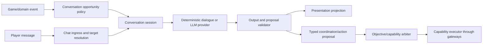

# Agent Social Chat Architecture

## Status

The provider-neutral generic-chat foundation is implemented. Targeted generic
chat and elected untargeted replies now use Agent OS immutable projections,
bounded async lanes, deterministic fallback, personality presentation styles,
and an optional independent PostgreSQL social-memory store. Typed gameplay
proposals and autonomous ambient conversations remain later phases.

## Adopted direction

The legacy `capabilities.dialogue.llm` orchestration, mutable prompt builder,
file memory, and raw Ollama gateway have been removed. New social features must
target `server.agents.social`; external providers belong under integration
adapters and receive `DialogueRequest` only.

Social dialogue is optional presentation, never an Agent OS dependency. Every
visible dialogue request carries deterministic catalog replies. The runtime may
enrich one with a model in `DIALOGUE_ONLY` mode, but missing hardware, disabled
configuration, load shedding, timeout, invalid output, or provider failure must
select a deterministic reply without changing the Agent's operational outcome.

The initial implementation deliberately permits text only. World decisions and
Agent-to-Agent operational coordination remain typed, deterministic Agent OS
contracts and do not pass through the dialogue provider.

## Goals

The chat system should:

- let two or more Agents converse naturally without making Maple chat their
  operational protocol;
- let players address one Agent, a party, or nearby Agents without every Agent
  replying;
- preserve plan progress during casual conversation;
- allow conversation to propose cooperation, trade, party, quest, or TownLife
  actions through typed, validated contracts;
- work with deterministic dialogue alone;
- support dialogue-only and dialogue-plus-proposal LLM plugins later;
- degrade safely under load and across simulation tiers;
- remain explainable, bounded, auditable, and removable independently of core
  gameplay capabilities.

## Non-goals

Chat must not:

- directly mutate Cosmic state;
- parse Agent speech as the source of truth for Agent-to-Agent coordination;
- hold scheduler threads or capability locks while waiting for a model;
- interrupt combat, navigation, shops, NPC scripts, or recovery by default;
- allow a model to bypass authority, budgets, inventory reservations, or plan
  arbitration;
- require an observing client for Agent cooperation to work;
- cause every nearby Agent to answer the same untargeted player message.

## Current foundation

The repository already contains useful pieces:

| Existing component | Keep | Limitation to address |
|---|---|---|
| `AgentChatIngressService` | Server-facing chat entry and routing order | Uses leader/owner-era concepts and mutable `Character` inputs |
| `AgentTargetedChatRouteService` | Named-Agent resolution and deterministic-first handling | Generic fallback now hands off to the social application |
| `AgentUntargetedChatRouteService` | Group request routing | Deterministic commands still reach the group; generic replies elect one responder |
| `AgentChatOrchestrator` and flows | Existing deterministic commands and reports | A command router, not a social conversation engine |
| `AgentDialogueIntentEvent` projection | Observer-gated event presentation | Covers reactions/intention lines, not multi-turn social sessions |
| `AgentCoordinationEnvelope` | TTL, correlation, scope, acknowledgement metadata | Needs a typed social protocol family and delivery policy |
| `AgentInteractionSessionRegistry` | Bounded accepted/declined/expired sessions | Needs conversation turn, interruption, and outcome semantics |
| `DialogueProvider` | Immutable, text-only optional provider contract | Gameplay proposals remain intentionally unsupported |
| Agent mailbox and async lanes | Generation-safe delivery, bounded LLM/persistence work, load shedding | Live population soak remains required |

The implementation should evolve these seams rather than add a second
unrelated chat engine.

## Core separation

The system has two independent planes.

### Coordination plane

This is the authoritative Agent-to-Agent protocol. It uses typed messages and
never depends on visible chat.

Examples:

- `SupplyNeed`
- `SupplyOffer`
- `PartyInvitation`
- `PartyRoleProposal`
- `TradeProposal`
- `TradeCounterProposal`
- `QuestCooperationProposal`
- `MapRegionLeaseProposal`
- `ConversationInvitation`
- `ConversationOutcome`

A receiver can accept, reject, defer, or expire a proposal. An accepted
proposal still becomes a normal objective or capability command and passes
the same validation as a deterministic decision.

### Presentation plane

This produces speech bubbles, whispers, party chat, guild chat, and facial
expressions for humans to observe. It can render:

- a human-facing summary of a structured coordination exchange;
- a deterministic ambient line;
- a response to a player;
- an LLM-generated line that passed output policy.

Presentation may be suppressed in unobserved or abstract simulation. The
coordination outcome remains unchanged.



## Agent-to-Agent protocol

### Envelope

Extend the existing coordination envelope rather than introducing chat-based
commands. A social message should carry:

| Field | Purpose |
|---|---|
| `messageId` | Unique idempotency key |
| `correlationId` | Groups invitation, replies, outcome, and presentation |
| `conversationId` | Identifies the social session |
| `sourceAgentId` | Sender |
| `targetScope` | Agent, party, cohort, guild, map vicinity, or service |
| `targetId` | Scope-specific recipient |
| `messageType` | Typed payload discriminator |
| `createdAt` / `expiresAt` | Bounded lifetime |
| `replyToMessageId` | Turn/reply lineage |
| `acknowledgementRequired` | Delivery contract |
| `priority` | Safety, operational, social, or cosmetic |
| `payloadVersion` | Schema migration |
| `payload` | Typed immutable record |

Do not use a general string map for core protocols once their shape is known.
Use dedicated versioned records and reserve the generic structured message for
experimental or diagnostic traffic.

### Conversation invitation

An Agent that wants to talk publishes a `ConversationInvitation` containing:

- topic key;
- participant limits;
- desired channel/presentation;
- expected duration;
- whether gameplay action may be proposed;
- interruptibility;
- expiry;
- a compact reason/provenance.

Recipients evaluate admission independently. Personality influences tone,
willingness, turn length, and topic preference. It must not override safety,
current critical activity, cooldown, or capacity.

### Session state machine

```text
PROPOSED
  -> ACCEPTED
  -> ACTIVE
  -> OUTCOME_PROPOSED (optional)
  -> COMPLETED

Any nonterminal state:
  -> DECLINED
  -> EXPIRED
  -> INTERRUPTED
  -> CANCELLED
```

Only one participant owns the current conversational turn. Turn leases expire
so a failed model call cannot stall the session.

### Outcomes

Speech is not an action. A conversation may produce a typed proposal:

```text
SocialActionProposal
  proposalId
  conversationId
  proposerAgentId
  actionType
  immutable arguments
  expected cost
  required participants
  expiresAt
  evidence/provenance
```

The objective/capability arbiter validates it against:

- current plan and interrupt policy;
- authority and relationship policy;
- item/meso/resource reservations;
- map and channel state;
- participant acceptance;
- cooldown and rate limits;
- simulation tier;
- idempotency receipts.

Accepted proposals enter the normal objective system. Rejected proposals may
produce a polite reply but no mutation.

## Agent-to-player flow

### Ingress normalization

All player channels become one immutable input:

```text
PlayerChatInput
  messageId
  playerCharacterId
  playerName
  channel
  map/channel/world
  target token or explicit target id
  sanitized text
  receivedAt
  authority/relationship projection
```

Raw `Character`, client, map, or packet objects must not cross into policy or
model-provider code.

### Routing order

1. Validate sender, channel, size, rate, and target.
2. Handle explicit administrative commands through AuthorityService.
3. Resolve a pending deterministic interaction/session response.
4. Route explicit `AgentName: message` to one Agent.
5. Route party/guild messages to an elected responder when appropriate.
6. For untargeted local speech, score eligible nearby Agents.
7. Run deterministic intent classification.
8. If unmatched and enabled, request a bounded LLM dialogue response.
9. Validate/sanitize the output.
10. Queue presentation through the owning Agent mailbox.

Untargeted speech must elect zero or one primary responder by default. A small
number of secondary reactions may be selected by policy, but never one reply
from every Agent.

### Responder election

Score candidates using immutable inputs:

- explicitly named target;
- distance and line-of-social-presence;
- relationship/familiarity;
- current conversation participation;
- personality interest in the topic;
- whether the Agent can answer from known facts;
- current activity and interrupt cost;
- recent response count/cooldown;
- simulation tier and load-shedding state.

Use stable deterministic jitter based on message and Agent ids. This prevents
synchronized replies while keeping tests reproducible.

### Trust boundary

Player text is untrusted input. It cannot:

- grant authority;
- inject system prompts;
- reveal hidden Agent/server state;
- make an Agent transfer assets without validated trade flow;
- override active objectives;
- name arbitrary server classes, commands, files, or tools;
- cause unbounded Agent fan-out or model calls.

## Non-disruptive scheduling

Conversation is a soft foreground activity, not a plan replacement.

| Current Agent state | Default chat behaviour |
|---|---|
| Dead, recovering, falling, portal transition | Queue briefly or decline |
| Active combat with threat | Short reaction only; no multi-turn session |
| Critical supply/shop/NPC mutation | Wait until mutation completes |
| Navigation on a safe walk segment | Allow short local/party response |
| TownLife or idle | Allow multi-turn session |
| Background active | Structured coordination; presentation only if observed |
| Background abstract | Resolve deterministic protocol/outcome abstractly; no visual chat |

The conversation session stores a soft activity lease. It never holds a
movement, inventory, or plan lock while waiting on asynchronous work.

If a conversation produces an accepted gameplay proposal, the objective
supervisor decides whether to:

- execute immediately as a harmless side action;
- suspend the current objective with a durable reason;
- enqueue it after the current objective;
- reject it as incompatible.

## Dialogue providers

Define a provider-neutral interface:

```text
DialogueProvider.generate(DialogueRequest, CancellationToken)
    -> DialogueResult
```

`DialogueRequest` contains only immutable, bounded projections:

- Agent identity/personality/tone;
- relationship summary;
- current safe-to-disclose activity summary;
- conversation transcript summary and last few turns;
- relevant public world facts;
- permitted response channels;
- allowed proposal schemas;
- token/time budget;
- locale and safety policy version.

`DialogueResult` contains:

- display text;
- optional emote;
- optional typed proposals;
- confidence;
- provider/model id;
- prompt/policy/catalog versions;
- latency/token/cost metrics;
- refusal or fallback reason.

### Support levels

| Mode | Model authority |
|---|---|
| `DETERMINISTIC_ONLY` | No model call; catalog/classifier replies only |
| `DIALOGUE_ONLY` | May propose text and emote; cannot propose gameplay action |
| `DIALOGUE_PLUS_PROPOSALS` | May emit allowlisted typed proposals; deterministic validation remains authoritative |

There is deliberately no direct-decision or direct-mutation mode.

## Memory

Use separate memory classes:

| Memory | Examples | Retention |
|---|---|---|
| Session transcript | Last few turns and pending question | Session TTL |
| Relationship summary | Familiarity, trust category, last interaction | Bounded durable summary |
| Public fact memory | Player-stated preference that is safe to retain | Consent/policy bounded |
| Operational coordination | Supply offer, party role, trade proposal | Protocol TTL and receipts |
| Model provenance | Prompt/policy/model version and result hash | Audit window |

Do not store raw chat indefinitely. Summarize after a bounded number of turns,
drop expired protocol payloads, and keep private server facts out of prompts.

## Observer-aware presentation

Before emitting Maple chat, check the real-network-recipient view:

- no real observer: skip cosmetic map chat;
- one or more observers: render according to channel and visibility;
- structured Agent coordination: always deliver independently of presentation;
- player-directed whisper: deliver only to the target player;
- abstract tier: record an optional compact social outcome, not packet text.

This keeps 2,000-Agent operation from generating pointless packet, model, or
log traffic.

## Rate limits and load shedding

Apply independent budgets:

- per-player ingress messages;
- per-Agent replies;
- per-map ambient conversations;
- concurrent sessions per Agent;
- model requests per Agent/world;
- token/cost budget;
- coordination messages per correlation id;
- secondary reactions per player message.

Load shedding order:

1. ambient LLM conversations;
2. ambient deterministic presentation;
3. secondary reactions;
4. proactive player engagement;
5. nonessential transcript persistence.

Never shed:

- authority/security handling;
- accepted transaction reconciliation;
- critical structured coordination;
- conversation/session cancellation and cleanup.

## Observability

Record structured metrics without logging private prompt content:

- ingress accepted/rejected by reason;
- responder-election candidates and winner;
- deterministic/model/fallback route;
- session starts, completions, interruptions, expiries;
- proposal accepted/rejected and policy reason;
- reply latency;
- model timeout/error/token/cost;
- presentation suppressed because unobserved;
- dedupe and loop-guard hits;
- mailbox/async queue rejection.

Every generated line should be traceable to:

- input message/event id;
- conversation id;
- Agent profile version;
- deterministic catalog or provider/model version;
- safety policy version;
- optional proposal ids.

## Loop and abuse prevention

Agent-to-Agent conversation needs explicit guards:

- maximum turns and duration;
- repeated-normalized-line detection;
- repeated-topic cooldown;
- no self-reply;
- no model output fed back as new player ingress;
- correlation-chain depth;
- per-session token budget;
- participant and map fan-out limits;
- cancellation on session generation change or relog;
- idempotent proposal receipts.

## Recommended package boundaries

```text
server.agents.social
  contracts/        immutable messages, sessions, proposals, results
  policy/           opportunity, admission, responder election, interruption
  coordination/     typed Agent-to-Agent protocol adapters
  conversation/     turn/session state machine
  memory/           bounded transcript and relationship projections
  provider/         deterministic and LLM provider interfaces
  validation/       output, disclosure, proposal, loop, budget checks
  projection/       observer-aware Maple presentation intents
  monitoring/       metrics and diagnostics

server.agents.capabilities.dialogue
  existing command compatibility and presentation formatting

server.agents.integration
  chat delivery, recipient views, Cosmic channel adapters
```

The new `social` domain may consume immutable dialogue, event, personality,
relationship, and perception contracts. It must not import concrete Combat,
Navigation, Inventory, Trade, Quest, Plan, or Cosmic implementations.

## Implementation sequence

### Phase 1 — Contracts and routing safety

1. Add immutable `PlayerChatInput`, `ConversationInvitation`,
   `ConversationTurn`, `DialogueRequest`, `DialogueResult`, and
   `SocialActionProposal`.
2. Replace untargeted fan-out with deterministic responder election.
3. Add conversation admission, TTL, turn limit, dedupe, and cancellation.
4. Adapt existing deterministic chat flows behind `DialogueProvider`.
5. Keep all existing gameplay commands functioning.

Acceptance:

- one untargeted message cannot make every Agent respond;
- suppressing presentation does not change Agent behaviour;
- sessions terminate under timeout/relog/failure.

### Phase 2 — Structured Agent-to-Agent social protocol

1. Add dedicated coordination payload records for invitations and outcomes.
2. Connect them to the interaction session registry.
3. Project selected exchanges to chat only when observed.
4. Add typed proposal validation and objective/capability arbitration.

Acceptance:

- Agents cooperate with map chat disabled;
- duplicate messages cannot duplicate actions or transactions;
- conversation never owns inventory, trade, or plan mutation.

### Phase 3 — Dialogue-only plugin

1. Replace raw two-string model calls with immutable `DialogueRequest`.
2. Add cancellation, time/token budgets, provenance, and output policy.
3. Run calls on the bounded LLM lane.
4. Keep deterministic fallback for timeout, rejection, and load shedding.

Acceptance:

- provider has no mutable runtime/Cosmic types;
- a failed model call cannot stall an Agent;
- output is bounded, sanitized, attributable, and optional.

### Phase 4 — Dialogue plus proposals

1. Allow only versioned proposal schemas advertised in each request.
2. Validate proposals with the same deterministic policy as native decisions.
3. Require participant acceptance where relevant.
4. Journal decision provenance and idempotent result receipts.

Acceptance:

- adversarial output cannot bypass capability boundaries;
- replaying a result cannot duplicate a mutation;
- a proposal can be explained, rejected, queued, suspended, or accepted.

### Phase 5 — Personality, relationships, and population scale

1. Add bounded relationship summaries.
2. Let personality tune opportunity, tone, patience, and topic preference.
3. Integrate party/guild/TownLife contexts.
4. Validate FULL, BACKGROUND_ACTIVE, and BACKGROUND_ABSTRACT parity.
5. Run 100/500/2,000-Agent load tests with model calls disabled and enabled at
   controlled percentages.

## Review decisions required before implementation

1. Which player channels are supported first: map, whisper, party, guild?
2. Should untargeted local speech elect at most one or at most two responders?
3. Which proposal types are allowed in the first social MVP?
4. What relationship facts may be retained, and for how long?
5. Which messages require an observer before a model call is worthwhile?
6. What per-world model budget and maximum response latency are acceptable?
7. Should a player be able to opt out of Agent-initiated conversation?
8. Which moderation/disclosure policy applies to model-generated text?

## Recommended first implementation slice

The safest valuable slice is:

1. normalized immutable player-chat input;
2. deterministic one-responder election;
3. bounded conversation session state;
4. deterministic dialogue provider adapter;
5. observer-aware presentation;
6. no gameplay proposals yet.

That slice improves current chat behaviour and establishes the final boundaries
without making progression depend on an LLM.
