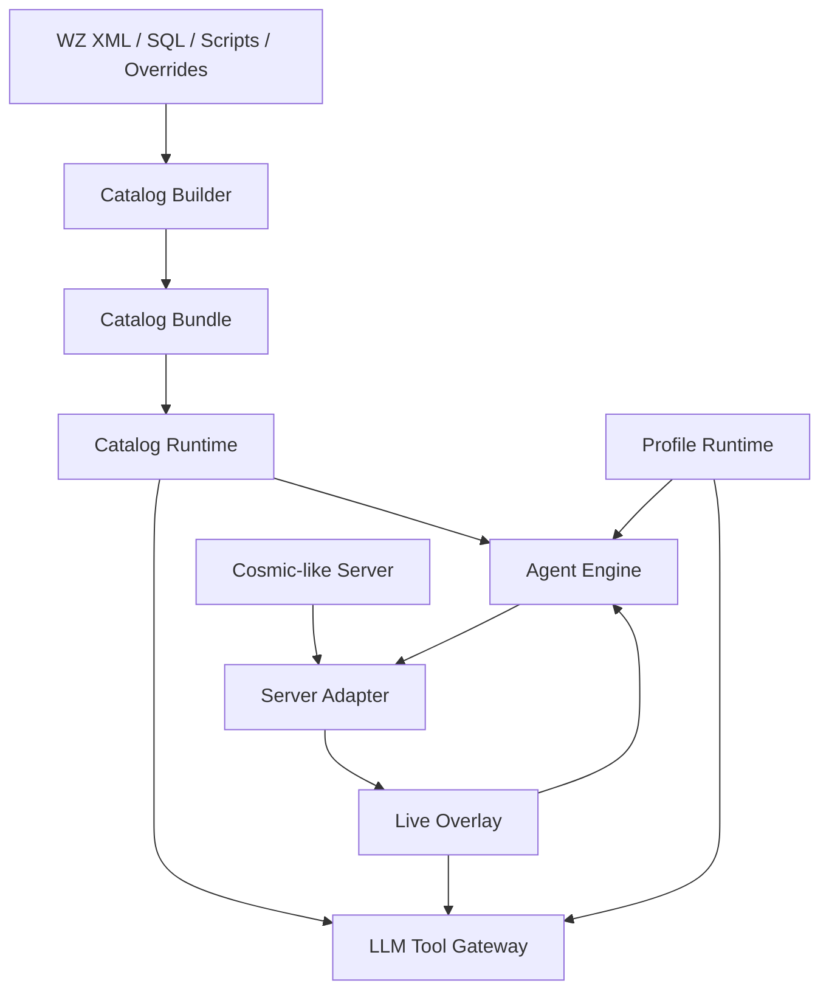

# Catalog Platform Architecture

The catalog platform is a portable knowledge system for Cosmic-like servers.
It prepares static game knowledge for Agent engines and LLM directors without
taxing the live server.

The platform must not depend on Cosmic server runtime classes. Any server can
adopt it by implementing the server adapter contract.

## Goals

- Build game knowledge from WZ/XML, SQL seed data, scripts, and overrides.
- Package the result as a portable catalog bundle.
- Load the bundle into a fast read-only runtime.
- Serve Agent engine and LLM queries through stable APIs.
- Keep live server truth separate from static catalog knowledge.
- Allow other Cosmic-based servers to port the system with only adapter work.

## Non-Goals

- Do not execute quest, shop, script, combat, or movement actions.
- Do not require the catalog builder to run inside the game server.
- Do not require a specific database.
- Do not require an LLM.
- Do not treat static catalog data as live truth.

## Architecture



## Layer Responsibilities

### Catalog Builder

Answers:

```text
What exists in this server's assets?
```

Responsibilities:

- Parse WZ XML.
- Parse SQL seed data.
- Optionally scan scripts.
- Merge manual overrides.
- Generate normalized catalogs.
- Generate query indexes.
- Write manifest and source hashes.
- Produce validation reports.

### Catalog Bundle

Answers:

```text
What portable data was generated?
```

Responsibilities:

- Store canonical JSON catalogs.
- Store derived indexes.
- Store schema versions.
- Store source hashes.
- Be safe to copy to another process or machine.

### Catalog Runtime

Answers:

```text
What does static game knowledge say?
```

Responsibilities:

- Load bundle.
- Validate manifest compatibility.
- Build in-memory or SQLite indexes.
- Serve read-only query APIs.
- Provide LLM-safe summaries.
- Never mutate game server state.

### Live Overlay

Answers:

```text
What has been observed recently?
```

Responsibilities:

- Store market observations.
- Store route failures.
- Store live crowding/danger signals.
- Store discovered shops/prices.
- Expire or decay time-sensitive observations.

### Server Adapter

Answers:

```text
What is true live right now, and how can validated actions execute?
```

Responsibilities:

- Expose live agent/map/inventory/quest state.
- Execute validated actions.
- Hide server-specific classes.
- Provide live validation data.

### Agent Engine

Answers:

```text
What should this agent do next, and how should it execute?
```

Responsibilities:

- Combine catalog, profile, memory, and live server state.
- Route commands to capabilities.
- Validate actions.
- Execute movement/combat/NPC/economy tasks.

### LLM Tool Gateway

Answers:

```text
What goals/tasks should be assigned?
```

Responsibilities:

- Provide safe read-only tools.
- Submit typed commands.
- Summarize batch agent state.
- Never expose raw server mutation APIs.

## Portable Boundary

The platform should use plain IDs and DTOs:

```text
mapId
npcId
mobId
itemId
questId
skillId
agentId
worldId
channelId
```

Avoid:

```text
MapleMap
Character
MapleQuest
MapleShop
MapleMonster
Client
```

Those belong only inside the server adapter implementation.

## Knowledge Composition

Consumers should query a composed view:

```text
KnowledgeView = Static Catalog + Live Overlay + Agent Profile + Agent Memory
```

Examples:

- Static catalog says an item drops from a mob.
- Live overlay says a route to that map failed recently.
- Profile says the agent avoids high death risk.
- Engine chooses a different farming map.

## Data Format Strategy

Canonical bundle:

```text
JSON
```

Optional runtime accelerators:

```text
SQLite
in-memory hash indexes
memory-mapped binary cache
```

The JSON bundle is the portable source of truth. Accelerated indexes can be
rebuilt from it.
