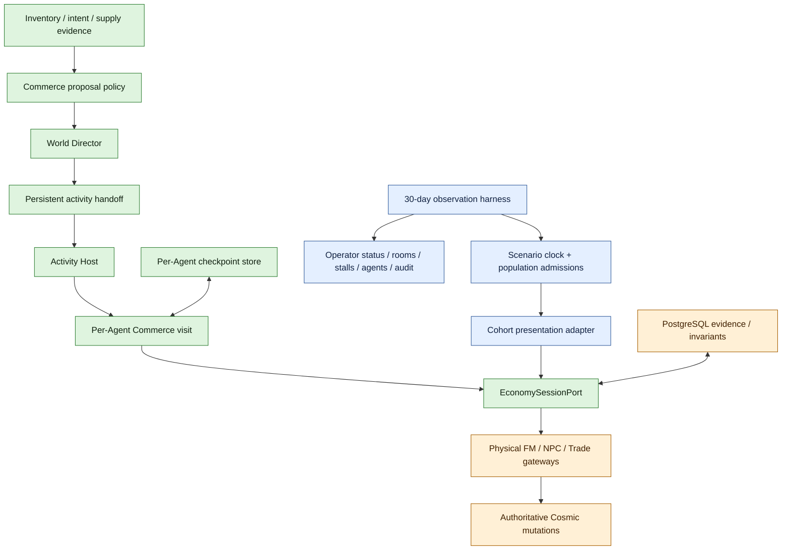

# Commerce target architecture and 12-phase rollout

This is the canonical migration plan for two deliberately separate deliverables:

1. **Agent-owned Commerce** — a production primary activity entered by one Agent for one bounded
   visit through the World Director and Activity Host.
2. **Commerce observation** — an external 30-day operator harness that reserves a deterministic
   cohort, changes its size from 10 to 100, and makes physical Free Market behavior inspectable.

The observation harness may compose Commerce. Commerce must never depend on the harness, its
population planner, or its simulated external-activity scheduler.

## Target architecture



### Ownership rules

- The World Director selects Commerce; Commerce never starts Hunting, Questing, or TownLife.
- The Activity Host admits exactly one foreground owner.
- A Commerce visit owns market decisions and protected shop/trade drain only for its accepted
  session. Travel to the visit remains an external transfer responsibility.
- Inventory owns item eligibility and reservations. Socials owns interaction protocol. Commerce
  owns market intent and valuation. Cosmic gateways alone mutate items, mesos, shops, or trades.
- Test population growth, logical-day scheduling, and calibrated offscreen farming are observation
  concerns. They are not production Commerce APIs.
- PlayerShop permits must come from the WZ-verified `514xxxx` pool. The default FM participation
  subsidy is an explicit journaled source; Hired Merchant items and unlabeled administrative grants
  remain rejected.

## Per-Agent visit lifecycle

```text
evidence -> proposal -> World Director selection -> destination preflight
         -> source drains/suspends -> transfer reaches FM -> requestEntry
         -> ACTIVE market cycles -> DRAINING shop/trade -> COMPLETED/FAILED
         -> terminal outcome consumed -> checkpoint acknowledged
```

`AgentCommerceSessionCheckpoint` is the restart boundary. It stores the request, real economy
session identity, Activity Host phase, timing, retry time, and reason. File and PostgreSQL stores
implement the same port. A restored session does not replay admission.

## Observation lifecycle

The 30-day preset reserves 100 live characters deterministically. Day one materializes ten at the
FM entrance. Ten more materialize at each logical-day boundary through day ten. Future cohorts are
removed from map observers while staged; stopping restores only characters that were never admitted.
Admitted characters retain normal physical market state for inspection.

`MAX_THROUGHPUT` compresses logical waiting and offscreen calibrated activity. Portal movement,
walking, shop opening, browsing, chat, Trade settlement, and shop drain remain physical gates.
Therefore `advance 1` is not a promise of instant completion.

## Twelve phases

| Phase | Deliverable | Local status | Release evidence still required |
|---|---|---|---|
| 1 | Freeze production/observation ownership and dependencies | Complete | Boundary test remains green in full suite |
| 2 | Move the neutral participant model out of scenario ownership | Complete | Checkpoint compatibility review before old class deletion ships |
| 3 | Add typed bounded per-Agent visit request, purpose, and terminal outcome | Complete | One live entry/release trace per purpose |
| 4 | Add durable per-Agent checkpoints and atomic file/PostgreSQL stores | Complete | Apply V022 and perform restart during ACTIVE and DRAINING |
| 5 | Register per-Agent Commerce as an Activity Host primary owner | Complete | Live handoff from each of TownLife, Hunting, and Questing |
| 6 | Publish evidence-backed Commerce proposals to the neutral World Director model | Complete foundation | Autonomous proposal collection/selection stays off until all four systems publish comparable evidence |
| 7 | Make session leases per-Agent and preserve protected drain semantics | Complete | Live PlayerShop and Trade drain; no leaked or stolen lease |
| 8 | Move process-level population/scenario runtime under observation ownership | Complete | No production import of observation packages |
| 9 | Add deterministic 10-to-100 cohort staging and physical admission | Complete | Live day-1/day-2 admission and stop restoration check |
| 10 | Add observable commands for population, rooms, stalls, agents, and audit | Complete | Operator client screenshots and command smoke test |
| 11 | Keep strict permits, exact Cosmic mutations, evidence, and invariants | Complete baseline | Real permit inventory, sales/closures, restart, and clean audit |
| 12 | Canary, 30-day soak, rollback, and legacy scenario retirement | Ready to begin | Complete the rollout gates below |

“Complete” above means the local code and focused automated contracts exist. It does not claim that
a physical 30-day client-visible soak has occurred.

## Operator commands

Apply database migrations through V022, start at least 100 live Agents on channel 1, and capture the
required activity calibrations. The default entry policy provisions one journaled real permit only
for entrants who own none.

```text
!commerce observe preflight
!commerce observe start [run-uuid]
!commerce observe advance 1
!commerce observe status
!commerce observe population
!commerce observe rooms
!commerce observe stalls
!commerce observe agent <logical-id|IGN>
!commerce observe audit
!commerce observe stop
!commerce observe resume <run-uuid>
```

`preflight` reports how many reserved characters happen to be in the FM, but it no longer requires
them to be manually parked there: cohort presentation owns deployment. It still fails closed for
roster, job binding, channel, database, calibration, and permit-policy problems.

## Phase-12 rollout and rollback

1. Run the focused tests and full Maven suite.
2. Apply V022 to a disposable database and verify clean initialization.
3. Canary one Agent through entry, browsing, release, and restart.
4. Canary ten Agents for one logical day; verify physical rooms and invariant audit.
5. Resume the same run after a server restart while one shop is open.
6. Advance one day and verify the second ten-Agent cohort appears exactly once.
7. Stop before day ten and verify only unadmitted staged characters return to their original maps.
8. Run the complete 30-day 10-to-100 observation and export evidence.
9. Enable per-Agent autonomous Commerce proposals only after equivalent proposals exist for all four
   primary systems and selection telemetry is reviewable.
10. Retire the legacy process roster lease only after no operator command or checkpoint depends on it.

Rollback is configuration- and entry-point-based: stop the observation run, leave autonomous
Commerce proposal activation disabled, and continue using the prior activity owners. V022 is
additive and does not alter existing economy tables. Never roll back by deleting evidence rows or
forcibly closing protected shops/trades.

## Known live gates

- The harness requires 100 simultaneously live Agent characters because it reserves identities up
  front for deterministic resume.
- Calibrated external activity remains an observation placeholder. It is detached from production
  Commerce and can later be replaced by real Agents requesting Hunting.
- Autonomous World Director ingestion is intentionally not activated system-wide yet. Selecting
  Commerce before TownLife, Hunting, and Questing expose comparable proposal evidence would create a
  new hidden priority policy.
- A real v83 PlayerShop permit remains mandatory to open a stall. The default policy creates one
  only as a visible `VENUE_SUBSIDY`; it never substitutes a Hired Merchant or hides the source.
