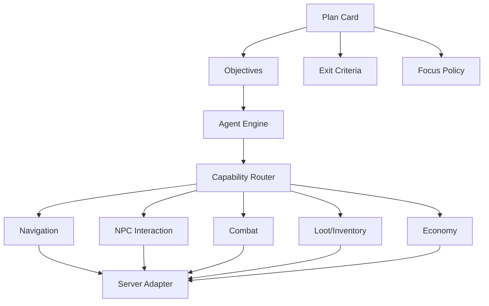

# Plan Card System

The Plan Card system is the future high-level planning layer above legacy bot
behavior and Agent capabilities.

It lets an Agent engine run structured plans such as questlines, farming loops,
market scouting, supply runs, party support, and LLM-assigned goals.

## Design Rule

```text
Plan Card = what should be achieved.
Objective = one concrete step toward the plan.
Capability = how the engine achieves the objective.
Server Adapter = live validation and execution.
```

The LLM may create, select, reorder, pause, or cancel plans, but the Agent engine
executes objectives through validators and capabilities.

## Core Shape



## Plan Card

Example:

```json
{
  "schemaVersion": 1,
  "planId": "maple-island-basic",
  "title": "Maple Island Questline",
  "category": "questline",
  "priority": "normal",
  "owner": "llm-director",
  "status": "available",
  "objectiveMode": "ordered",
  "focusPolicy": {
    "focusLevel": "medium",
    "allowSidetracks": true,
    "allowEmergencyInterrupts": true,
    "allowSocialInterrupts": false,
    "allowEconomyInterrupts": false,
    "maxSidetrackDurationMs": 300000
  },
  "entryCriteria": {
    "minLevel": 1,
    "maxLevel": 12,
    "requiredMapIdsAny": [0, 10000, 20000],
    "blockedIfQuestCompleted": []
  },
  "exitCriteria": {
    "completeWhen": "all-required-objectives-cleared",
    "finalMapId": 60000,
    "forbiddenActions": [
      {
        "type": "npc-interact",
        "npcId": 1022000,
        "reason": "Do not talk to Shanks yet."
      }
    ]
  },
  "objectives": []
}
```

## Plan-Level Controls

Every plan card should declare enough policy for the scheduler to decide whether
to run, pause, sidetrack, or abandon it without hardcoded special cases.

Recommended controls:

- `priority`: how strongly this plan should compete with other plans.
- `objectiveMode`: fixed order, dependency order, opportunistic, LLM-directed,
  or hybrid.
- `focusPolicy`: whether sidetracks, social events, economy events, and
  emergencies may interrupt.
- `forbiddenActions`: actions that must not happen while the plan is active.
- `budget`: meso, item, potion, time, death-risk, and travel limits.
- `timeLimit`: hard or soft deadline for this plan.
- `riskPolicy`: when to continue, postpone, ask for help, or request LLM review.
- `retryPolicy`: retry count, backoff, and alternate objective behavior.
- `pauseResumePolicy`: how to persist state and resume after crash/relog.
- `exitCriteria`: machine-checkable success, failure, and early-exit rules.
- `rollbackPolicy`: what to undo when the plan partially completes.

## Objective

Each objective should do one thing. It may activate multiple capabilities, but
the objective itself should remain simple.

Example: start a quest.

```json
{
  "objectiveId": "start-quest-1000",
  "kind": "quest-start",
  "required": true,
  "status": "pending",
  "dependsOn": [],
  "target": {
    "questId": 1000,
    "npcId": 1012100,
    "mapId": 100000000
  },
  "capabilities": [
    {
      "type": "navigation",
      "command": "navigate-to-npc",
      "inputs": {
        "mapId": 100000000,
        "npcId": 1012100
      }
    },
    {
      "type": "npc",
      "command": "accept-quest",
      "inputs": {
        "questId": 1000,
        "npcId": 1012100
      }
    }
  ],
  "successCriteria": {
    "questState": "started"
  },
  "failurePolicy": {
    "retryLimit": 3,
    "onBlocked": "request-replan",
    "onTooDangerous": "postpone-plan"
  }
}
```

Example: do quest requirement.

```json
{
  "objectiveId": "collect-item-4000004-x10",
  "kind": "collect-item",
  "required": true,
  "status": "pending",
  "dependsOn": ["start-quest-1000"],
  "target": {
    "itemId": 4000004,
    "quantity": 10,
    "forQuestId": 1000
  },
  "capabilities": [
    {
      "type": "knowledge",
      "command": "find-drop-source",
      "inputs": {
        "itemId": 4000004
      }
    },
    {
      "type": "navigation",
      "command": "navigate-to-best-farm-map"
    },
    {
      "type": "combat",
      "command": "farm-mobs-for-item"
    },
    {
      "type": "loot",
      "command": "collect-required-item"
    }
  ],
  "successCriteria": {
    "inventoryHasItem": {
      "itemId": 4000004,
      "quantity": 10
    }
  }
}
```

## Objective Types

Objectives are not limited to quest steps. A plan card can contain concrete
steps, policy-driven decisions, maintenance actions, exploration, social work,
or economy actions.

Recommended objective kinds:

- `ConcreteObjective`: one specific target, such as start quest, complete quest,
  navigate to NPC, buy item, or kill mob.
- `PolicyObjective`: choose an action from rules, profile, inventory, economy
  state, and current context.
- `ExplorationObjective`: discover maps, portals, shops, drops, mobs, or player
  market information.
- `MaintenanceObjective`: refill supplies, repair plan state, clear inventory,
  recover from death, or return to a safe map.
- `SocialObjective`: party support, trade assist, follow player, respond to
  request, or join/leave group activity.
- `ReactiveObjective`: temporary response to danger, rare drop, shop bargain,
  party request, or LLM intervention.
- `EconomicObjective`: sell, buy, hold, stash, merchant-list, farm-for-sale, or
  scan market.

The scheduler should treat objective kind as a routing hint, not as permission
to mutate server state. All mutation still goes through capability validators.

## Policy Objective

A `PolicyObjective` describes what outcome is desired and the rules for choosing
actions at runtime. This is needed for plans such as selling trash, because the
correct behavior depends on agent profile, quest state, market state, crafting
needs, and inventory pressure.

Example: sell trash.

```json
{
  "objectiveId": "sell-trash-policy",
  "kind": "policy",
  "policyType": "sell-trash",
  "required": false,
  "status": "pending",
  "inputs": {
    "inventoryScope": ["etc", "equip", "use"],
    "preserveQuestItems": true,
    "preserveFutureQuestItems": true,
    "preserveCraftingMaterials": "profile-dependent",
    "preserveRequestedItems": true,
    "preserveAboveAverageEquips": true,
    "sellCommonBelowAverageEquips": true,
    "sellNpcJunk": true
  },
  "profileVariants": [
    {
      "variant": "crafter",
      "policy": {
        "preserveOres": true,
        "preserveMakerMaterials": true,
        "preferStashOverNpcSell": true
      }
    },
    {
      "variant": "minimalist",
      "policy": {
        "preserveOres": false,
        "sellLowLiquidityItems": true,
        "minimumReserveSlots": 8
      }
    },
    {
      "variant": "market-aware",
      "policy": {
        "checkMarketBeforeNpcSell": true,
        "minimumMarketPremiumOverNpc": 3.0,
        "avoidSellingItemsWithKnownBuyerDemand": true
      }
    }
  ],
  "capabilities": [
    {
      "type": "economy",
      "command": "recommend-disposal-actions"
    },
    {
      "type": "inventory",
      "command": "validate-protected-items"
    },
    {
      "type": "npc",
      "command": "sell-approved-items-to-npc"
    }
  ],
  "successCriteria": {
    "inventoryPressureBelow": "medium",
    "noProtectedItemsSold": true
  }
}
```

Policy objectives should emit an explainable proposal first:

```text
policy objective
  -> proposal from economy/profile/catalog state
  -> validator checks protected items and plan constraints
  -> capability executes approved actions
  -> objective records result and reason codes
```

The economy engine can recommend actions, but the plan engine owns whether those
actions become executable objectives.

## Objective Ordering

Supported modes:

```text
ordered:
  objectives run in fixed order

dependency:
  objectives can run when dependencies are satisfied

opportunistic:
  engine chooses convenient objectives based on map, route, profile, supplies

llm-directed:
  LLM can reorder between objective boundaries

hybrid:
  dependency rules are hard, convenience ordering is allowed within them
```

For quests, use `dependency` or `hybrid`, not only fixed ordering. This allows
the engine to complete nearby compatible objectives without breaking quest
prerequisites.

## Objective Status

```text
pending
ready
running
blocked
postponed
skipped
failed
completed
cancelled
manual-review-required
```

## Exit Criteria

Exit criteria should be explicit and machine-checkable.

Types:

```text
all-required-objectives-cleared
any-objective-cleared
agent-decision
llm-decision
time-limit
death-risk
supply-shortage
blocked-prerequisite
social-interrupt
manual-cancel
```

Example:

```json
{
  "exitCriteria": {
    "completeWhen": "all-required-objectives-cleared",
    "alsoRequire": [
      {
        "type": "agent-location",
        "mapId": 60000,
        "description": "Stop at Southperry."
      }
    ],
    "forbiddenActions": [
      {
        "type": "npc-interact",
        "npcId": 1022000,
        "description": "Do not proceed to Lith Harbor yet."
      }
    ],
    "allowedEarlyExitReasons": [
      "too-dangerous",
      "missing-prerequisite",
      "supply-shortage",
      "party-invite-accepted",
      "llm-reassigned"
    ]
  }
}
```

## Focus Policy

Focus policy controls how much the agent may sidetrack.

```json
{
  "focusLevel": "high",
  "allowSidetracks": true,
  "allowedSidetrackTypes": ["emergency", "assist-party", "loot-valuable-drop"],
  "blockedSidetrackTypes": ["market-scan", "exploration", "social-idle"],
  "maxSidetrackDurationMs": 180000,
  "returnToPlan": "always",
  "llmApprovalRequiredForSidetrack": false
}
```

Focus levels:

- `locked`: only emergencies can interrupt.
- `high`: finish plan unless blocked or unsafe.
- `medium`: allow useful short sidetracks.
- `low`: plan is a preference, not strict.
- `opportunistic`: agent may reorder heavily for convenience.

## Sidetrack Cards

Do not represent sidetracks as random behavior hidden inside capabilities.
Represent them as temporary child plan cards.

```json
{
  "planId": "sidetrack-help-agent-42",
  "parentPlanId": "maple-island-basic",
  "category": "assist",
  "priority": "high",
  "timeLimitMs": 180000,
  "returnPolicy": {
    "returnToParentPlan": true,
    "restoreObjectiveId": "collect-item-4000004-x10"
  }
}
```

This makes interruptions auditable and resumable.

## Agent Decision Exit

Agents may request to postpone or exit a plan, but they should not silently drop
it.

Request:

```json
{
  "agentId": 123,
  "planId": "maple-island-basic",
  "request": "postpone",
  "reason": "too-dangerous",
  "evidence": {
    "deathRisk": "high",
    "recentDeaths": 1,
    "potionPressure": "high"
  },
  "recommendedNextPlan": "buy-supplies"
}
```

The Plan Scheduler decides:

- approve postpone
- override and continue
- ask LLM
- switch to support/supply/training plan

## LLM Readiness

LLM should see summarized plan state:

```json
{
  "agentId": 123,
  "activePlan": {
    "planId": "maple-island-basic",
    "title": "Maple Island Questline",
    "progress": "5/12 objectives",
    "currentObjective": "collect Orange Mushroom Caps",
    "blocked": false,
    "focusLevel": "medium",
    "allowedSidetracks": ["emergency", "assist-party"]
  },
  "recommendations": [
    "continue",
    "buy more potions soon"
  ]
}
```

LLM commands should be high-level:

```text
assign_plan
pause_plan
resume_plan
cancel_plan
reprioritize_plan
approve_sidetrack
reject_sidetrack
change_focus_policy
```

The LLM should not directly execute objective capabilities.

## Direct LLM Navigation

Expose direct navigation as intent-level control, not raw movement control.

Allowed:

```text
navigate_to_point(agentId, mapId, x, y, constraints)
```

Not allowed:

```text
press left
press jump
set position
teleport to x/y
```

Recommended command:

```json
{
  "type": "NAVIGATE_TO_POINT",
  "agentId": 123,
  "payload": {
    "mapId": 100000000,
    "x": 450,
    "y": 120,
    "footholdId": null,
    "tolerancePx": 24,
    "reason": "llm-directed-positioning"
  },
  "constraints": {
    "mustBeSameMap": true,
    "allowPortalTravel": false,
    "allowUnsafePath": false,
    "allowTeleportRecovery": true,
    "maxDurationMs": 30000
  }
}
```

Validation:

- agent exists
- agent is alive
- agent is not in a blocked state
- target map is valid
- target point is inside map bounds
- target point resolves to a walkable foothold or valid interaction area
- path exists, or a permitted fallback exists
- current plan focus policy allows direct override

Direct LLM navigation should become a temporary sidetrack plan/objective, not a
special bypass around the Plan Scheduler:

```text
LLM command
  -> command bus
  -> temporary direct-control plan
  -> navigate-to-point objective
  -> navigation capability
  -> server adapter validation
  -> return to parent plan when complete
```

Example temporary plan:

```json
{
  "planId": "llm-direct-nav-cmd-123",
  "category": "direct-control",
  "parentPlanId": "maple-island-basic",
  "priority": "high",
  "objectives": [
    {
      "kind": "navigate-to-point",
      "target": {
        "mapId": 100000000,
        "x": 450,
        "y": 120
      }
    }
  ],
  "exitCriteria": {
    "completeWhen": "all-required-objectives-cleared"
  },
  "returnPolicy": {
    "returnToParentPlan": true
  }
}
```

## Plan Scheduler

The scheduler chooses which plan to run next.

Inputs:

- active plans
- plan priorities
- objective readiness
- profile decisions
- live danger/supplies
- LLM instructions
- social/economy opportunities
- cooldowns

Output:

```json
{
  "selectedPlanId": "maple-island-basic",
  "selectedObjectiveId": "collect-item-4000004-x10",
  "reason": ["active-plan", "objective-ready", "focus-medium"]
}
```

## Plan Stack

Each agent should have a stack:

```text
current sidetrack plan
active primary plan
queued plans
background plans
completed history
postponed plans
```

Example:

```text
top: assist party member for 2 minutes
parent: Maple Island Questline
queued: buy supplies
background: scan market prices later
```

## Capability Activation

Objectives activate capabilities through a router:

```text
objective kind -> capability commands
```

Examples:

```text
quest-start:
  navigation -> npc -> quest validator

collect-item:
  knowledge -> route -> combat -> loot -> inventory

complete-quest:
  navigation -> npc -> quest validator -> reward handling

market-scan:
  navigation -> economy -> memory
```

Capabilities report progress back to the objective, not directly to the plan.

## Better Than A Linear Quest Script

Recommended improvements over a simple ordered list:

- Use dependency graph instead of fixed order when possible.
- Use plan stack for sidetracks and resume.
- Use focus policy to control how distractible the agent is.
- Use profile runtime to decide whether to postpone, ask for help, or push on.
- Use exit criteria as first-class data, not hidden code.
- Use objective success criteria so plans can resume after crashes/restarts.
- Use LLM only at plan boundaries or blocked states, not every tick.

## Implementation Boundary

Plan Cards should be portable data. Runtime implementation later should live
above capability code:

```text
AgentPlanScheduler
AgentPlanCardRepository
AgentObjectiveRunner
AgentCapabilityRouter
AgentPlanProgressStore
```

Legacy behavior can remain underneath as a fallback capability until replaced.
