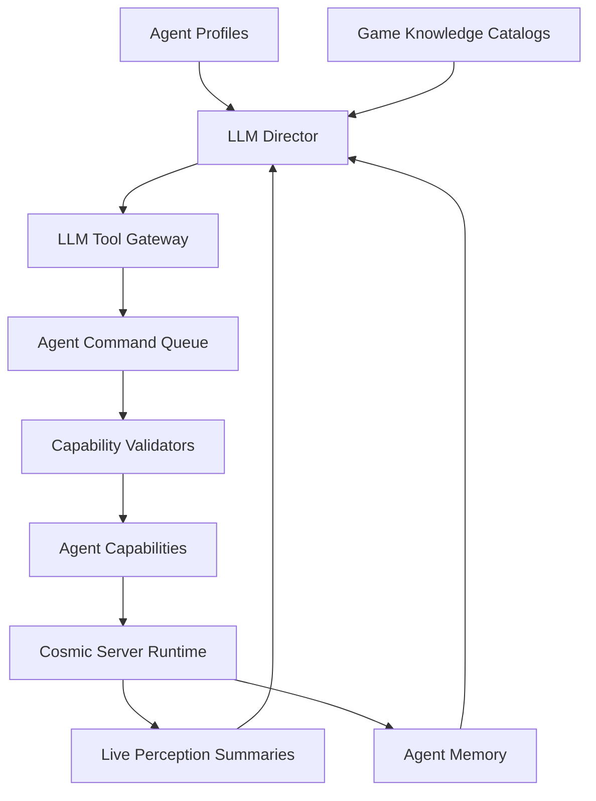

# LLM Autonomy Prep

This folder defines the future full-autonomy layer for agents.

Goal: let an LLM manage many agents through safe, typed capabilities while the
agent engine remains responsible for validation, movement, combat, timing, and
server-side execution.

This is preparation only. It should not be wired into runtime until the Agent
restructure has stable capability boundaries.

## Design Rule

```text
LLM decides intent.
Agent engine executes behavior.
Server validates reality.
```

The LLM should not press keys, spoof packets, complete quests directly, or read
raw server internals. It should call controlled tools.

## Planned Layers



## Files

- `GAME_KNOWLEDGE_CATALOGS.md`
  - Everything to catalog so the LLM can understand the world.
- `LLM_CONTROL_CONTRACT.md`
  - Tool/command model for controlling agents safely.
- `AGENT_PROFILE_SCHEMA.md`
  - Stable identity, mood, behavior, and randomness model.
- `PERCEPTION_MEMORY_SCHEMA.md`
  - What agents can see and remember.
- `ECONOMY_SYSTEM_SCHEMA.md`
  - Free Market, price memory, farming, trading, and economic roles.
- `IMPLEMENTATION_ROADMAP.md`
  - Safe prep order before and after reconstruction.
- `PLAN_CARD_SYSTEM.md`
  - Plan/objective/sidetrack framework for full autonomous task execution.

Related portable platform contracts:

- `../catalog-platform/CATALOG_PLATFORM_ARCHITECTURE.md`
- `../catalog-platform/CATALOG_BUNDLE_SPEC.md`
- `../catalog-platform/CATALOG_QUERY_API.md`
- `../catalog-platform/PORTABLE_PLATFORM_TODO.md`
- `../profile-platform/PROFILE_RUNTIME_ARCHITECTURE.md`
- `../profile-platform/PROFILE_DECISION_API.md`
- `../server-adapter/SERVER_ADAPTER_CONTRACT.md`

## Non-Goals For Now

- Do not connect an LLM to live quest/shop/script functions.
- Do not let the LLM micromanage movement every tick.
- Do not build economy automation before validators and rate limits exist.
- Do not mix this with current reconstruction work unless the boundary is ready.
