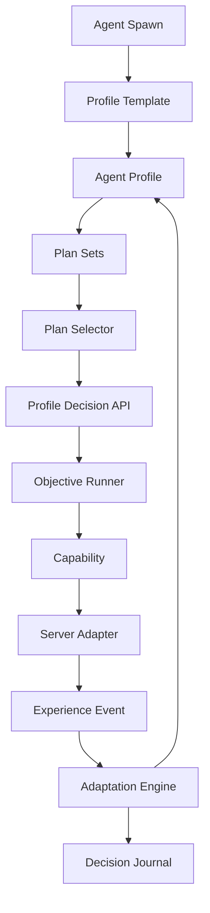

# Agent Profile System Design Specification

This document defines the full Agent Profile System: what it owns, how it
influences behavior, how agents become different from each other, and how the
system stays portable across Cosmic-like servers.

Related implementation contracts:

- `docs/agents/profile-platform/PROFILE_RUNTIME_ARCHITECTURE.md`
- `docs/agents/profile-platform/PROFILE_DECISION_API.md`
- `docs/agents/profile-platform/PROFILE_ADAPTATION_SYSTEM.md`
- `docs/agents/profile-platform/AGENT_PROFILE_SYSTEM_TECHNICAL_SPECIFICATION.md`
- `docs/agents/llm-autonomy/AGENT_PROFILE_SCHEMA.md`
- `docs/agents/llm-autonomy/PROFILE_PLAN_SET_SYSTEM.md`

## Purpose

The profile system makes agents behave like individuals instead of identical
workers executing the same script.

It should answer:

```text
Who is this agent?
What does this agent want?
How does this agent usually act?
What does this agent remember?
Who does this agent trust?
What risks does this agent avoid?
What plans does this agent prefer?
How has past experience changed this agent?
Why did this agent make a specific decision?
```

## Design Position

The profile system is not a normal gameplay capability.

Navigation, combat, looting, NPC interaction, shopping, trading, and questing
are capabilities because they execute actions. The profile system is a
portable decision, memory, and preference service that those capabilities and
the plan engine consult.

Recommended package classification:

```text
agent-profile-platform:
  owns profile data, memory, adaptation, decisions, journals, and summaries

agent-capabilities:
  execute validated actions and report outcomes

agent-plan-runtime:
  chooses objectives and asks profile system for preferences

agent-economy-engine:
  supplies market facts and receives profile/economy events

server-adapter:
  converts live server facts into portable snapshots and events
```

Capabilities should not own long-term personality, relationship memory, or
learning rules. They should emit outcomes and consume profile decisions.

## Core Goals

- Support unique agent identity.
- Support stable archetypes like islander, merchant, quester, grinder,
  collector, social idler, and helper.
- Allow mixed behavior through weighted plan sets.
- Support hard constraints, such as an islander never leaving Maple Island.
- Support soft preferences, such as preferring quests over grinding.
- Track mood and short-term state.
- Track memories about maps, mobs, items, quests, markets, and people.
- Track relationships with agents and players.
- Track build intent, job path, stat choices, skill direction, and equipment
  goals.
- Track economy preferences and beliefs.
- Adapt from outcomes without needing an LLM.
- Provide compact summaries for future LLM control.
- Record important decisions with readable explanations and structured
  influence data.
- Stay decoupled from Cosmic server runtime classes.

## Non-Goals

- Do not execute server actions.
- Do not complete quests, trade, warp, attack, loot, or shop directly.
- Do not bypass plan/capability validators.
- Do not replace catalog facts or live server truth.
- Do not let learning mutate hard policy.
- Do not require an LLM.
- Do not require the profile package to run inside the game server.

## Mental Model

```text
Catalog tells what exists.
Live server snapshot tells what is currently true.
Profile tells what this agent prefers.
Plan card tells what objective is being pursued.
Capability performs the validated action.
Outcome event tells what happened.
Adaptation updates profile memory and weights.
Decision journal records important why.
```

## High-Level Flow



## Profile Layers

### Identity

Stable identity fields:

- display name.
- creation timestamp.
- seed.
- archetype.
- lifecycle stage.
- origin story tags.
- operator-assigned labels.

Identity should rarely change. It gives continuity to the agent.

### Archetype

Archetype is the main behavior identity.

Examples:

- `careful-quester`: prefers safe quest progress and avoids risky grinds.
- `stubborn-grinder`: repeats efficient maps for long periods.
- `market-scout`: spends more time observing prices and trading.
- `self-sufficient-farmer`: prefers farming over buying.
- `islander`: never leaves Maple Island.
- `social-idler`: spends more time in towns and reacts to nearby activity.
- `collector`: preserves rare/useful items and pursues collection goals.
- `helper`: accepts more party/help sidetracks.
- `optimizer`: focuses EXP/hour and efficient progression.

Archetype should be implemented as default weights, not hard-coded behavior.
Hard constraints are separate.

### Hard Constraints

Hard constraints define what the agent must not do.

Examples:

- islander cannot take Shanks to leave Maple Island.
- no Free Market access for a challenge profile.
- do not sell protected items.
- do not buy above maximum risk budget.
- do not trade with players if disabled.
- do not run script-sensitive NPC actions unless explicitly allowed.

Hard constraints are enforced by profile policy and capability validators.
Adaptation and LLM patches must not override them.

### Traits

Traits are long-term behavior weights.

Recommended dimensions:

- `patience`: how long to continue before changing approach.
- `riskTolerance`: willingness to fight dangerous mobs or enter hard maps.
- `efficiencyBias`: preference for high-value actions.
- `questBias`: preference for questlines.
- `grindBias`: preference for training.
- `marketBias`: preference for buying/selling/trading.
- `selfSufficiency`: preference to farm or craft instead of buy.
- `socialBias`: willingness to party, help, chat, or idle around others.
- `curiosity`: willingness to explore alternate maps.
- `stubbornness`: tendency to retry after failure.
- `frugality`: reluctance to spend mesos.
- `greed`: willingness to pursue profit opportunities.
- `pickiness`: selectiveness about equipment stats and scroll quality.
- `generosity`: chance to help, gift, or accept low-profit social actions.
- `routinePreference`: preference for familiar maps/plans.
- `boredomSensitivity`: chance to sidetrack after repeated work.

Traits should usually be normalized in the `0.0` to `1.0` range.

### Mood

Mood is short-term and event-driven.

Recommended dimensions:

- `confidence`
- `frustration`
- `boredom`
- `fatigue`
- `curiosity`
- `socialEnergy`
- `riskAlertness`

Mood should decay toward baseline over time. Mood can influence microbehavior,
sidetrack chance, retry policy, and whether to postpone difficult objectives.

### Role

Role is the current purpose in the simulated population.

Examples:

- beginner progression.
- islander farmer.
- material supplier.
- town social presence.
- market liquidity provider.
- quest helper.
- job-specific trainee.
- crafter.

Role can change more often than archetype, but less often than mood.

### Plan Profile

Plan profile controls plan selection.

It includes:

- plan set ids.
- plan category weights.
- hard allowed/forbidden plan categories.
- sidetrack tolerance.
- focus mode preferences.
- plan completion strictness.
- long-term progression goals.

Example:

```json
{
  "archetype": "islander",
  "planSetIds": ["maple-island-life", "maple-island-market"],
  "categoryWeights": {
    "questline": 0.20,
    "training": 0.35,
    "farming": 0.25,
    "town-social": 0.15,
    "market": 0.05
  },
  "hardConstraints": {
    "forbiddenMapIds": [104000000],
    "forbiddenNpcActions": ["shanks.leave-maple-island"],
    "allowFreeMarket": false
  },
  "sidetrackPolicy": {
    "allowSocialSidetrack": true,
    "allowMarketSidetrack": false,
    "maxSidetrackDurationMs": 600000
  }
}
```

### Build Intent

Build intent explains where the agent is trying to grow.

Recommended fields:

- target job path.
- stat build.
- AP/SP preferences.
- skill priority.
- equipment goals.
- scroll strategy.
- acceptable item quality.
- acquisition preferences.
- fallback items.
- budget thresholds.

This is where a dexless assassin knows that normal DEX-required claws are not
useful, and that a Maple Claw may become a future target.

### Economy Model

Economy model stores agent-specific beliefs and preferences.

Recommended fields:

- meso reserve requirement.
- buy/farm/craft preference.
- price sensitivity.
- sell urgency.
- hoarding tendency.
- liquidity preference.
- tax sensitivity.
- item valuation memories.
- market manipulation suspicion.
- willingness to hold valuable items.
- preferred market roles.

This lets one agent sell ore quickly while another preserves it for crafting.

### Relationship Memory

Relationship memory stores how this agent perceives another agent or player.

Recommended dimensions:

- familiarity.
- trust.
- affinity.
- trade reliability.
- party compatibility.
- generosity remembered.
- annoyance.
- conflict.
- helpfulness.
- market reputation.
- last interaction time.
- interaction count.
- tags.

Relationship memory is advisory. It can make an agent more likely to help or
party with someone, but it cannot bypass safety and trade policy.

### World Memory

World memory is personal experience, separate from static catalog facts.

Recommended areas:

- map safety.
- map crowding tolerance.
- route success and failure.
- stuck points.
- NPC approach point confidence.
- mob danger.
- mob availability.
- item dry streaks.
- item source confidence.
- shop memories.
- quest blockers.
- preferred town hangout locations.

Catalog says an item can drop from a mob. World memory says this agent farmed
for two hours and got nothing, so buying is starting to look attractive.

### Decision Journal

Decision journal records strategic decisions with an overview and details.

Examples of journal-worthy decisions:

- choose job path.
- choose stat build.
- choose equipment target.
- switch from farming to buying.
- abandon a long farming attempt.
- postpone a quest due to repeated deaths.
- trust or avoid a counterparty.
- adopt a new plan set.
- change profile preference due to repeated outcomes.

The journal should not store every movement tick, attack, or chat line.

## Profile Decisions

The profile runtime should produce preferences, not direct actions.

Examples:

```text
Prefer safer route with lower fall risk.
Prefer random NPC approach point within valid interaction box.
Prefer farming item first, but switch to market if dry streak exceeds patience.
Prefer killing alternate quest-relevant mobs when target spawn is low.
Prefer delaying NPC completion by a human-like reading delay.
Prefer postponing plan after repeated deaths.
Prefer preserving ore because this agent has crafter tendencies.
```

The plan engine and capability validators decide what is executable.

## Decision Inputs

Profile decisions should combine:

- profile traits.
- mood.
- plan context.
- catalog facts.
- live state snapshot.
- economy state.
- relationship memory.
- world memory.
- hard policy.
- LLM directive, if available.

No single soft influence should dominate hard policy.

## Profile Templates

Profiles should be spawned from templates.

Recommended templates:

- `default-beginner`
- `maple-island-mvp-tester`
- `careful-quester`
- `stubborn-grinder`
- `casual-social`
- `market-scout`
- `self-sufficient-farmer`
- `crafter-material-hoarder`
- `islander`
- `job-focused-warrior`
- `job-focused-magician`
- `job-focused-bowman`
- `job-focused-thief`
- `job-focused-pirate`, if the server supports it.

Templates should define defaults. Runtime history should make each individual
agent drift slightly from the template.

## Specific Profile Examples

### Maple Island MVP Tester

Purpose:

- complete Maple Island questline consistently.

Behavior:

- adaptation off or observe-only.
- realism optional.
- high focus.
- low sidetrack.
- force-test fallbacks allowed.

### Islander

Purpose:

- never leave Maple Island.
- train, farm, mingle, and participate in island economy.

Hard constraints:

- never complete Shanks leave-island interaction.
- do not enter non-island maps.

Behavior:

- higher Maple Island map memory.
- higher local social idling.
- farming and collection plans stay relevant forever.

### Cursed Doll Farmer

Purpose:

- repeatedly farm high-demand items.

Behavior:

- high patience.
- high routine preference.
- low quest bias after setup.
- market-aware sell timing.

### Social Idler

Purpose:

- make the world feel alive.

Behavior:

- higher town idle time.
- higher party/help response.
- lower efficiency bias.
- stronger relationship memory.

## Adaptation

Agents should self-adapt before LLM control exists.

Adaptation should update:

- plan weights.
- mood.
- map safety memory.
- route confidence.
- item source confidence.
- farming patience outcomes.
- market beliefs.
- relationship values.
- microbehavior tendencies.

Adaptation should never update:

- hard constraints.
- anti-abuse policy.
- maximum trade risk rules.
- protected item rules.
- operator restrictions.

## LLM Readiness

The profile system should expose compact LLM summaries:

```text
Agent Mira is a careful quester aiming for dexless assassin.
She prefers safe quests, avoids spending below a meso reserve, and has had a
long dry streak farming Maple Claw alternatives. She trusts Agent Ryn from
past party success but avoids Player X after failed trades.
```

The LLM should be able to request patches, but the profile system validates
them:

```text
LLM proposes: add market-scout plan set.
Profile policy validates: allowed.
Patch applied: plan set weight +0.10, market sidetrack allowed for 30 minutes.
```

## Recommended Enhancements

### Population-Level Diversity

Add a population director that controls archetype distribution.

Examples:

- only a few agents should be high-volume merchants.
- only some agents should be islanders.
- not every assassin should be dexless.
- town social agents should appear in believable clusters.

### Life Stages

Add lifecycle stages:

- `newbie`
- `islander`
- `first-job-trainee`
- `lv30-prep`
- `merchant`
- `farmer`
- `social`
- `retired`

Life stage changes can unlock or suppress plan families.

### Reputation And Social Graph

Add group-level summaries:

- who trades fairly.
- who helps often.
- who is unreliable.
- who farms the same maps.
- who has party compatibility.

This should be per-agent memory first, then optionally summarized.

### Profile Drift

Allow slow drift from repeated experience:

- repeated profitable farming increases farming confidence.
- repeated deaths lower risk tolerance for that map.
- successful parties increase social willingness.
- long boredom increases sidetrack chance.

Use clamps and decay so agents do not become extreme accidentally.

### Operator Controls

Add admin/debug tools:

- view profile summary.
- view decision journal.
- reset memory domain.
- freeze adaptation.
- switch template.
- preview next plan weights.
- explain last decision.

### Privacy Controls

If player interaction is recorded, store player ids carefully.

Recommended:

- support hashed display names.
- store relationship dimensions instead of raw chat logs.
- compact old interactions into summaries.
- allow relationship memory reset.

## Success Criteria

The profile system is successful when:

- two agents assigned the same plan do not behave identically.
- agents can explain why they selected a plan or action preference.
- agents can change future preferences after repeated outcomes.
- agents can have stable identities like islander, merchant, helper, or grinder.
- capabilities remain reusable and do not contain personality logic.
- profile runtime can be ported to another Cosmic-like server through adapters.
- LLM can read and influence profiles later without direct server coupling.
