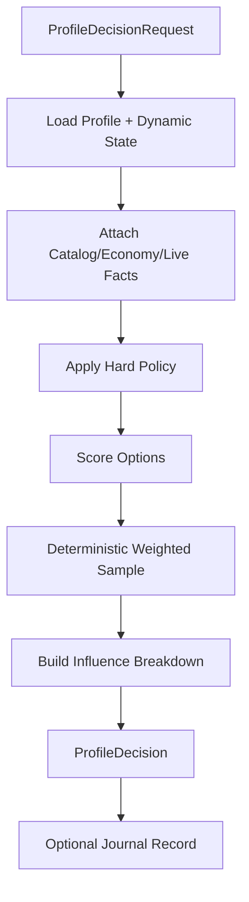
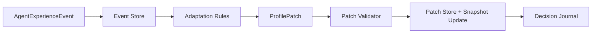

# Agent Profile System Technical Specification

This document defines how to implement the Agent Profile System as a portable
package that can be used by the Agent engine, Plan runtime, capabilities,
Economy engine, and future LLM tooling.

The profile system should be implemented as infrastructure, not as a gameplay
capability. Capabilities execute actions; the profile system supplies
preferences, memory, policy, adaptation, and explanations.

## Recommended Package Layout

Portable package:

```text
server/agents/profile/
  api/
  model/
  decision/
  store/
  memory/
  relationship/
  economy/
  build/
  mood/
  policy/
  adaptation/
  journal/
  summary/
  template/
  random/
  validation/
```

If the final portable platform is moved outside `server/agents`, the same
logical modules should remain:

```text
agent-profile-platform/
  agent-profile-api
  agent-profile-model
  agent-profile-store
  agent-profile-decision
  agent-profile-adaptation
  agent-profile-journal
  agent-profile-summary
```

Cosmic-specific adapter package:

```text
server/agents/integration/cosmic/profile/
  CosmicProfileEventAdapter
  CosmicProfileSnapshotAdapter
  CosmicProfileCommandAdapter
```

The portable profile package must not import Cosmic runtime classes.

## Runtime Placement

Recommended runtime ownership:

```text
AgentProfileRuntime:
  top-level service owned by agent platform

PlanRuntime:
  asks AgentProfileRuntime for plan/category/objective preferences

Capabilities:
  ask AgentProfileRuntime for local execution preferences when needed

ServerAdapter:
  publishes live-state events and validates actions

EconomyEngine:
  supplies economy facts and publishes market events

LLMToolGateway:
  reads profile summaries and submits validated patch requests
```

## Core Interfaces

```java
public interface AgentProfileRuntime {
    AgentProfileView getProfile(AgentId agentId);
    AgentMoodView getMood(AgentId agentId);
    AgentPolicyView getPolicy(AgentId agentId);
    AgentProfileSummary summarize(AgentId agentId, SummaryScope scope);

    ProfileDecision decide(ProfileDecisionRequest request);
    ProfileDecision decideNpcInteraction(ProfileDecisionRequest request);
    ProfileDecision decideRoutePreference(ProfileDecisionRequest request);
    ProfileDecision decideCombatRisk(ProfileDecisionRequest request);
    ProfileDecision decideLootPolicy(ProfileDecisionRequest request);
    ProfileDecision decideQuestReward(ProfileDecisionRequest request);
    ProfileDecision decideMarketAction(ProfileDecisionRequest request);
    ProfileDecision decideEquipmentAcquisition(ProfileDecisionRequest request);
    ProfileDecision decidePlanSelection(ProfileDecisionRequest request);
    ProfileDecision decideRelationshipAction(ProfileDecisionRequest request);
    ProfileDecision decideMicroBehavior(ProfileDecisionRequest request);

    void recordExperienceEvent(AgentExperienceEvent event);
    ProfilePatchPreview previewAdaptation(AgentExperienceEvent event);
    ProfilePatchResult applyProfilePatch(ProfilePatch patch);
    void recordDecision(ProfileDecisionRecord record);
}
```

Use typed ids instead of raw integers where possible:

```java
public record AgentId(int value) {}
public record MapId(int value) {}
public record NpcId(int value) {}
public record MobId(int value) {}
public record ItemId(int value) {}
public record QuestId(int value) {}
```

Typed ids make the portable layer safer while still serializing cleanly.

## Model Objects

### AgentProfile

```java
public final class AgentProfile {
    private final int schemaVersion;
    private final AgentId agentId;
    private final ProfileIdentity identity;
    private final ProfileRole role;
    private final ProfileTraits traits;
    private final PlanProfile planProfile;
    private final BuildIntent buildIntent;
    private final EconomyProfile economyProfile;
    private final AgentPolicy policy;
    private final ProfileMetadata metadata;
}
```

Keep this mostly stable. Dynamic fields should live in separate stores.

### DynamicProfileState

```java
public final class DynamicProfileState {
    private final AgentId agentId;
    private final long profileVersion;
    private final MoodState mood;
    private final WorldMemorySummary worldMemory;
    private final EconomyMemorySummary economyMemory;
    private final RelationshipSummary relationshipSummary;
    private final PlanPreferenceState planPreferenceState;
}
```

### ProfileMemory

Implement memory as bounded domain maps:

```text
MapMemory:
  key: mapId
  value: safety, crowding, routeSuccess, preferredSpots, dangerTags

MobMemory:
  key: mobId
  value: comfort, danger, questRelevance, killEfficiency, dropConfidence

ItemMemory:
  key: itemId
  value: sourceConfidence, dryStreaks, personalValue, sellability

QuestMemory:
  key: questId
  value: completed, blocked, postponedReason, failedObjectiveIds

NpcMemory:
  key: npcId
  value: approachPointConfidence, interactionSuccess, delayStyle

MarketMemory:
  key: itemId
  value: observedPrices, listingAge, saleConfidence, liquidity
```

Do not store unbounded tick-level data in memory.

## Storage

Recommended storage layers:

```text
profile_templates:
  reusable defaults

profile_snapshots:
  current canonical profile and dynamic state

profile_events:
  append-only experience events

profile_patches:
  append-only profile patches generated from events or operator/LLM requests

profile_journal:
  strategic decision journal

relationship_memory:
  per-agent relationship records
```

Early implementation can use JSON files for portability:

```text
profiles/
  templates/
  agents/
    123/profile.json
    123/dynamic-state.json
    123/events.ndjson
    123/patches.ndjson
    123/journal.ndjson
    123/relationships.json
```

Production can use DB tables or SQLite while keeping the same API.

## Serialization

All model objects must serialize to stable JSON.

Portable JSON contracts:

- `docs/agents/profile-platform/agent-profile.schema.json`
- `docs/agents/profile-platform/decision-journal-entry.schema.json`
- `docs/agents/profile-platform/relationship-memory.schema.json`
- `docs/agents/profile-platform/agent-experience-event.schema.json`
- `docs/agents/profile-platform/profile-patch.schema.json`

These schemas define the portable profile, strategic decision journal,
relationship memory, experience event, and bounded profile patch envelopes.
They are data contracts only and do not implement adaptation, plan selection,
social behavior, or server-side actions.

Patch safety verifier:

- `tools/agent-contracts/Test-ProfilePatchSafety.ps1`

The verifier checks that profile patches cannot declare hard-policy mutation
and that default blocked paths include `/policy` and
`/planProfile/hardConstraints`.

Rules:

- include `schemaVersion`.
- include unknown-field tolerant readers.
- use ids and primitive values, not server objects.
- use UTC epoch milliseconds for timestamps.
- use strings for enum wire values.
- add migration functions for schema upgrades.

## Decision Pipeline



### ProfileDecisionRequest

```json
{
  "schemaVersion": 1,
  "agentId": 123,
  "decisionKind": "plan-selection",
  "requestId": "req-123-0001",
  "timeBucketMs": 123456000,
  "planContext": {
    "activePlanId": "maple-island-mvp",
    "objectiveId": "hunt-orange-mushrooms",
    "focusMode": "strict"
  },
  "options": [
    {
      "optionId": "continue-objective",
      "category": "quest-combat"
    },
    {
      "optionId": "recover-on-chair",
      "category": "recovery"
    }
  ],
  "live": {},
  "catalog": {},
  "economy": {},
  "relationships": {}
}
```

### ProfileDecision

```json
{
  "schemaVersion": 1,
  "requestId": "req-123-0001",
  "agentId": 123,
  "decisionKind": "plan-selection",
  "selectedOptionId": "recover-on-chair",
  "confidence": 0.78,
  "seed": "agent-123:plan-selection:maple-island-mvp:123456",
  "hardRejections": [
    {
      "optionId": "buy-potions",
      "reason": "no-meso"
    }
  ],
  "influences": [
    {
      "source": "profile",
      "key": "riskTolerance",
      "weight": 0.30,
      "direction": "toward-recovery"
    },
    {
      "source": "live",
      "key": "hpPercent",
      "value": 0.18,
      "weight": 0.55,
      "direction": "toward-recovery"
    }
  ],
  "shouldRecordDecision": true
}
```

## Deterministic Randomness

Agents should feel varied but debuggable.

Use deterministic randomness for strategic choices:

```text
decisionSeed = agentSeed + decisionKind + optionSetHash + planId + timeBucket
```

Use short time buckets for microbehavior and longer buckets for strategic
choices.

Examples:

- NPC delay: seconds bucket.
- route spot selection: objective attempt bucket.
- plan selection: 5 to 30 minute bucket.
- long-term build decision: day bucket or explicit milestone.

## Scoring Model

Profile decisions should score candidate options.

Recommended formula:

```text
score(option) =
  baseWeight
  + traitModifiers
  + moodModifiers
  + memoryModifiers
  + relationshipModifiers
  + economyModifiers
  + liveStateModifiers
  + planFocusModifiers
  - riskPenalties
```

Then:

```text
reject options violating hard policy
clamp scores
normalize scores
sample or choose based on decision mode
return explanation
```

Decision modes:

- `highest-score`: tests and strict objectives.
- `weighted`: normal agent behavior.
- `weighted-with-threshold`: avoid bad options.
- `explore-small-chance`: occasional non-optimal exploration.

## Policy Enforcement

Policy enforcement should happen in three places:

```text
Profile policy:
  rejects preferences that violate identity or operator rules

Plan validator:
  rejects objectives that violate plan/profile constraints

Capability validator:
  rejects actions that are impossible or unsafe in live server state
```

Never rely on profile policy alone for server safety.

## Adaptation Pipeline



### Adaptation Interfaces

```java
public interface AgentExperienceEventSink {
    void publish(AgentExperienceEvent event);
}

public interface AgentExperienceEventStore {
    void append(AgentExperienceEvent event);
    List<AgentExperienceEvent> readForAgent(AgentId agentId, EventReadWindow window);
}

public interface ProfileAdaptationEngine {
    List<ProfilePatch> adapt(AgentExperienceEvent event, ProfileAdaptationContext context);
}

public interface ProfilePatchValidator {
    ValidationResult validate(ProfilePatch patch, AgentProfileView profile);
}

public interface ProfilePatchStore {
    ProfilePatchResult apply(ProfilePatch patch);
}
```

### Adaptation Modes

```java
public enum ProfileAdaptationMode {
    OFF,
    OBSERVE_ONLY,
    BOUNDED,
    FAST_LEARN_TEST
}
```

Mode behavior:

- `OFF`: ignore events for profile changes.
- `OBSERVE_ONLY`: store events and proposed patches but do not apply.
- `BOUNDED`: apply validated bounded patches.
- `FAST_LEARN_TEST`: apply larger test deltas, never for production.

## Event Publishing From Capabilities

Capabilities should emit outcomes, not profile updates.

Example combat result:

```java
eventSink.publish(AgentExperienceEvent.builder()
    .agentId(agentId)
    .source("capability.combat")
    .eventType("combat.near_death")
    .mapId(mapId)
    .mobId(mobId)
    .outcome("warning")
    .metric("hpPercent", 0.08)
    .metric("potionsUsed", 4)
    .relatedPlanId(planId)
    .relatedObjectiveId(objectiveId)
    .build());
```

Example market result:

```java
eventSink.publish(AgentExperienceEvent.builder()
    .agentId(agentId)
    .source("economy.market")
    .eventType("market.sell_success")
    .itemId(itemId)
    .outcome("success")
    .metric("listedPrice", listedPrice)
    .metric("salePrice", salePrice)
    .metric("listingAgeMs", listingAgeMs)
    .build());
```

## Capability Integration

### Navigation Capability

Profile decisions:

- route risk preference.
- town idle movement preference.
- NPC approach spot style.
- avoid remembered stuck point.
- prefer familiar or efficient path.

Events emitted:

- route success.
- route failed.
- stuck.
- fall.
- portal failed.
- travel duration.

### Combat Capability

Profile decisions:

- mob target priority.
- risk tolerance.
- potion reserve threshold.
- whether to kill alternate mobs when target spawn is low.
- whether to recover, continue, or postpone.

Events emitted:

- kill success.
- death.
- near death.
- out of potions.
- mob unavailable.
- objective progress.

### Loot Capability

Profile decisions:

- protected item policy.
- quest item priority.
- meso pickup priority.
- trash sell/drop policy.
- material preservation.

Events emitted:

- item looted.
- item ignored.
- inventory full.
- dry streak.

### NPC/Quest Capability

Profile decisions:

- interaction delay style.
- random approach point selection.
- reward choice preference.
- whether to start optional quest.
- whether to postpone blocked quest.

Events emitted:

- quest started.
- quest completed.
- NPC interaction failed.
- reward selected.
- requirement missing.

### Shop/Market/Trade Capability

Profile decisions:

- buy/farm/craft preference.
- max acceptable price.
- sell listing price.
- sell urgency.
- counterparty trust.
- whether to accept trade/help sidetrack.

Events emitted:

- listing seen.
- buy success/reject.
- sell success/expired.
- trade good/bad.
- market outlier observed.

## Plan Runtime Integration

Plan runtime asks profile for:

- which plan to start.
- whether to continue current plan.
- whether to sidetrack.
- whether to postpone.
- whether to request LLM/operator review.
- how strict focus mode should be.

Plan runtime should not directly inspect raw trait fields unless it is a simple
local optimization. Prefer going through `ProfileDecisionAPI` so decisions stay
explainable.

## LLM Integration

LLM should use:

```java
AgentProfileSummary summarize(AgentId agentId, SummaryScope scope);
ProfilePatchPreview previewPatch(ProfilePatchRequest request);
ProfilePatchResult requestPatch(ProfilePatchRequest request);
List<ProfileDecisionRecord> readJournal(AgentId agentId, JournalQuery query);
```

LLM may propose:

- temporary goal.
- plan set weight changes.
- role change.
- relationship note.
- long-term project.
- summary of repeated journal entries.

LLM must not:

- write profile JSON directly.
- disable hard policy.
- mutate relationship memory without event or operator approval.
- grant items or quest progress.

## Schema Files To Add

Recommended future schema files:

```text
docs/agents/profile-platform/schema/
  agent-profile.schema.json
  agent-profile-summary.schema.json
  dynamic-profile-state.schema.json
  profile-template.schema.json
  plan-profile.schema.json
  build-intent.schema.json
  economy-profile.schema.json
  relationship-memory.schema.json
  agent-experience-event.schema.json
  profile-patch.schema.json
  profile-decision-request.schema.json
  profile-decision-result.schema.json
  profile-decision-record.schema.json
```

## Validation

Validators:

- profile schema validator.
- template schema validator.
- hard constraint validator.
- patch validator.
- relationship memory validator.
- plan profile validator.
- decision request validator.

Patch validator must reject:

- unknown schema version.
- invalid target path.
- unclamped numeric mutations.
- hard policy mutations from adaptation.
- LLM patches without allowed source.
- patches that downgrade safety restrictions without operator source.

## Performance Requirements

Profile decisions are on the hot path.

Targets:

- single profile decision should be in-memory and bounded.
- no full profile-event scan during agent tick.
- pre-load active agent profile snapshots.
- cache common summaries.
- batch low-priority adaptation.
- journal writes should be async where possible.
- LLM summaries should be precomputed or cached.

Recommended caches:

- active profile snapshot cache.
- relationship top-N cache.
- item memory hot cache.
- plan weight cache.
- LLM compact summary cache.

## Concurrency

Use versioned profile snapshots and idempotent patches.

Rules:

- every profile snapshot has `profileVersion`.
- every patch declares `profileVersionFrom`.
- patch application checks version or merges commutative increments safely.
- every event has unique `eventId`.
- every patch has unique `patchId`.
- duplicate events and patches are ignored.

For production:

- use per-agent patch ordering.
- process adaptation asynchronously.
- keep hard policy updates strongly consistent.

## Observability

Add diagnostics:

- last profile decision.
- last applied patch.
- rejected patch reason.
- adaptation mode.
- plan weights.
- mood state.
- top relationship memories.
- top map/item memories.
- journal tail.

Recommended commands later:

```text
!agentprofile <agent>
!agentmood <agent>
!agentmemory <agent> map|item|mob|quest|market
!agentjournal <agent>
!agentexplain <agent>
!agentprofilefreeze <agent>
!agentprofilereset <agent> <domain>
```

## Implementation Order

Phase 1: Read-only profile base

1. Add model classes for profile, traits, policy, plan profile, build intent.
2. Add JSON template loading.
3. Add `AgentProfileRuntime.getProfile`.
4. Add read-only decision API for plan selection and NPC realism.
5. Add deterministic random helper.

Phase 2: Maple Island MVP support

1. Add `maple-island-mvp-tester` profile template.
2. Add `islander` profile template.
3. Add profile decisions for:
   - objective focus.
   - recovery fallback.
   - NPC delay/approach style.
   - combat risk.
   - target mob fallback.
   - reward choice.
4. Keep adaptation `OFF` or `OBSERVE_ONLY` for deterministic testing.

Current safe-prep templates:

- `docs/agents/profile-platform/templates/maple-island-mvp-tester.profile.json`
- `docs/agents/profile-platform/templates/islander.profile.json`

Current safe-prep verifier:

- `tools/profile-platform/Test-AgentProfileTemplates.ps1`

These templates are data-only and are not loaded into live Agents until the
Profile Runtime boundary exists.

Phase 3: Event and journal foundation

1. Add `AgentExperienceEvent`.
2. Add event sink and append-only event store.
3. Emit plan/objective/capability outcomes.
4. Add decision journal records for strategic choices.

Phase 4: Bounded adaptation

1. Add profile patch model.
2. Add patch validator.
3. Add adaptation engine.
4. Enable mood/map/combat/farming adaptations.
5. Add relationship adaptations.
6. Add economy adaptations.

Phase 5: LLM readiness

1. Add compact profile summaries.
2. Add LLM-safe journal query.
3. Add patch preview and request APIs.
4. Add operator approval mode for sensitive profile changes.

Current safe-prep LLM summary contract:

- `docs/agents/profile-platform/agent-profile-summary.schema.json`

Current safe-prep summary generator:

- `tools/profile-platform/New-AgentProfileSummary.ps1`

The generator reads a profile/template JSON file and emits a compact summary for
future LLM context. It does not inspect live Agent state or mutate profile
storage.

## Recommended Enhancements

### Profile Archetype Composer

Allow profiles to be assembled from layers:

```text
base beginner + thief ambition + frugal + self-sufficient + low-social
```

This creates more variety than one fixed template per archetype.

### Population Balancer

Add an offline or runtime balancer that controls how many agents of each role
exist, so the world does not become 80% market scouts or 80% assassins.

### Learned Map Roles

Let agents learn map roles:

- safe training map.
- risky but profitable map.
- social town map.
- farming map.
- quest bottleneck map.

### Memory Summarizer

Compact repeated events into summaries:

```text
Farmed Slime Tree for 3 sessions, 2 deaths, good meso, poor quest item yield.
```

This is useful for LLM and debugging.

### Synthetic Personal Goals

Allow agents to develop personal goals:

- collect a cosmetic set.
- become known seller of an item.
- help new islanders.
- save mesos for a weapon.
- avoid a map after bad history.

These should be plan-profile inputs, not direct actions.

## Definition Of Done

The first complete implementation should provide:

- profile template loading.
- profile snapshot store.
- profile decision API.
- plan profile and hard constraints.
- build intent.
- mood model.
- relationship memory model.
- event sink.
- event store.
- decision journal.
- adaptation observe-only mode.
- bounded patch application.
- Maple Island MVP tester and islander templates.
- capability integration points for navigation, combat, loot, NPC, shop, and
  trade.
- LLM-safe profile summary API.
