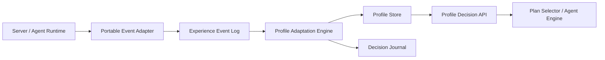

# Profile Adaptation System

The profile adaptation system is the self-learning layer for agents before an
LLM is involved. It updates agent preferences, memories, relationships, and
plan weights from outcomes that happen during normal play.

The goal is not to make agents rewrite themselves every minute. The goal is to
let repeated experience slowly influence future decisions while keeping hard
rules, server safety, and operator control intact.

## Core Recommendation

Use an event-driven profile updater.



Server and agent code should publish neutral events. The profile platform
consumes those events and creates bounded profile patches. This keeps profile
learning decoupled from Cosmic server classes and allows the same profile
system to be reused on another Cosmic-like server.

## Separation Rules

- Server code reports what happened.
- Agent runtime reports plan, objective, and capability outcomes.
- Economy runtime reports market observations and trade outcomes.
- Profile adaptation decides what the experience means for the agent.
- Profile decision API decides future preferences.
- Plan engine and capabilities still validate whether an action is possible.

Profile adaptation must not directly call Cosmic server objects, warp agents,
grant items, accept trades, complete quests, or bypass validators.

## Event Contract

Use one portable event shape for profile learning:

```json
{
  "schemaVersion": 1,
  "eventId": "evt-agent-123-000001",
  "agentId": 123,
  "worldId": 0,
  "channelId": 1,
  "timestampMs": 123456789,
  "source": "agent-runtime",
  "eventType": "objective.completed",
  "relatedPlanId": "maple-island-mvp",
  "relatedObjectiveId": "kill-stumps-for-quest",
  "mapId": 40000,
  "npcId": null,
  "mobId": 100100,
  "itemId": null,
  "questId": 1003,
  "counterparty": null,
  "outcome": "success",
  "metrics": {
    "durationMs": 184000,
    "attempts": 1,
    "deaths": 0,
    "potionsUsed": 2
  },
  "context": {
    "profileVersion": 7,
    "level": 8,
    "mesos": 1234,
    "inventoryPressure": 0.22
  },
  "tags": ["maple-island", "quest-combat"]
}
```

Required fields:

- `schemaVersion`
- `eventId`
- `agentId`
- `timestampMs`
- `source`
- `eventType`
- `outcome`

Optional fields should stay generic: ids, counters, durations, tags, and small
context snapshots. Do not store server objects or serialized Java classes.

## Event Sources

Recommended event sources:

- `plan-runtime`: plan assigned, completed, failed, postponed, abandoned,
  sidetracked, resumed.
- `objective-runtime`: objective completed, blocked, retried, timed out,
  skipped by policy, force-resolved for testing.
- `capability-runtime`: navigation result, combat result, loot result,
  NPC interaction result, shop result, trade result.
- `server-adapter`: death, map change, disconnect, inventory full, no potions,
  catalog mismatch, unavailable map.
- `economy-engine`: listing seen, item bought, item sold, listing expired,
  price outlier detected, liquidity changed.
- `social-adapter`: party invite, help request, gift, trade offer, chat
  interaction, repeated map sharing.
- `operator-tools`: profile template assigned, policy patch applied,
  diagnostic reset, manual note.

## Event Types

Plan and objective:

- `plan.assigned`
- `plan.completed`
- `plan.failed`
- `plan.postponed`
- `plan.sidetracked`
- `plan.resumed`
- `objective.completed`
- `objective.blocked`
- `objective.timeout`
- `objective.loop_guard_triggered`

Navigation and map:

- `navigation.route_success`
- `navigation.route_failed`
- `navigation.stuck`
- `navigation.fell`
- `navigation.portal_failed`
- `map.crowded`
- `map.safe_grind_success`
- `map.dangerous_outcome`

Combat and recovery:

- `combat.kill_success`
- `combat.target_unavailable`
- `combat.near_death`
- `combat.death`
- `combat.potion_used`
- `combat.out_of_potions`
- `recovery.rested`
- `recovery.chair_used`

Quest, NPC, and item:

- `quest.started`
- `quest.completed`
- `quest.blocked`
- `quest.requirement_missing`
- `npc.interaction_success`
- `npc.interaction_failed`
- `npc.approach_point_failed`
- `item.looted`
- `item.dry_streak`
- `inventory.full`

Economy:

- `market.listing_seen`
- `market.buy_success`
- `market.buy_rejected`
- `market.sell_success`
- `market.sell_expired`
- `market.price_outlier`
- `market.profit_realized`
- `market.loss_realized`

Social and relationship:

- `relationship.met`
- `relationship.party_success`
- `relationship.help_given`
- `relationship.help_received`
- `relationship.trade_good`
- `relationship.trade_bad`
- `relationship.conflict`
- `relationship.repeat_map_sharing`

## Adaptation Domains

Profile adaptation should update these areas:

- `mood`: short-term frustration, confidence, boredom, energy.
- `memory.map`: map safety, route success, crowd tolerance, farming outcome.
- `memory.mob`: kill comfort, danger, quest relevance, drop confidence.
- `memory.item`: known sources, dry streaks, sellability, personal value.
- `memory.quest`: blockers, easy objectives, postponed objectives.
- `memory.market`: acceptable price ranges, liquidity memories, seller trust.
- `relationshipMemory`: trust, affinity, generosity, reliability, avoidance.
- `planProfile`: plan weights, sidetrack tolerance, repeat preference.
- `buildIntent`: equipment target confidence, acquisition preference.
- `microBehavior`: pause tendency, NPC delay style, town idle tendency.

## Patch Contract

Events should produce profile patches instead of direct object mutation.

```json
{
  "schemaVersion": 1,
  "patchId": "patch-agent-123-000001",
  "agentId": 123,
  "sourceEventId": "evt-agent-123-000001",
  "profileVersionFrom": 7,
  "operations": [
    {
      "path": "/memory/map/40000/safetyScore",
      "op": "increment",
      "delta": 0.03,
      "clamp": [0.0, 1.0],
      "halfLifeDays": 21,
      "reason": "completed quest combat without death"
    },
    {
      "path": "/planProfile/weights/questing",
      "op": "increment",
      "delta": 0.01,
      "clamp": [0.0, 1.0],
      "reason": "quest objective completed efficiently"
    }
  ],
  "journalHint": {
    "record": false,
    "reason": "minor routine adaptation"
  }
}
```

Patch rules:

- Every patch must reference a source event.
- Every numeric adjustment must define clamps.
- Repeated memories should decay or be summarized.
- Hard policy fields must not be changed by adaptation patches.
- Major preference changes should create a decision journal entry.
- Patch application must be idempotent by `patchId`.

## Learning Guardrails

Use guardrails so agents adapt without drifting into broken behavior:

- Hard constraints do not learn. Examples: never leave Maple Island for an
  islander, protected item rules, trade value caps, quest validity.
- Learning is bounded. Every score has min and max clamps.
- Learning is slow. Single events create small deltas; repeated outcomes matter.
- Learning decays. Old map danger, old relationships, and old market prices
  should fade toward neutral unless refreshed.
- Learning is explainable. Significant profile changes record reasons.
- Learning is reversible. Operator tools can reset a domain, replay events, or
  disable adaptation for testing.
- Learning has modes. Fast test mode can disable realism/adaptation and focus
  only on sequence completion.

## Example Rules

Deaths and danger:

```text
If agent dies 3 times in one map within 30 minutes:
  increase map danger memory
  increase combat caution
  increase potion reserve preference
  reduce high-risk plan weight
  journal if the agent postpones the objective
```

Navigation:

```text
If the same NPC approach point fails repeatedly:
  lower that approach point confidence
  prefer another cataloged approach point
  keep the NPC and quest objective valid
```

Farming:

```text
If target item dry streak exceeds profile patience:
  lower source confidence slightly
  increase buy-from-market alternative score
  increase boredom/frustration
  journal if acquisition method changes
```

Economy:

```text
If item sells quickly near listed price:
  increase confidence in that price range
  increase agent's willingness to farm or trade that item
  record liquidity memory for future plan selection
```

Relationships:

```text
If another agent helps complete a hunt objective:
  increase familiarity, trust, and affinity
  increase chance to accept future party/help sidetrack from that entity
  do not bypass trade or safety policy
```

## Self-Learning Without LLM

Before LLM control, the profile system can still self-adapt with deterministic
rules:

- plan weight adjustments from outcomes.
- map and route confidence from success/failure.
- item source confidence from farming results.
- market confidence from observed listing age and sale outcomes.
- relationship trust from repeated interactions.
- mood changes from frustration, boredom, success, and loss.
- archetype-specific behavior within bounded ranges.

This gives agents individual history and unpredictability without requiring an
LLM call for every decision.

## LLM Enhancement Later

When LLM is added, it should read summaries and propose higher-level patches:

- change life goal.
- adopt a new plan set.
- mark a long-term rival/friend.
- create a personal project.
- summarize repeated journal entries.

LLM patches should still go through the same policy and patch validators as
normal adaptation. The LLM should not mutate profiles directly.

## Portable Interfaces

Recommended package-level interfaces:

```java
public interface AgentExperienceEventSink {
    void publish(AgentExperienceEvent event);
}

public interface AgentExperienceEventStore {
    void append(AgentExperienceEvent event);
    List<AgentExperienceEvent> readForAgent(int agentId, EventReadWindow window);
}

public interface ProfileAdaptationEngine {
    List<ProfilePatch> adapt(AgentExperienceEvent event, AgentProfileSnapshot profile);
}

public interface ProfilePatchStore {
    void apply(ProfilePatch patch);
}
```

Cosmic-specific code should live behind an adapter:

```java
public final class CosmicAgentExperienceEventAdapter {
    public AgentExperienceEvent fromObjectiveResult(ObjectiveResult result) {
        // Map runtime-specific data into the portable event contract.
    }
}
```

The profile package must not import:

- `client.Character`
- `server.maps.MapleMap`
- `server.life.MapleMonster`
- packet classes
- Netty classes
- database row classes from the game server

## Storage Strategy

Use three storage layers:

- `profile_snapshots`: current materialized profile state.
- `profile_events`: append-only raw experience events.
- `profile_patches`: append-only profile changes generated from events.

This allows:

- replaying profile evolution after rule changes.
- debugging why a profile changed.
- rolling back a bad adaptation rule.
- rebuilding summaries for LLM context.

## Update Timing

Recommended timing:

- publish events immediately from runtime outcomes.
- process routine adaptations asynchronously.
- apply high-priority safety memories quickly, such as repeated deaths or
  route loops.
- compact raw events periodically into summaries.
- write decision journal only for strategic decisions or meaningful profile
  changes.

## Testing Modes

Support profile adaptation modes:

- `off`: no adaptation; useful for deterministic MVP testing.
- `observe-only`: store events and proposed patches, but do not apply.
- `bounded`: apply normal bounded patches.
- `fast-learn-test`: larger deltas for simulation testing only.

For Maple Island MVP, start with `off` or `observe-only` until the questline is
stable. Then enable `bounded` for realism.

## More Complete Profile System

To make profiles richer over time, add these areas:

- `lifecycleStage`: beginner, islander, first-job trainee, merchant, farmer,
  social idler, retired.
- `archetype`: careful quester, stubborn grinder, market scout, islander,
  helper, collector, efficiency optimizer.
- `planSets`: weighted plan families with hard constraints.
- `mentalState`: boredom, confidence, frustration, fatigue, curiosity.
- `riskModel`: death tolerance, potion reserve, map avoidance, mob comfort.
- `economyModel`: budget style, buy/farm preference, price confidence,
  item liquidity memory.
- `buildIdentity`: job path, stat build, equipment targets, scroll strategy.
- `relationshipMemory`: trust, affinity, reliability, generosity, conflict.
- `worldMemory`: remembered maps, routes, mobs, shops, NPCs, and blockers.
- `socialStyle`: party willingness, help tendency, town hangout tendency,
  trade negotiation style.
- `decisionJournal`: overview plus detailed influence record.
- `operatorPolicy`: hard limits, allowed plan families, adaptation mode.

The useful mental model:

```text
Profile gives preference.
Catalog gives facts.
Economy gives market state.
Plan card gives objective structure.
Capabilities execute.
Runtime emits outcomes.
Adaptation updates profile from outcomes.
Decision journal records important why.
```

## Implementation Phases

1. Define `AgentExperienceEvent`, `ProfilePatch`, and versioned JSON schemas.
2. Add event publishing from plan, objective, and capability outcomes.
3. Add append-only event and patch storage.
4. Implement adaptation rules for mood, map memory, route memory, combat
   caution, farming confidence, and plan weights.
5. Add relationship adaptation from party, help, trade, and map-sharing events.
6. Add economy adaptation from listing age, sale success, buy decisions, and
   market confidence.
7. Add profile patch validators and hard-policy protection.
8. Add decision journal entries for major preference shifts.
9. Add replay, diagnostics, and observe-only mode.
10. Add LLM profile summary and LLM patch proposal later.

## Open Decisions

- Exact event storage format: JSON files for early portability, database tables
  for production, or both.
- Profile patch granularity: small patches per event or compacted batches per
  time window.
- Decay schedule for memories and relationships.
- Which adaptation domains should be enabled for Maple Island MVP.
- How much player-identifying data should be stored versus hashed.
