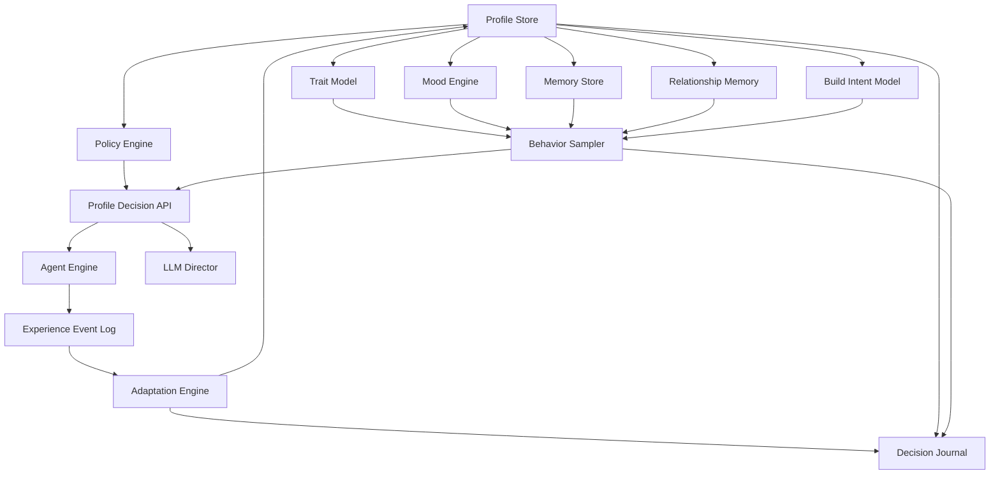

# Profile Runtime Architecture

The profile runtime is a portable behavior system for agents. It should be
usable by Agent engines and LLM directors across Cosmic-like servers.

It must not depend on server runtime classes.

Profile self-learning and event-driven updates are specified in
`docs/agents/profile-platform/PROFILE_ADAPTATION_SYSTEM.md`.

## Current Executable Bridge

The current server has a deliberately small executable presentation adapter:

- `AgentBehaviorProfile` loads timing, movement-fidget, encounter, and rest
  preferences without holding a `Character` or executing gameplay;
- `AgentBehaviorProfileRuntime` assigns the generic `maple-island-quester`
  profile to Amherst and Southperry runs and samples bounded timing decisions;
- capabilities remain responsible for validation and execution;
- the navigation hook reuses existing fidget actions and currently admits only
  grounded stationary modes;
- encounter and rest preferences are data-only until their policies are wired.

This bridge is not a second identity system. Its `presentation` block is
shaped for later inclusion in the portable profile described below, once the
canonical store, identity linkage, and adaptation runtime are implemented.

## Goals

- Store stable agent identity.
- Model behavior traits and preferences.
- Support archetype-specific plan sets and hard identity constraints.
- Track short-term mood.
- Track long-term memory.
- Track long-term build intent.
- Adapt preferences from plan, objective, market, and relationship outcomes.
- Record explainable strategic decisions.
- Enforce policy limits.
- Produce behavior decisions for the Agent engine.
- Provide compact profile summaries for the LLM.

## Architecture



## Profile Layers

```text
identity:
  stable who-this-agent-is

traits:
  long-term behavior weights

role:
  current purpose in the population

mood:
  short-term dynamic state

memory:
  remembered events, routes, prices, successes, failures

adaptation:
  event-driven bounded profile updates from outcomes

relationshipMemory:
  per-agent view of other agents, players, traders, and party members

buildIntent:
  desired job path, stat build, equipment goals, upgrade plans

decisionJournal:
  compact reasoned history of important choices

policy:
  hard limits and permissions

planProfile:
  archetype-specific plan sets, hard constraints, and plan selection weights
```

## Storage Model

Canonical profile:

```json
{
  "schemaVersion": 1,
  "agentId": 123,
  "identity": {
    "name": "Mira",
    "archetype": "careful-quester",
    "createdAt": 123456789
  },
  "role": {
    "primary": "quester",
    "secondary": "self-sufficient-farmer"
  },
  "relationshipPolicy": {
    "defaultPlayerTrust": 0.50,
    "defaultAgentTrust": 0.55,
    "relationshipDecayHalfLifeDays": 14,
    "maxRelationshipTradeTrustBonus": 0.20,
    "allowRelationshipSidetracks": true
  },
  "buildIntent": {
    "targetJobPath": ["beginner", "thief", "assassin"],
    "statBuild": {
      "type": "dexless",
      "baseDexTarget": 25
    },
    "equipmentGoals": [
      {
        "itemId": 1472030,
        "targetLevel": 35,
        "acceptableQuality": "cheap-any-stat",
        "preferredAcquisition": ["buy-if-cheap", "farm-if-expensive"]
      }
    ]
  },
  "traits": {
    "patience": 0.65,
    "curiosity": 0.40,
    "socialness": 0.25,
    "efficiency": 0.72,
    "caution": 0.58,
    "greed": 0.32,
    "stubbornness": 0.44,
    "routineBias": 0.38,
    "explorationBias": 0.35,
    "mistakeRate": 0.03
  },
  "policy": {
    "maxDeathRisk": "medium",
    "minReserveMesos": 50000,
    "maxSinglePurchaseMesos": 100000,
    "allowPlayerTrade": false,
    "allowScriptSensitiveNpc": false
  },
  "seeds": {
    "identitySeed": 1,
    "routeSeed": 2,
    "timingSeed": 3,
    "marketSeed": 4,
    "socialSeed": 5
  }
}
```

Dynamic profile state:

```json
{
  "agentId": 123,
  "mood": {
    "energy": 0.75,
    "boredom": 0.20,
    "frustration": 0.05,
    "confidence": 0.62,
    "urgency": 0.30,
    "socialOpenness": 0.22
  },
  "activePreferences": {
    "preferredTrainingStyle": "quest-then-grind",
    "shopScanStyle": "selective"
  }
}
```

## Decision Philosophy

The profile runtime should return decisions and ranges, not exact low-level
commands.

Good:

```json
{
  "decision": "npc-delay",
  "delayMsRange": [1400, 4200],
  "reasons": ["normal-reader", "first-time-quest", "careful-profile"]
}
```

Avoid:

```text
press key at exact time
stand at exact x/y unless selected by navigation
force a fixed delay globally
```

Strategic decisions should include a brief explanation and influence list so the
agent lifecycle can be studied later.

Good:

```json
{
  "decision": "equipment-acquisition",
  "chosenAction": "buy-cheap-market-item",
  "summary": "Dexless assassin target needs Maple Claw; cheap market listing is within budget after a long farming dry streak.",
  "reasons": [
    "dexless-build-needs-maple-claw",
    "market-price-within-budget",
    "low-equipment-pickiness",
    "farm-dry-streak"
  ],
  "journal": true
}
```

## High-Level Operating Concept

The profile runtime does not run the agent by itself. It is consulted by the
plan engine and capability layer whenever a choice needs personality, build
intent, memory, or tolerance.

```text
Plan Objective
  -> Profile Runtime evaluates preference
  -> Catalog Runtime provides static facts
  -> Economy Engine provides price/supply/demand facts
  -> Relationship Memory provides trust/affinity/history facts
  -> Live Server Adapter provides current state
  -> Plan Scheduler selects or updates objective
  -> Capability executes validated action
  -> Events feed back into profile mood/memory
  -> Major choices are written to Decision Journal
```

Example:

```text
Objective: prepare level 35 weapon.

Profile:
  build identity = dexless assassin
  equipment pickiness = low
  grind persistence = medium
  budget strictness = high

Catalog:
  Maple Claw is compatible with dexless build.
  Known mobs can drop it.

Economy:
  market has cheap below-average Maple Claw within budget.

Memory:
  agent farmed 10 hours without drop.

Relationship:
  no strong relationship pressure.

Decision:
  buy cheap Maple Claw, use safe 100% scrolls, resume grinding.

Journal:
  overview records readable story.
  details records influence weights and rejected alternatives.
```

The profile runtime should answer:

```text
Given this agent's build, personality, mood, memory, relationships, policy, and
current state, what kind of action would this agent prefer, and why?
```

It should not answer:

```text
Which packet should be sent?
Which exact key should be pressed?
Should server state be mutated directly?
```

## Event Feedback

The Agent engine should report events:

```text
task-started
task-succeeded
task-failed
route-failed
death
rare-drop
low-supplies
market-profit
market-loss
player-nearby
crowded-map
party-invite
trade-offer
help-request
help-given
help-received
trade-completed
trade-cancelled
bad-trade
stuck
manual-intervention
```

The profile runtime updates mood and memory from these events.

Major decisions should additionally be recorded into the decision journal:

```text
build direction chosen
job advancement plan selected
important equipment target selected
buy/farm/craft/scroll decision
expensive purchase approved/rejected
long farming attempt abandoned
market opportunity taken/skipped
plan postponed for risk, budget, or social reason
profile preference changed by repeated outcomes
relationship trust/affinity changed by repeated interaction
```

## Relationship Memory

Relationship memory should record an agent's learned opinion of another agent or
player. It is consulted by social, party, trade, assistance, and map-sharing
decisions.

Recommended relationship dimensions:

- `familiarity`: how often this entity has been seen.
- `trust`: whether interactions have been safe/reliable.
- `affinity`: whether the agent generally likes helping/interacting.
- `helpfulnessDebt`: whether the agent feels it owes or is owed help.
- `tradeReliability`: whether trade/shop interactions were fair.
- `partyCompatibility`: whether party play has worked well.
- `annoyance`: repeated negative social or map interactions.
- `avoidance`: desire to avoid future interaction.

Example effects:

```text
high trust + high tradeReliability:
  more likely to accept normal-value trades.

high affinity + help request:
  more likely to create a short sidetrack plan to help.

high annoyance or avoidance:
  more likely to change channel/map or reject party invite.

helpfulnessDebt positive:
  more likely to provide supplies or assist with a kill/loot objective.
```

Relationship memory is advisory. Policy and validators still win:

```text
trusted relationship cannot bypass max trade value.
trusted relationship cannot sell protected items.
trusted relationship cannot force unsafe maps.
trusted relationship cannot bypass anti-abuse rules.
```

The journal should store:

- decision id and timestamp.
- profile version.
- plan id and objective id.
- chosen action.
- overview:
  - short title.
  - natural-language summary.
  - main reason codes.
  - confidence.
- details:
  - structured context.
  - weighted influence breakdown.
  - alternatives considered.
  - outcome after execution.
- links to relevant events or market observations.

The journal must not store every physics tick, movement packet, combat hit, or
chat line. It is a strategic audit trail, not raw telemetry.

Use `overview` for LLM context, dashboards, and lifecycle timelines. Use
`details` for debugging, tuning, balancing, and comparing decisions across
agents.

## Portability Rules

Profile runtime may know:

```text
agentId
mapId
itemId
questId
mobId
taskKind
abstract risk levels
economy roles
build intent
decision summaries
relationship summaries
```

Profile runtime must not know:

```text
Character
Client
MapleMap
MapleQuest
server locks
packet classes
```
