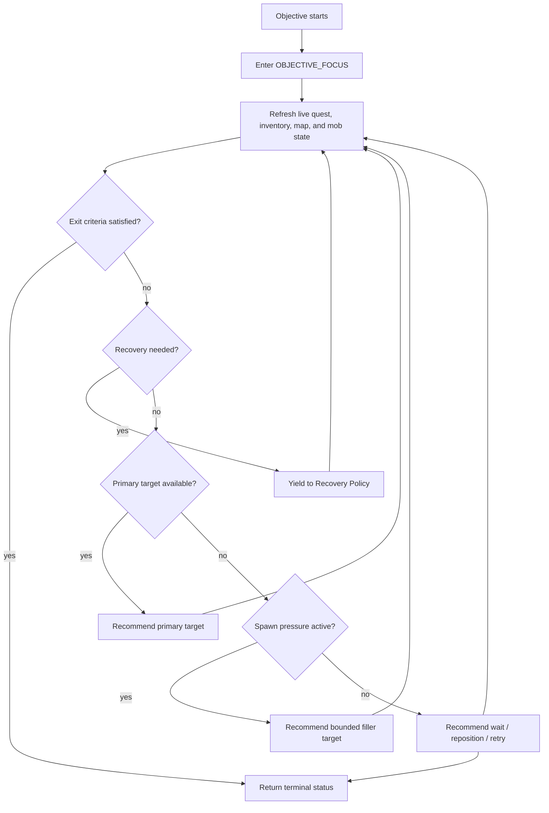

# Quest Objective Policy Design Specification

Purpose:

```text
Define how an Agent stays focused on a quest objective while still making
smart tactical choices in mixed maps, scarce-spawn situations, recovery loops,
and future-loot opportunities.
```

This is post-reconstruction implementation work. It should not be wired into
live Agent combat before the reconstructed Agent runtime, Plan Runtime, and
Capability Runtime boundaries are stable.

Recommended package:

```text
agent-quest-objective-policy
```

## Design Position

This package is a policy layer, not a combat capability.

```text
Plan Runtime owns which objective is active.
Quest Objective Policy owns tactical focus rules for that objective.
Combat/Loot/Navigation capabilities execute validated commands.
Recovery Policy handles danger, death, stuck state, and resource exhaustion.
```

The package answers:

```text
Given this active quest objective and this live map state, what should the
Agent focus on next?
```

It does not attack mobs, pick up loot, complete quests, or mutate server state.

## Goals

- Keep Agents committed to the active objective until clear exit criteria.
- Avoid putting tactical combat details directly inside Plan Cards.
- Support deterministic Maple Island MVP mode first.
- Support optional adaptive spawn-pressure clearing later.
- Prefer current quest targets over filler behavior.
- Use catalog expected spawn counts and live map state to avoid waiting
  forever when the target mob is temporarily depleted.
- Prioritize filler mobs that may help future selected quests, when safe.
- Avoid counting quest-active-only drops before their quest is active.
- Provide structured blocker, postpone, and fallback reasons.
- Record explainable audit entries for tactical choices.

## Non-Goals

- Do not implement combat execution.
- Do not implement loot execution.
- Do not implement navigation execution.
- Do not replace Recovery Policy.
- Do not decide global plan selection.
- Do not run market, shop, social, LLM, or economy behavior.
- Do not bypass quest requirement validation.

## Core Concepts

### Objective Focus

Explicit runtime state saying the Agent is currently committed to one
objective.

Examples:

- kill 10 Snails for a quest.
- collect 10 quest items.
- use Roger's Apple.
- activate reactor boxes for Pio's items.

Focus state should survive temporary tactical subtasks and recovery.

### Tactical Subtask

A short supporting action that helps the active objective but is not itself the
objective.

Examples:

- clear two filler mobs because target mobs are depleted and the map is
  clogged.
- loot a safe future quest item while moving through the target area.
- reposition to another spawn cluster.

Tactical subtasks must be bounded so they do not turn into generic grinding.

### Spawn Pressure

A situation where target mobs are scarce, but the map is filled with other mobs
that may be blocking new spawns.

Inputs:

- expected target mob count from catalog.
- live target mob count.
- expected total mob count from catalog.
- live total mob count.
- configured low-target ratio.
- configured clogged-map ratio.

### Future Quest Loot

Items useful for later selected quests.

Two categories matter:

- `prelootable`: normal items that can be collected before the quest starts.
- `quest-active-only`: drops or reactor items that should not be assumed
  collectible/countable before live quest state allows them.

### Exit Criteria

Machine-checkable conditions that prove the objective is done, blocked, skipped,
or postponed.

Live server state wins over cached progress.

## Modes

### Deterministic

Recommended for first Maple Island MVP.

Behavior:

- kill only current quest targets.
- loot only current objective items.
- no future-loot priority.
- no filler spawn-pressure clearing.
- clear blocker if targets cannot be found after retry budget.

### Adaptive

Recommended after deterministic Maple Island completion works.

Behavior:

- current objective remains primary.
- spawn-pressure clearing may run in bounded bursts.
- future selected quest loot may influence filler target choice.
- audit explains each non-primary kill.

### Observe Only

Policy scores and logs suggested tactical choices but does not influence
capability commands.

Useful for:

- comparing policy suggestions against legacy behavior.
- tuning thresholds.
- validating catalog expected spawn counts.

## Focus Flow



The `Done` branch represents any terminal exit: success, skip, block, or
postpone. Implementations should name the exact terminal status.

## Target Priority

Recommended order:

1. current quest target mob.
2. current quest drop source mob.
3. reactor/field object required by current objective.
4. spawn-pressure filler mob with future quest value.
5. spawn-pressure filler mob with safe supply/EXP/meso value.
6. safe nearby filler mob.
7. reposition/search/wait.
8. block or postpone.

Primary objective targets must always outrank filler targets unless safety or
recovery policy blocks combat.

## Spawn Pressure Rule

Definitions:

```text
targetLow =
  liveTargetCount <= max(1, floor(expectedTargetCount * targetLowRatio))

spawnClogged =
  liveTotalMobCount >= floor(expectedTotalMobCount * spawnCloggedRatio)
```

Spawn-pressure clearing is allowed only when:

- adaptive mode is enabled.
- current objective permits combat filler subtasks.
- target is low.
- map is clogged.
- filler burst limit has not been reached.
- selected filler mob is safe for the Agent.
- inventory pressure does not make future-loot pickup unsafe.

## Future Quest Loot Rule

Future-loot priority is allowed only when:

- adaptive mode is enabled.
- the future quest is in the active or selected plan set.
- item is marked `prelootable`.
- inventory has safe free slots.
- item is not forbidden by profile or plan policy.

Quest-active-only drops may be scored as mob utility for spawn clearing, but
must not satisfy future objective progress until live quest state confirms it.

## Fallback And Postpone Reasons

Recommended reason codes:

- `OBJECTIVE_ALREADY_SATISFIED`
- `PRIMARY_TARGET_AVAILABLE`
- `PRIMARY_TARGET_MISSING`
- `SPAWN_PRESSURE_CLEARING_DISABLED`
- `SPAWN_PRESSURE_ACTIVE`
- `NO_SAFE_FILLER_TARGET`
- `FILLER_BURST_LIMIT_REACHED`
- `FUTURE_LOOT_DISABLED`
- `FUTURE_LOOT_NOT_PRELOOTABLE`
- `INVENTORY_PRESSURE`
- `DANGER_TOO_HIGH`
- `NO_PROGRESS_TIMEOUT`
- `LIVE_STATE_MISMATCH`
- `CATALOG_MISSING_SPAWN_DATA`
- `POSTPONE_LOW_RESOURCES`
- `BLOCKED_CAPABILITY_MISSING`

These reason codes should be shared with Plan Runtime and Observability.

## Maple Island MVP Policy

First green run:

```text
mode = deterministic
spawnPressureClearing = false
futureQuestLootPriority = false
```

After the full deterministic route works:

```text
mode = adaptive
spawnPressureClearing = true
futureQuestLootPriority = true
```

This keeps first implementation focused on sequence correctness, then adds
human-like tactical variety later.

## Package Relationships

### Plan Runtime

Provides:

- active plan.
- active objective.
- objective exit criteria.
- objective retry budget.
- allowed tactical policies.

Consumes:

- policy recommendation.
- blocker/postpone reason.
- audit events.

### Catalog Platform

Provides:

- expected mob counts by map.
- mob spawn map indexes.
- item drop source indexes.
- future quest item metadata.
- quest-active-only vs prelootable metadata.
- reactor/field object requirements.

### Capability Runtime

Consumes:

- policy recommendation.

Executes:

- combat command.
- loot command.
- navigation/reposition command.
- reactor command.

### Recovery Policy

May override policy recommendations for:

- low HP/MP.
- death.
- dangerous mobs.
- no potion/no meso.
- repeated stuck state.
- no progress timeout.

### Profile Platform

May influence:

- patience.
- danger tolerance.
- willingness to clear filler.
- willingness to collect future loot.
- preference for efficiency vs completion.

Hard constraints still win.

## Success Criteria

The package is ready when:

- deterministic mode can support Maple Island MVP without filler behavior.
- adaptive mode can recommend bounded filler clearing.
- policy never treats future quest-active-only drops as preloot progress.
- live quest/inventory/map state wins over cached state.
- every non-primary tactical recommendation has a reason code.
- retry, block, and postpone decisions are inspectable.
- tests prove the Agent returns to the primary objective after filler bursts.

## Deferred Until After Reconstruction

- runtime integration with combat targeting.
- runtime integration with loot priority.
- runtime focus state persistence.
- live map mob snapshot provider.
- adaptive policy tuning from soak-test evidence.
