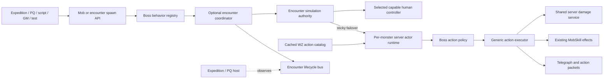
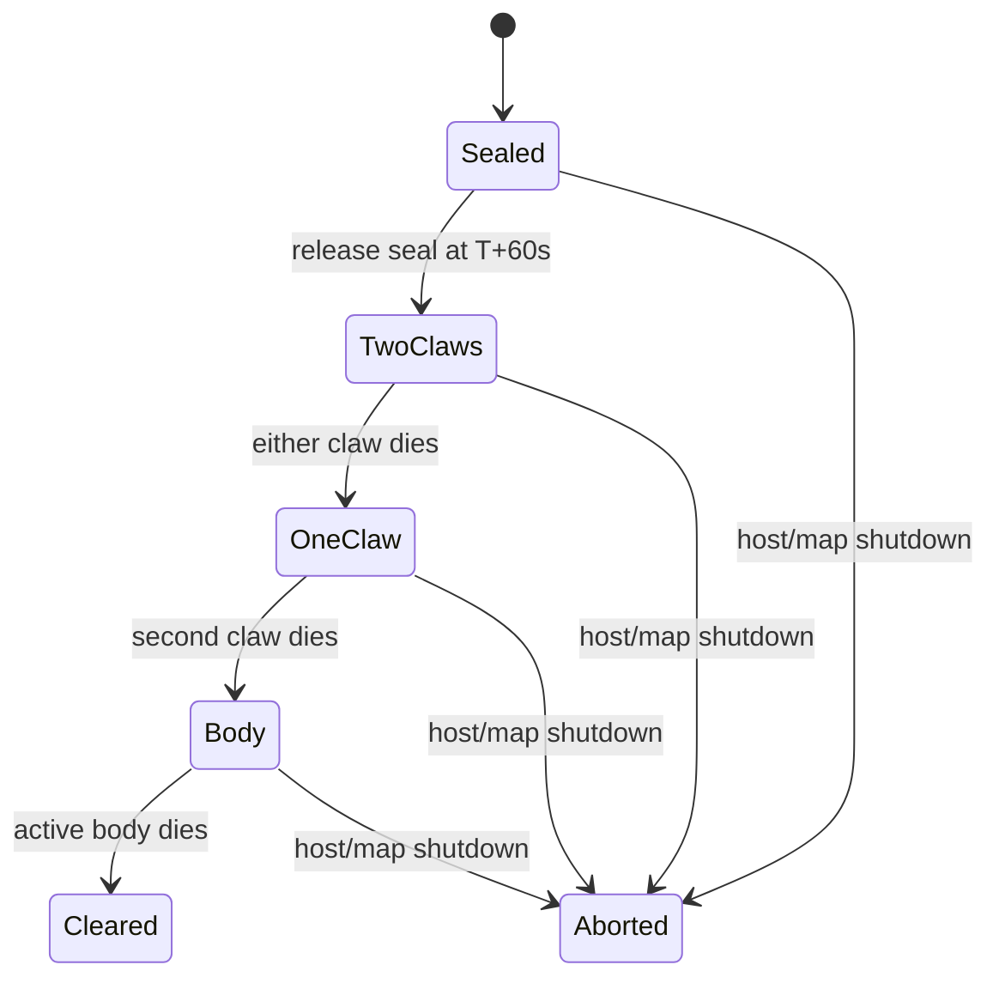

# Server Boss Combat Runtime Architecture

Status: implemented reference architecture. Easy Balrog is the first complete composite encounter wired to it; regular-client visual and full live-expedition validation remain release gates.

This document is the implementation authority for native-client boss simulation with sticky server failover. It defines the reusable runtime, the boundary between a boss and the event that hosts it, the Easy Balrog reference behavior, and the extension process for other bosses such as Alishar.

## Goal

A configured boss must perform the same combat routine whenever it is spawned, regardless of whether it was created by:

- an expedition or party quest;
- a scripted event;
- a GM command;
- a test fixture; or
- a direct summon on an ordinary map.

The expedition or party quest may create and observe an encounter, but it must not select attacks, apply boss skills, calculate boss damage, or own boss cooldowns. A reusable authority policy chooses a capable human controller when possible and irreversibly transfers the encounter to the server only when no eligible capable human remains.

## Implemented server boundary

Normal unowned monster action selection remains client-led:

- `MoveLifeHandler` accepts `MOVE_LIFE`, recognizes ordinary attacks and skills, validates them, applies `MobSkill`, and proposes a possible next skill.
- `Monster.canUseSkill` and `Monster.canUseAttack` account for MP and cooldown state.
- `TakeDamageHandler` consumes the player's damage report and applies character defenses, buffs, reflected damage, deadly attacks, MP burn, diseases, inventory loss, death, and related side effects.
- `MobSkill.applyEffect` already applies server-side monster buffs, diseases, dispel, banish, poison mist, reverse input, undead, counters, and summons.

The implemented runtime preserves that native path. `ServerMobAutonomyService` owns encounter-wide controller selection, lease renewal, deterministic handoff, and irreversible server fallback. In sticky-server mode it replaces decision, telegraph, targeting, and authoritative impact while reusing `Monster.canUseAttack`, `Monster.canUseSkill`, `MobSkill`, and `ServerMobDamageService`. `MoveLifeHandler` and `TakeDamageHandler` reject duplicate client claims only for actors currently owned by the server runtime.

## Ownership model



There are four separate concepts:

1. **Host system:** handles entry rules, party registration, time limits, rewards, exits, and map instances.
2. **Encounter behavior:** coordinates related monsters and phase transitions.
3. **Actor behavior:** controls one monster's targeting and combat actions.
4. **Simulation authority:** pins capable native-client control or performs a one-way transition to server control.

A single-monster boss may use only an actor behavior. A composite boss such as Easy Balrog uses an encounter behavior plus actor behaviors for its body and claws.

## Simulation authority policy

Authority is encounter-scoped for a composite boss and actor-scoped for a standalone summon:

```text
NATIVE_CLIENT(controllerCharacterId)
    -> NATIVE_CLIENT(replacementCharacterId)
    -> SERVER_STICKY
    -> TERMINATED
```

Allowed transitions:

1. On encounter creation, select one eligible, capable human participant when available.
2. Keep that participant pinned as controller while connected, alive, in the same event/map instance, and responsive.
3. When unavailable, hand all encounter actors to another eligible capable human before considering server takeover.
4. If no eligible capable human remains, remove native control and enter `SERVER_STICKY`.
5. `SERVER_STICKY` never returns to native control, even if a human reconnects, revives, or enters later. It ends only when the encounter/actor dies, despawns, aborts, or is disposed.
6. If all humans are render-only or otherwise unable to generate valid mob simulation (for example WASM), start in `SERVER_STICKY`.

The encounter coordinator remains server-owned in both modes. It controls seal timing, actor roles, phase changes, clear/abort, and cleanup. Only combat simulation changes authority.

### Eligible controller

For an expedition/PQ encounter, a controller candidate must be:

- a registered human boss participant, not an Agent or spectator;
- connected and logged into the world;
- alive and not changing maps;
- present in the exact encounter map instance; and
- marked capable of native mob simulation.

For a standalone boss without a host roster, the default candidate pool is capable, alive, non-hidden humans in the exact map instance. A caller may provide a stricter participant predicate.

Selection must be deterministic, using the encounter participant order with a stable character-ID tie-breaker. Ordinary aggro/DPS changes must not replace the pinned controller.

Warped-in observers are not expedition controller candidates or server-runtime combat victims. If no registered, capable participant is present, the boss starts in or transitions to `SERVER_STICKY`; an observer arriving later cannot claim it. Registered BotClient Agents remain valid combat victims even though they are headless and controller-ineligible.

### Ordinary summoned-mob authority

Ordinary summoned mobs use a separate, reversible policy. Before Agent interaction, any capable real observer in the map may run their native movement and attacks. An accepted Agent hit atomically promotes that mob to server-owned movement and combat for a seven-second aggro lease. The lease does not require a real observer, so an Agent-only expedition can still fight active adds. Each subsequent accepted Agent hit renews the lease.

After seven seconds without an Agent hit, the server stabilizes the mob pose, ends both combat and physics ownership, and hands it to any available capable real client without immediate aggro. Unlike boss takeover, this handoff is intentionally reversible. Grounded and flying mobs keep their WZ-authored movement model throughout server ownership.

### Client capability

Do not infer capability solely from `!(client instanceof BotClient)`: WASM may use a real network `Client` but still be unable to simulate mob attacks. Add a session-scoped capability such as:

```text
NATIVE_MOB_SIMULATION
RENDER_ONLY
HEADLESS
```

`BotClient` is `HEADLESS`; a transport or integration known not to implement boss AI marks its session `RENDER_ONLY`; ordinary v83 sessions begin as `NATIVE_MOB_SIMULATION`. The initial two-second accepted-`MOVE_LIFE` deadline is a second safety net: a nominally native session that cannot actually simulate the assigned actor is rejected and the policy tries the next eligible participant before server takeover.

The controller uses a lease renewed by valid `MOVE_LIFE` traffic. Assignment has an initial-response deadline and a conservative heartbeat timeout. Expiry follows the same human-handoff-then-sticky-server sequence; it must not oscillate on brief packet jitter.

## Implemented package structure

The runtime is channel-scheduled and boss plug-ins live under `server.life`, never under `server.agents` or `server.expeditions`:

```text
net/server/services/task/channel/
  ServerMobAutonomyService.java

server/combat/
  ServerMobDamageService.java

server/life/autonomy/
  ServerMobBehaviorRegistry.java
  ServerMobActionCatalog.java
  BossClientSimulationCapability.java
  BossAction.java
  BossActionGeometry.java
  BossActorBehavior.java
  GenericWzMobBehavior.java

server/life/autonomy/balrog/
  EasyBalrogEncounterService.java
  EasyBalrogBehavior.java
  EasyBalrogBodyBehavior.java
  EasyBalrogReleasedClawBehavior.java
  EasyBalrogInitialClawBehavior.java

server/life/autonomy/alishar/
  AlisharActorBehavior.java
```

Actor, authority, prepared-action, and scheduler state are private runtime types inside `ServerMobAutonomyService`; this keeps one channel scheduler and prevents boss plug-ins from mutating generic ownership state.

## Spawn contracts

Do not make an ordinary component spawn silently create a full multi-monster encounter. Provide two explicit operations:

```java
Monster spawnBossMob(int mobId, MapleMap map, Point position);

EncounterHandle spawnBossEncounter(
        BossEncounterId encounterId,
        MapleMap map,
        Point origin,
        EncounterOptions options);
```

The intended semantics are:

- `spawnBossMob(8830007, ...)` creates a Balrog body only and selects native or sticky-server authority from eligible map participants.
- `spawnBossEncounter(EASY_BALROG, ...)` creates the seal, claws, body, phase coordinator, lifecycle handle, and encounter authority state.

A GM command such as `!spawnencounter easy-balrog` should call the encounter operation. Existing generic mob-spawn commands may continue to create a single monster unless they explicitly request boss behavior or force sticky server takeover.

The registry registers the behavior profile at spawn, then the authority policy either pins a native controller or attaches the server actor runtime. Attachment and takeover must be idempotent: one map object generation can have at most one combat authority.

## Core contracts

The following sketches communicate responsibility, not final method signatures.

### Boss actor behavior

```java
interface BossActorBehavior {
    BossActionPolicy actionPolicy();

    TargetSet perceive(BossActionContext context);

    void onAttached(BossActionContext context);

    void onDetached(BossActionContext context, DetachReason reason);
}
```

The actor behavior may filter targets or contribute boss-specific facts. It must not schedule independent threads or mutate expedition state.

### Boss action policy

```java
interface BossActionPolicy {
    List<BossAction> eligibleActions(BossActionContext context);

    Optional<BossAction> select(
            BossActionContext context,
            List<BossAction> eligible,
            RandomGenerator random);
}
```

Eligibility must consider:

- actor alive and still present in the same map;
- encounter phase and vulnerability state;
- current HP percentage;
- available MP;
- action cooldown;
- global actor recovery/action lock;
- required targets and range;
- summon population limits; and
- temporary suppressions such as stun or neutralize.

Selection may use weights, priorities, or deterministic phase rules. Random selection must use an injected seed in tests.

### Boss action

A normalized action should contain only data needed by the generic executor:

```text
action identity
ordinary attack index or MobSkill id/level
telegraph duration
impact delay
recovery duration
cooldown
MP cost
HP gate
targeting rule
relative hit regions
maximum targets
damage kind and attack metadata
optional phase/summon predicate
```

WZ remains the authority for action and skill values that it defines. Boss Java code should describe selection and phase policy, not copy numerical WZ data without a documented reason.

## WZ action catalog

Load boss data through the repository's normal provider path (`DataProviderFactory`, `DataTool`, `LifeFactory`, `MonsterInformationProvider`, and `MobSkillFactory`). Do not parse XML in the action loop.

Important rules:

- Cache immutable action descriptions when the monster template or behavior profile is loaded.
- Use `DataTool` defaults and tolerate absent nodes.
- Treat ordinary monster attacks and `MobSkill` entries as different action types.
- Preserve WZ HP gates, MP consumption, cooldowns, animation delays, attack regions, damage metadata, summon limits, and skill probability.
- Reuse `MobSkillFactory` and `MobSkill.applyEffect`; do not reproduce individual disease or buff behavior in a boss module.
- If a boss needs a deliberate override, place it in that boss's profile with a source comment and a focused test.

## Runtime and scheduling

`ServerMobAutonomyService` should be a channel service with map-scoped ownership. Prefer one timing queue or channel scheduler over one thread or permanent repeating task per monster.

An actor runtime holds ephemeral state:

```text
monster object ID and generation/identity
map instance identity
behavior/profile identity
current action and action-lock deadline
per-action cooldown deadlines
deterministic random source
encounter handle, if any
next evaluation deadline
```

Nothing in this state needs database persistence.

Every scheduled telegraph or impact must revalidate:

- the monster is alive;
- the object ID still identifies the same monster generation;
- the monster and target remain in the expected map instance;
- the encounter has not cleared, aborted, or changed to an incompatible phase; and
- the target is alive and otherwise eligible.

Run actor and encounter mutations through the map/channel execution context. Avoid taking a monster lock and then an encounter lock in the inverse order elsewhere. Prefer serialized commands and immutable snapshots over nested locking.

## Action execution sequence

An ordinary attack follows this sequence:

1. Evaluate the actor only when it is not action-locked.
2. Snapshot eligible actions and targets.
3. Select one action.
4. Atomically reserve its MP, cooldown, and action lock.
5. Broadcast the standard monster action/telegraph packet.
6. Schedule impact for the WZ-defined delay.
7. Revalidate actor, phase, map, and targets at impact time.
8. Resolve hit regions and affected targets.
9. Ask `ServerMobDamageService` to calculate and apply each hit.
10. Publish diagnostic and lifecycle observations.
11. Evaluate again after recovery ends.

A monster skill follows the same reservation and telegraph sequence, then calls the existing `MobSkill` effect at the correct impact time. Banish output and similar post-effect transitions must be completed exactly as `MoveLifeHandler` does today.

## Shared server damage service

This extraction is the main safety prerequisite. `TakeDamageHandler` currently contains both packet validation and gameplay mutation. Separate those responsibilities so native client-reported damage and sticky-server boss damage call the same gameplay service.

Conceptually:

```java
MobDamageResult applyMobDamage(MobDamageRequest request);
```

The request identifies the attacker, target, attack index, damage type, base attack metadata, and whether this is a contact, ordinary, deadly, or skill-associated hit. The service—not the boss module—must preserve applicable existing rules, including:

- physical and magic mitigation;
- Dark Sight and other authoritative negation;
- Magic Guard and MP loss;
- Meso Guard;
- Achilles and Combo Barrier;
- Power Guard and Mana Reflection;
- deadly attack MP reduction;
- attack MP burn and diseases;
- invulnerability and fake/miss results;
- HP/MP updates, death, and banish; and
- related packets and aggro updates.

Refactor with characterization tests before changing ownership. Do not initially alter damage formulas while extracting them.

## Client-authority boundary

In `NATIVE_CLIENT`, the selected human remains the normal monster controller. Existing `MOVE_LIFE`, `MOVE_MONSTER_RESPONSE`, `MobSkill`, and victim `TAKE_DAMAGE` processing remain active. The authority policy prevents ordinary aggro/DPS logic from changing that controller while its lease is valid.

In `SERVER_STICKY`, the server owns action selection, skills, summons, target hits, and damage. Accepting the same client decisions would cause duplicate attacks, so handlers must:

- Ignore client-proposed attack and skill fields for sticky-server monsters.
- Do not propose a next skill for a sticky-server monster.
- Allow only explicitly supported visual movement reporting, or reject movement entirely when the boss is stationary.
- Continue broadcasting server-generated standard packets so native clients can render animations.

At sticky takeover, remove native controller ownership for every current encounter actor, invalidate outstanding controller leases, attach server runtimes, and mark all future encounter actors/adds server-owned before they become actionable. Easy Balrog components remain stationary under server authority.

The final clause applies to composite boss actors. They never enter Agent mob physics: fixed body/claw actors retain their authored position and cannot receive gravity or knockback simulation. Ordinary summons may instead use the reversible Agent-aggro lease described above; their movement and combat authority must start and end together.

WASM is `RENDER_ONLY`; an encounter containing only WASM humans and Agents enters `SERVER_STICKY` immediately. WASM rendering completeness is optional troubleshooting support and never makes it controller-eligible.

## Targeting and arbitrary maps

The default target pool is every alive, visible, non-transitioning character in the actor's current map instance. Boss-specific policies may narrow this pool, but should not distinguish human players from server Agents unless gameplay explicitly requires it.

At action selection and impact time, exclude:

- characters in another map instance;
- dead characters;
- hidden GMs when normal monster rules would ignore them;
- characters changing maps; and
- targets outside the resolved hit region.

Boss arena attacks are often authored around a particular map. To preserve a routine on arbitrary maps:

- represent hit regions relative to the actor or encounter origin;
- translate and clip regions to map bounds;
- use valid footholds for summoned monsters;
- define what happens when a region has no valid ground;
- never rely on a hard-coded Balrog-map coordinate in the generic executor.

The timing and action semantics remain identical on a cramped map, but the usable spatial coverage may be smaller. That is preferable to spawning actors or hazards outside valid geometry.

## Encounter lifecycle

The lifecycle bus should publish immutable events such as:

```text
ENCOUNTER_STARTED
ACTOR_SPAWNED
PHASE_CHANGED
ACTOR_DEFEATED
ENCOUNTER_CLEARED
ENCOUNTER_FAILED
ENCOUNTER_ABORTED
```

Events carry the encounter ID, instance ID, map instance, timestamp, phase, and relevant actor identity. Consumers must not be able to mutate the encounter through an event object.

The host subscribes to these events to award rewards, advance a PQ, display results, or return players. The encounter never imports or calls Agent expedition classes.

Cleanup must detach every actor and cancel or invalidate pending work when:

- the encounter clears or aborts;
- a component dies;
- a monster is removed without death;
- the map instance is disposed or reset;
- the channel shuts down; or
- the event hosting the map ends.

Late scheduled callbacks must become harmless through identity and state revalidation.

## Easy Balrog reference behavior

Easy Balrog is the first composite reference implementation.

### Actors

| Mob ID | Role |
|---:|---|
| `8830007` | Initially fake body; later active body |
| `8830008` | Released claw |
| `8830009` | Initially active claw |
| `8830013` | Release seal |
| `8830011` | Helper revived by `8830008` |
| `8830012` | Helper revived by `8830009` |
| `8830010` | Post-body sealed/summon form used by existing data/script behavior |

### Phase graph



Encounter creation spawns fake body `8830007`, active claw `8830009`, and seal `8830013`. At 60 seconds the encounter releases the seal; the seal's configured death/revive behavior produces claw `8830008`. The body receives no actions while fake. After both claws have died, the body becomes real and vulnerable. Death of the active body clears the encounter.

The encounter publishes one stable boss HP gauge using body UI ID `8830007`. Its maximum and current HP are the sums of body `8830007` and both claws `8830008`/`8830009`, including the sealed body's and not-yet-released claw's full HP from encounter start. Damage to any component updates that same gauge identity, avoiding client throttling between multipart actors. A standalone body or claw keeps its individual gauge.

Do not infer this transition merely by counting all monsters in a map. Track actor roles in the encounter handle so unrelated summons or a direct component spawn cannot corrupt the phase.

### Verified action inventory

The initial Balrog policy should expose the following WZ-defined actions. Exact runtime values must be re-read through the normal data loaders during implementation and protected with fixture tests.

Body `8830007`:

- Attack 1: nine-zone magical tremor; approximately 3240 ms attack delay.
- Attack 2: random fire strikes; approximately 930 ms attack delay.
- Attack 3: deadly three-of-eleven pillars, physical attack damage metadata `280`, approximately 2040 ms attack delay; deadly handling reduces MP to 1.
- Attack 4: wide magic dispel using monster skill `127`, level `12`; approximately 1200 ms attack delay.
- Skill `145`, level `4`: physical and magic counter at or below 50% HP, seven-second duration, 60-second cooldown; WZ reflection values include physical `1000` and magic `400` semantics.
- Skill `133`, level `3`: undead at or below 25% HP, seven-second duration, 60-second cooldown, wide arena range, 100% probability.

Claw `8830008`:

- Attack 1: three-of-seven physical warning regions, physical attack damage metadata `336`, approximately 1500 ms delay.
- Attack 2: directional magic sweep, approximately 2400 ms delay.
- Summon Jr. Balrog `6400008`, maximum three, approximately 100-second interval.
- Summon Crimson Balrog `6400009`, maximum three, approximately 180-second interval.

Claw `8830009`:

- Attack 1: four-of-thirteen physical pillars, physical attack damage metadata `336`, approximately 1170 ms delay.
- Attack 2: arena-wide reverse input using monster skill `132`, level `3`, approximately 1200 ms delay.
- Attack 3: directional magic sweep, approximately 1260 ms delay.

Helper forms `8830011` and `8830012` have no independent attack inventory. Mob `8830010` can summon three Baby Balrogs `6400007` with an approximately 150-second interval, although the normal Easy encounter clears before that post-body form is relevant.

Jr. Balrog `6400008` resolves through linked template `8130100` and has three WZ-authored magical ordinary attacks. Crimson Balrog `6400009` resolves through linked template `8150000`, has two WZ-authored magical ordinary attacks, and is a flying mob with WZ fly speed 10. Neither add defines a separate `info/skill` inventory: its spell-like casts are ordinary attack actions. Under an Agent aggro lease, each add chases its primary Agent target, selects among its authored attacks only when the target enters an attack region, broadcasts the standard cast animation, and applies the delayed server-authoritative impact.

The original arena also applies environmental HP drain independently of boss autonomy. Preserve that as map behavior; do not encode it as a Balrog actor action.

### Balrog selection policy

The policy should:

- run only actions belonging to the currently active actors;
- prefer no target over inventing a hit when no target is eligible;
- enforce HP gates and cooldowns before reserving an action;
- keep counter and undead as ordinary eligible skills rather than phase transitions;
- honor WZ summon population limits;
- choose warning/pillar regions before telegraph broadcast and retain that selection through impact; and
- allow a fixed seed and fake clock for deterministic tests.

## Expedition and PQ integration

An Agent expedition should perform only this sequence:

1. Prepare and navigate members.
2. Register the expedition and create parties.
3. Create or acquire the battle-map instance.
4. Supply the registered participant roster and call `spawnBossEncounter(EASY_BALROG, ...)`.
5. Subscribe to lifecycle events.
6. Let Agents use their ordinary combat routines against encounter actors.
7. On clear/fail/abort, handle rewards and natural exit/return behavior.

The existing `AgentEasyBalrogScenario` currently contains Agent target-phase observations. During migration, retain only Agent-side decisions there: which monster Agents should target, recovery, positioning, and reporting. Move boss phase authority and sticky-server boss actions to the Balrog encounter module; native boss actions continue through the selected capable human client.

Ludibrium PQ should integrate Alishar the same way: its stage coordinator spawns or observes Alishar, while the Alishar actor behavior independently selects attacks, debuffs, and summons.

## Adding another boss

Use this checklist for Alishar or any later boss:

1. Identify every mob ID and whether the boss is a single actor or composite encounter.
2. Inspect Mob WZ attacks, skills, HP gates, MP costs, delays, ranges, summon limits, and revive relationships through the normal loaders.
3. Inspect the existing event/PQ script only for hosting, spawn, phase, clear, and failure rules.
4. Separate map hazards from boss actions.
5. Add the smallest boss-specific actor policy.
6. Add an encounter coordinator only when multiple actors or non-HP phase transitions require it.
7. Register the actor/encounter factory with the generic registry.
8. Add standalone spawn coverage before integrating the expedition/PQ.
9. Make the host observe lifecycle events instead of calling combat methods.
10. Test the same boss in its canonical arena and an unrelated map.

Boss-specific code may define:

- weighted action selection;
- target preference;
- phase transitions;
- actor activation and vulnerability;
- summons or encounter-owned hazards; and
- boss-specific lifecycle metadata.

Boss-specific code must not define:

- general player defense formulas;
- its own scheduler/thread model;
- copies of `MobSkill` disease logic;
- expedition registration or party formation;
- direct Agent-only shortcuts; or
- packet parsing.

If a boss introduces a genuinely reusable mechanic—map hazards, destructible encounter objects, or server-owned roaming movement—add a small generic capability interface after the second concrete use case demonstrates the common contract. Do not grow the core around one boss's special case.

## Diagnostics

Use structured, rate-limited logs carrying:

```text
encounterInstanceId
behaviorId
mapId and map-instance identity
mobId and objectId
phase
actionId
selected target IDs/count
telegraph, impact, and recovery timestamps
eligibility rejection reason
damage result summary
detach/abort reason
```

Avoid per-tick informational logging. A GM inspection command should report active encounters, actors, phases, current action locks, and next cooldown deadlines without mutating them.

## Test strategy and acceptance gates

### Characterization before extraction

- Existing `TakeDamageHandler` outcomes remain unchanged for representative physical, magical, deadly, missed, guarded, and disease-bearing attacks.
- Existing client-led monsters outside a registered boss authority scope behave exactly as before.

### Generic runtime tests

- A capable eligible human is pinned as controller and ordinary aggro changes do not replace it.
- Controller death/disconnect hands off to the next eligible capable human.
- No eligible capable human causes one-way `SERVER_STICKY` takeover.
- A revived, reconnected, or newly joined human never reverses sticky server ownership.
- Render-only and headless participants never become controllers.
- Only one server actor runtime attaches after takeover.
- HP, MP, cooldown, target, and phase gates reject actions correctly.
- Telegraph precedes impact by the configured delay.
- Targets leaving the map or dying before impact are not hit.
- Death, removal, reset, and shutdown invalidate pending callbacks.
- A sticky-server monster ignores client-proposed attacks and skills.
- A seeded policy produces a repeatable action sequence.

### Easy Balrog tests

- Encounter creation produces the fake body, first claw, and seal.
- The second claw releases at 60 seconds with a fake clock.
- One claw death does not activate the body.
- The second claw death activates exactly one body.
- Only the active body death clears the encounter.
- Counter and undead obey HP gates and cooldowns.
- Pillar selection is retained between telegraph and impact.
- Summon limits are enforced.
- Body-only spawn does not create an encounter.
- Full encounter works without an expedition on an unrelated map.

### Integration tests

- A 12-Agent Easy Balrog run enters, fights, clears, and exits naturally.
- A human expedition stays native-controlled while a capable participant remains.
- Controller loss hands off to another capable human without server takeover.
- Loss of the last capable human transfers the whole encounter to sticky server authority.
- Agent-only and WASM-only encounters start server-controlled.
- Expedition cancellation aborts the encounter and leaves no scheduled actions.
- In native mode the selected client owns normal simulation; after takeover all regular clients observe server broadcasts without owning hits.

## Implementation sequence

1. Add controller-capability, eligibility, pinned-lease, handoff, and sticky-takeover tests.
2. Add characterization tests and extract the shared server mob-damage service.
3. Add the authority identity, registry, actor runtime, scheduler integration, and cleanup.
4. Normalize and cache ordinary attack and `MobSkill` action data.
5. Add server telegraph, delayed impact, and skill execution.
6. Make packet handlers branch explicitly between pinned-native and sticky-server authority.
7. Implement body-only Easy Balrog behavior.
8. Implement the complete Easy Balrog encounter and lifecycle events.
9. Convert the Agent expedition to spawn and observe the encounter.
10. Run native, handoff, Agent-only sticky takeover, standalone-map, and 12-Agent tests.

## Source locations to inspect during implementation

- `src/main/java/net/server/channel/handlers/MoveLifeHandler.java`
- `src/main/java/net/server/channel/handlers/TakeDamageHandler.java`
- `src/main/java/server/life/Monster.java`
- `src/main/java/server/life/MobSkill.java`
- `src/main/java/server/life/MobSkillFactory.java`
- `src/main/java/server/life/MonsterInformationProvider.java`
- `src/main/java/server/life/MobAttackInfoFactory.java`
- `src/main/java/server/maps/MapleMap.java`
- `scripts/event/BalrogBattle_Easy.js`
- `src/main/java/server/agents/capabilities/expedition/balrog/`

WZ authority:

- `wz/Mob.wz/*.img.xml`
- `wz/Skill.wz/MobSkill.img.xml`
- `.claude/skills/wz-data/SKILL.md`

## Handoff instruction for another coding chat

Give the chat this document path and the boss to implement. A suitable instruction is:

> Read `CLAUDE.md`, `.claude/skills/wz-data/SKILL.md`, and `docs/current/SERVER_BOSS_COMBAT_RUNTIME_ARCHITECTURE.md` completely. Implement the requested boss through the generic boss-combat runtime and its simulation-authority policy. Prefer one pinned native-capable human controller, hand directly to another eligible human on loss, and enter irreversible server authority only when none remains or all clients are incapable. Keep expedition/PQ hosting separate from actor combat, reuse the shared server damage service and existing `MobSkill` effects, verify all IDs and action values through the normal WZ loaders, and satisfy the document's standalone-spawn and cleanup acceptance gates.

The runtime is available for additional boss plug-ins. New implementations must still add boss-specific WZ characterization and standalone behavior tests rather than assuming Easy Balrog geometry or phase rules.
